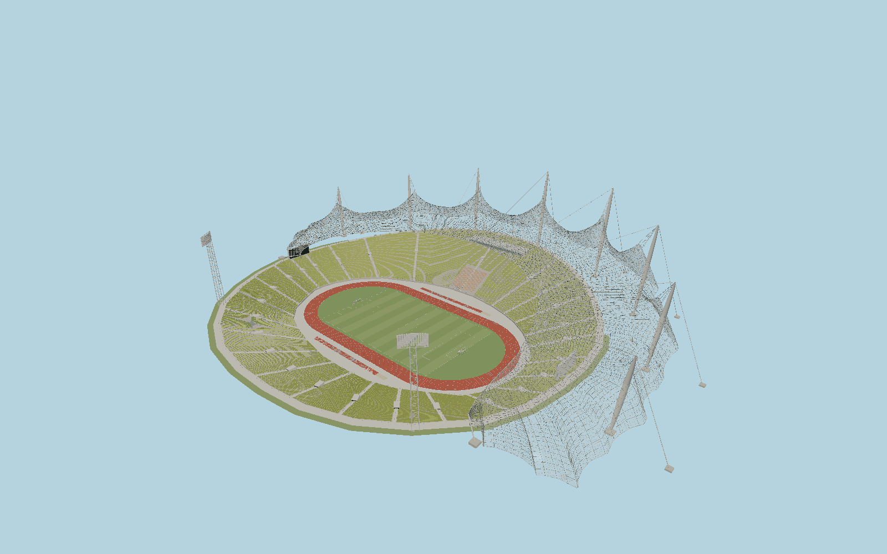

# Munich Olympic Stadium — N0692

Munich’s distinctive west-side tent uses the mapped scalloped acrylic envelope and eight main mast bases, a paired cable net, sheet seals, suspended inner nodes, long principal edge bundles and outward guys. Green molded seats follow the irregular asymmetric bowl with a high west frame, glazed press box, honorary seats, red athletics oval, apron equipment and two lattice floodlight towers. The eastern stands remain open.

## Identity and evidence

Exact catalog identity **Q131610**. Source facts: `{"published":"The original Olympic construction report describes the eight-mast, nine-saddle stadium canopy, nominal75cm paired cable mesh and3m acrylic sheets. It establishes the34m western frame and18m earth bank. SBP confirms the transparent cable-net structural system. The City’s1997 stadium account supplies the105x68m pitch and lighting arrangement.","reconstructed":"Exact OSM mast bases, stand blocks, pitch direction and roof perimeter control plan geometry. Mast heights, leaning offsets, sag surfaces, anchorage extents, portal sections and chair inventory are reconstructed from the primary engineering photographs and original sections; this is a detailed exterior, not a structural-analysis model."}`. The source specification keeps published dimensions separate from reconstructed details.

- https://www.sbp.de/en/project/roof-for-munich-olympic-stadium-1972/
- https://d.rsms.me/stuff/1972%20Munich%20s2.pdf
- https://mstatistik.muenchen.de/archivierung_historische_berichte/MuenchenerStatistik/1997/ms970901.pdf
- https://www.olympiapark.de/en/the-olympic-park/park-overview/olympic-stadium
- https://www.openstreetmap.org/way/25001469
- https://www.openstreetmap.org/way/419656920
- https://www.openstreetmap.org/way/15805167

Original authored geometry and shared procedural materials. Reference photographs and construction illustrations retain their rights and are evidence only; no pixels or external mesh are embedded. Mapped plan coordinates derive from OpenStreetMap contributors under ODbL1.0.

## Authored geometry and materials

4,116,886 triangles, 8,229,292 vertices, 7 surface groups; 337,431,788 source bytes. SHA-256: `sha256:409effa27bbc2a34d3d403240a17e10e98d7d30456d11c307afc7e0cb49c69cc`. Actual bounds: -120.462, -18.035, -170.712 to 177.760, 70.102, 191.222 m.

Shared canonical material graphs with metric UV repeats in extras.molenSurface; portable glTF PBR factors and vertex colors remain. Dark recesses/lantern panels retain local fallback materials. Shared references: `matgraph:molen.worldgen.material.metal_painted` (2 × 2 m), `matgraph:molen.worldgen.material.concrete_plain` (2 × 2 m), `matgraph:molen.worldgen.material.gravel` (2 × 2 m). Model-native axes: {"up":"+Y","front":"+Z","origin":"Mapped pitch center; +Z north-northwest, +X west. Y0 is upper public circulation around the open eastern bowl, with the field18m lower."}.

## Placement proposal

The pitch determines +Z north-northwest; the west roof is+X, with eight exact mapped mast bases and the independently traced roof boundary. Native ground follows upper circulation, not the field. The larger Olympic park, adjacent hall/swimming-pool canopies and temporary event staging are outside this single stadium asset. Proposed anchor 11.54656355, 48.173131 (longitude, latitude), heading -2.946946668651328 radians. Elevation policy: **terrain-contact**. See qa.json for the geographic review status and scope; this placement proposal does not claim surveyed site accuracy. Native ground and pitch datums follow the individual geographic proposal; depressed bowls require their declared terrain cutout.

## Limitations and review

- The intact pre-restoration exterior is depicted. The operator reports closure from September2025 for renovation; future alterations are not invented. Three-dimensional sag, members, cables and seat counts are photographic reconstruction over exact map plan evidence. Enclosed service rooms and surrounding Olympic park landscaping are outside this stadium envelope.

Portable inspection is ground-free so the faithful recessed athletics bowl is visible. Geographic inspection applies the native terrain cutout.

Near/far fixtures are in `spec.qaCameras`. Float32 finite geometry, triangle degeneracy and winding are checked by the generator. The hash-bound qa.json and capture reports record the scope and status of rendering, shared-material, exterior-fidelity and geographic reviews.

Regenerate with `node packages/worldgen/scripts/generate-stadium-models.mjs --ids=N0692`; add `--check` for reproducibility. Editable component recipes are registered by the imports and study list in `packages/worldgen/scripts/generate-stadium-models.mjs`. The generator protects artist-edited master hashes and preserves import/capture/shared-capture/QA documents.
