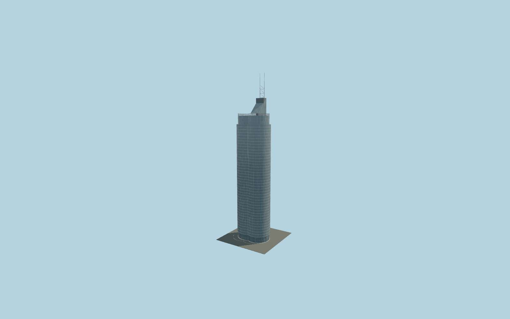

# Millennium Tower, Vienna

Two interlocking cylindrical glazed office volumes, projecting service spine, narrow silver mullions and glass spandrels, recessed entry columns, stepped lamella-screened hood, sloping glass crown and paired braced antenna masts.

## Evidence and reconstruction

Published dimensions and reconstructed details are separated in spec.json. Primary references:

- [Reference](https://www.millenniumtower.at/en/architecture/)
- [Reference](https://www.millenniumtower.at/en/office/)
- [Reference](https://www.podrecca.com/projects/millenium-tower)
- [Reference](https://www.atp.ag/en/projects/millennium-tower-vienna/)
- [Reference](https://ifgroup.org/en/project/millennium-tower-vienna)
- [Reference](https://www.tandfonline.com/doi/abs/10.2749/101686699780481961)
- [Reference](https://www.openstreetmap.org/way/105310525)

No third-party geometry, photograph or bitmap texture is embedded. Shared surface graphs come from the central library; vertex tints carry model colors. Glazing uses PBR materials; transparent surfaces are declared per model.

## Model and axes

268,856 triangles; 536,724 vertices; 4 material groups; 2,518,992 bytes. Native bounds: -21.515, 0.000, -17.748 to 21.598, 202.000, 17.580. Source hash: `sha256:9b5fe07fede15c7a47aee383c0e988589cfb4da45ba0a2d2cef9076b7ea63307`.

{"up":"+Y","longitudinal":"+X between cylindrical lobes in cached map frame","front":"-Z at the concave facade seam; +Z toward projecting rear service spine","origin":"Cached mapped envelope center at ground datum"}

Map-derived placement preview with asymmetric rear spine retained. Signed crown direction, terrain contact and mall interfaces still need a contextual visual review.

## Reproduce

Run `node packages/worldgen/scripts/generate-signature-towers.mjs --ids=N0235` (or add `--check`). The generator preserves manually edited masters by checking their baseline hashes. Import through the standard authored-model workflow with optimization disabled; then capture all QA cameras, including shared-surface views.

## Pending work

- Maximum exterior fidelity is pending. Main-body 140.5 m map tag is provisionally distinguished from the taller crown/spine and 202 m antenna; surveyed tier elevations are unavailable.
- Upper hood radii, concentric setbacks, sloping roof boundaries, lamella profiles and mast geometry are photographic reconstructions. Photographs do not resolve all roof service equipment.
- The reconstructed entrance and support spacing need as-built verification, including the 2017 renovated lobby. No claim is made to model its sculptural interior.
- Adjacent Millennium City mall, housing and footbridge are separate buildings and are outside this tower asset. Terrain, mall connection and signed roof orientation have not passed geographic fit review.
- No third-party mesh, photograph or floor-plan image is embedded. Glass is local PBR; painted metal and stainless steel use shared canonical material definitions.

This bundle contains source geometry, not a claim of maximum-fidelity completion. Hash-bound visual acceptance is recorded separately after capture inspection.
