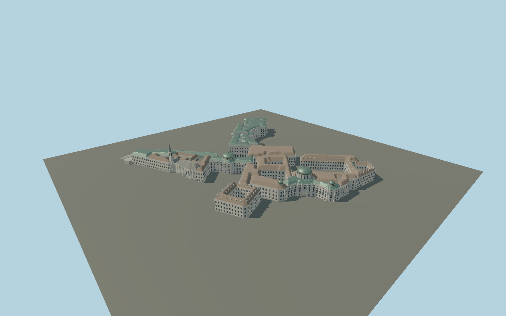

# Hofburg Palace

Individually mapped Hofburg wings around open courts, curved Neue Burg, Michaeler copper domes, Amalien clock turret, library dome, riding school and Stallburg courtyard, Augustinian spire, Albertina terrace and Palmenhaus.

## Evidence and reconstruction

Published dimensions and reconstructed details are separated in spec.json. Primary references:

- [Reference](https://www.openstreetmap.org/relation/3898175)
- [Reference](https://www.burghauptmannschaft.at/Themen/Hofburg-Wien/)
- [Reference](https://www.burghauptmannschaft.at/Liegenschaften/Liegenschaften/Wien/Hofburg-Wien-/Michaelertrakt.html)
- [Reference](https://www.burghauptmannschaft.at/Liegenschaften/Liegenschaften/Wien/Hofburg-Wien-/Neue-Burg.html)
- [Reference](https://www.burghauptmannschaft.at/Liegenschaften/Liegenschaften/Wien/Hofburg-Wien-/Amalientrakt.html)
- [Reference](https://commons.wikimedia.org/wiki/File:Hofburg_Vienna_plan.svg)
- [Reference](https://commons.wikimedia.org/wiki/File:Wien_Hofburg_Michaelertrakt.jpg)
- [Reference](https://commons.wikimedia.org/wiki/File:Wien_Hofburg_Neue_Burg_Heldenplatz.jpg)
- [Reference](https://commons.wikimedia.org/wiki/File:Leopoldinischer_Trakt_Vienna_August_2006_002.jpg)
- [Reference](https://commons.wikimedia.org/wiki/File:Amalienburg_Vienna_Oct._2006_004.jpg)
- [Reference](https://commons.wikimedia.org/wiki/File:Reichskanzleitrakt_Vienna_June_2006_336.jpg)

No third-party geometry, photograph or bitmap texture is embedded. Shared surface graphs come from the central library; vertex tints carry model colors. Glazing uses PBR materials; transparent surfaces are declared per model.

## Model and axes

606,293 triangles; 1,258,179 vertices; 11 material groups; 52,576,076 bytes. Native bounds: -227.674, 0.000, -202.462 to 215.357, 66.000, 224.863. Source hash: `sha256:79084a947c6c83616f25e862fab35a882027b1012e91d045614889f344256de9`.

{"up":"+Y","longitudinal":"+X approximately north","front":"+Z approximately east","origin":"Exact OSM anchor at provisional common palace ground"}

Draft only. Verify multi-wing ground contact, Michaeler passage and Albertina bastion against terrain before activating.

## Reproduce

Run `node packages/worldgen/scripts/generate-signature-towers.mjs --ids=N0245` (or add `--check`). The generator preserves manually edited masters by checking their baseline hashes. Import through the standard authored-model workflow with optimization disabled; then capture all QA cameras, including shared-surface views.

## Pending work

- Maximum exterior fidelity remains pending. Roof junctions, facade opening positions and repeated ornament are reconstructed; map heights are not a survey.
- Individual imperial statues, fountains, heraldic reliefs, equestrian monuments and detailed capitals are not faithfully sculpted; no generic stand-in is counted as those monuments.
- Court roof ridges and compound wing intersections need refinement. Michaeler passage is reconstructed and requires pedestrian/road alignment review.
- Palmenhaus central pavilion, Albertina basements and canopy supports, Swiss portal decoration, Stallburg arcades and small court stair towers require further detail.
- Ground datum is provisional. No interiors, temporary equipment or neighbouring Michaelerkirche included.

This bundle contains source geometry, not a claim of maximum-fidelity completion. Hash-bound visual acceptance is recorded separately after capture inspection.

## Additional geographic data

Map geometry © OpenStreetMap contributors, ODbL-1.0. Photographs are linked reference only; no third-party pixels or meshes distributed.
