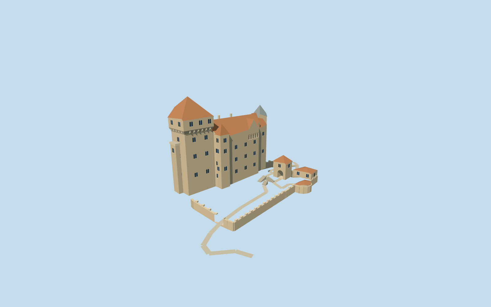

# Liechtenstein Castle

Current Austrian Burg Liechtenstein exterior draft: tall west keep with corbel gallery,round corner oriel and red pyramidal roof;long palas,five open upper arches,grey-roofed east tower,south turret,lower arched gatehouse and mapped curtain wall/current service buildings.

## Evidence and reconstruction

Published dimensions and reconstructed details are separated in spec.json. Primary references:

- [Reference](https://api.openstreetmap.org/api/0.6/map?bbox=16.2685,48.0915,16.272,48.0937)
- [Reference](https://www.burgliechtenstein.eu/de/die-burg.html)
- [Reference](https://www.burgliechtenstein.eu/de/die-burg/zeittafel.html)
- [Reference](https://www.burgliechtenstein.eu/images/site/slider.jpg)
- [Reference](https://www.burgliechtenstein.eu/images/uploads/images/headerbilder_klein/burg03.jpg)
- [Reference](https://www.burgliechtenstein.eu/images/uploads/images/Oliver-Bolch_Burg-Liechtenstein-010.jpg)
- [Reference](https://www.burgliechtenstein.eu/images/uploads/images/Burg/Aborttrum.1jpg.jpg)

Five existing shared256-square material graphs,flat glass,linear tints and metric repeats. No embedded/new image,downloaded mesh or photo texture. Natural rocky ridge is separate terrain.

## Model and axes

5,371 triangles; 16,113 vertices; 6 material groups; 648,248 bytes. Native bounds: -25.041, -8.300, -19.945 to 49.943, 39.000, 47.877. Source hash: `sha256:4ba0f40b52b388cf74f02c6f243a2e4b70d7db25a7081043696efd79f596e641`.

{"up":"+Y","longitudinal":"West keep is at negative plan X; palas/east tower and upper forecourt extend east. Native +X east,+Z south;heading0.","origin":"Exact-QID map research anchor at main castle;Y0 provisional rock/architectural attachment plane,lower courts below0."}

Exact-QID current castle and separate mapped forecourt components preserve native East/South geography with heading0. Reconstructed vertical sections and facade identity require current-site visual review;no surveyed terrain datum approval.

## Reproduce

Run `node packages/worldgen/scripts/generate-signature-towers.mjs --ids=N0302` (or add `--check`). The generator preserves manually edited masters by checking their baseline hashes. Import through the standard authored-model workflow with optimization disabled; then capture all QA cameras, including shared-surface views.

## Pending work

- Exact-QID current castle and separate mapped forecourt/gate/tower/wall/service buildings retain attribution. Native East/South heading0 and reconstructed west-keep/east-palas placement need actual-site visual approval.
- All vertical dimensions,roof profiles,corbels,oriel/windows,five-arch arcade,terrace steps and contacts are photographic estimates. No primary surveyed architectural height verified.
- Operator references show current exterior restored in the19th century;vanished historic forecourt buildings are excluded. Nearby Schloss Liechtenstein Q1726817 is a different asset and excluded.
- Natural exposed rock ridge and woodland are separate terrain/map data. Isolated architecture captures cannot establish ridge/terrace ground contact;placement remains inactive pending actual terrain review.
- Five existing shared256-square graphs plus flat glass use linear tints and metric repeats. No embedded/new image,downloaded mesh,photo texture or copied drawing.
- Interiors,chapel altar,cistern,surveyed staircase grades,sculpted heraldry and inscriptions are not modeled. Windows use stylized dark blue-grey panes;gate and upper arcade are actual geometric openings at near levels.
- Published photos have no established redistribution license and remain private research. Source contains original traces and measurements with reference metadata only.
- Continuous viewer LOD upgrades,walkable collision and physical ordinary-laptop/phone performance remain pending.

This bundle follows the medium-fi standard. Medium-fi appearance and geographic fit are reviewed separately. Hash-bound visual acceptance is recorded separately after capture inspection.

## Additional geographic data

©OpenStreetMap contributors;Burgverwaltung L.Fasching/Oliver Bolch.
