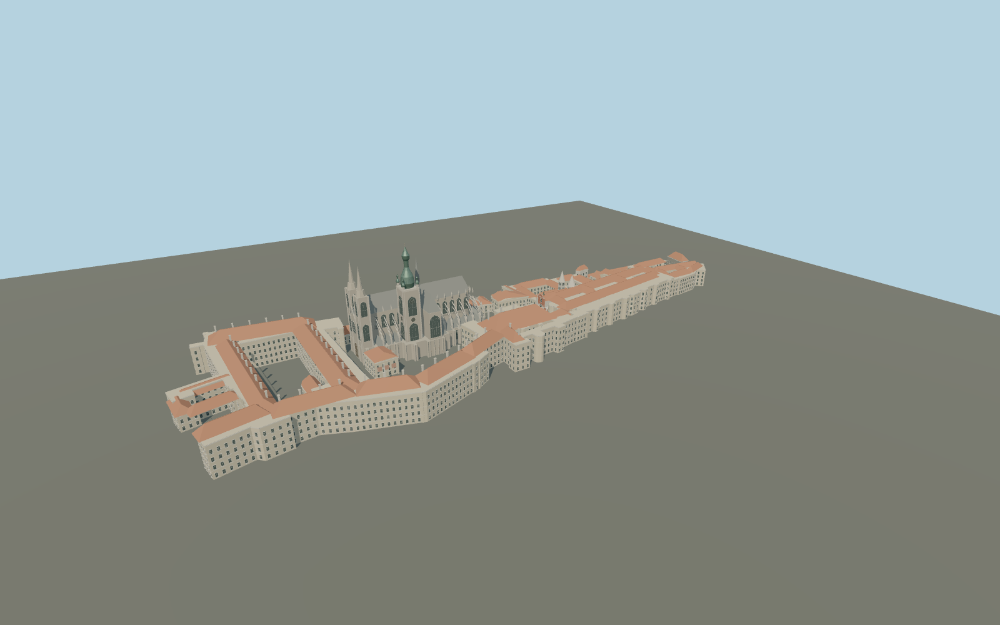

# Prague Castle

Mapped castle complex with open second and third courtyards, St Vitus Cathedral and its unequal Gothic and Baroque towers, St George Basilica, royal palace ranges, Rosenberg and Lobkowicz palaces, Powder and Black towers and the small Golden Lane houses.

## Evidence and reconstruction

Published dimensions and reconstructed details are separated in spec.json. Primary references:

- [Reference](https://www.openstreetmap.org/relation/3312247)
- [Reference](https://www.hrad.cz/en/prague-castle-for-visitors/castle-map)
- [Reference](https://www.hrad.cz/en/prague-castle-for-visitors/objects-for-visitors/st.-vitus-cathedral-10330)
- [Reference](https://www.hrad.cz/en/prague-castle-for-visitors/objects-for-visitors/old-royal-palace-10332)
- [Reference](https://virtualni.praha.eu/towers/cathedral-of-st-vitus-at-prague-castle)
- [Reference](https://virtualni.praha.eu/towers/basilica-of-st-george-at-the-prague-castle)
- [Reference](https://commons.wikimedia.org/wiki/File:Panoramic_view_of_St._Vitus_Cathedral_and_Prague_Castle_grounds.jpg)
- [Reference](https://commons.wikimedia.org/wiki/File:West_facade_of_St._Vitus_Cathedral-Prague.jpg)
- [Reference](https://commons.wikimedia.org/wiki/File:Bazilika_Svat%C3%A9ho_Ji%C5%99%C3%AD-Prague.JPG)

No third-party geometry, photograph or bitmap texture is embedded. Shared surface graphs come from the central library; vertex tints carry model colors. Glazing uses PBR materials; transparent surfaces are declared per model.

## Model and axes

567,918 triangles; 1,142,800 vertices; 10 material groups; 47,961,476 bytes. Native bounds: -279.925, -0.080, -92.091 to 279.465, 99.300, 92.054. Source hash: `sha256:80beee517c6a4c2b3e50ceea71e4e24d6270c97381b6f2b3d11533180f662ff0`.

{"up":"+Y","longitudinal":"+X from western palace toward the eastern gate","front":"+Z toward the southern gardens","origin":"Cached OSM precinct center; provisional base datum"}

Draft geographic registration; original mapped meter frame retained. Cross-site heights and terrain contact must be checked before enabling automatic footprint replacement.

## Reproduce

Run `node packages/worldgen/scripts/generate-signature-towers.mjs --ids=N0240` (or add `--check`). The generator preserves manually edited masters by checking their baseline hashes. Import through the standard authored-model workflow with optimization disabled; then capture all QA cameras, including shared-surface views.

## Pending work

- Maximum exterior fidelity remains pending. Reconstructed exterior is not surveyed as-built geometry; smaller elevations, roof valleys, facade bay spacing and ground levels need verification.
- Cathedral rose tracery, buttresses, portal carvings, saints, heraldic lion and Golden Gate mosaic are incomplete. Geometry indicates architectural form without claiming individually reproduced sculpture.
- Golden Lane colors and roof profiles are approximate; its small houses and northern gallery use mapped plan positions. Daliborka and north-facing defensive details need additional source coverage.
- No interiors, gardens, terrain hill, temporary scaffolding or copied photographs. Palace courtyard holes remain empty and require host terrain.
- Canonical shared limestone, raw limestone, lime plaster, ceramic tile, slate, copper, painted metal, wood and granite graphs are reused; glazing is local PBR.

This bundle contains source geometry, not a claim of maximum-fidelity completion. Hash-bound visual acceptance is recorded separately after capture inspection.

## Additional geographic data

Individual map geometry derives from © OpenStreetMap contributors, ODbL-1.0; map-parts.json records source, date, meter frame and tags. Photographs are linked only; no photographic pixels or third-party mesh are included.
