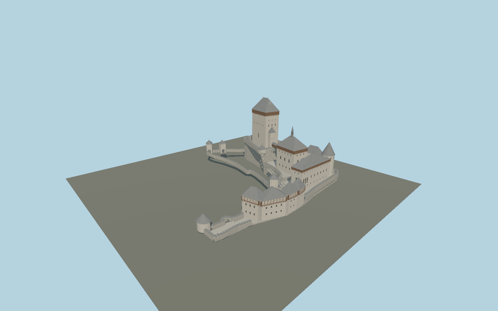

# Karlštejn Castle

Stepped Gothic castle with separately mapped Great and Marian towers, slate roofs, timber galleries, Imperial Palace and round eastern tower, Burgrave House, well tower, gatehouses, crenellated curtains and two elevated covered passages.

## Evidence and reconstruction

Published dimensions and reconstructed details are separated in spec.json. Primary references:

- [Reference](https://www.hrad-karlstejn.cz/en/about-the-castle)
- [Reference](https://www.hrad-karlstejn.cz/en/plan-your-visit/tours)
- [Reference](https://www.openstreetmap.org/relation/6706848)
- [Reference](https://www.openstreetmap.org/way/443238530)
- [Reference](https://commons.wikimedia.org/wiki/File:Karlštejn_(Sedláček,_1889).png)
- [Reference](https://commons.wikimedia.org/wiki/File:View_of_the_castle_Karlstejn_from_the_southeast._Czech_Republic.jpg)
- [Reference](https://commons.wikimedia.org/wiki/File:Burgkarlstein01.jpg)

No third-party geometry, photograph or bitmap texture is embedded. Shared surface graphs come from the central library; vertex tints carry model colors. Glazing uses PBR materials; transparent surfaces are declared per model.

## Model and axes

556,934 triangles; 1,115,998 vertices; 9 material groups; 46,864,188 bytes. Native bounds: -75.400, 0.000, -72.442 to 76.233, 75.000, 71.962. Source hash: `sha256:2094e82b6eb86b1ab78993df6cc09a84d5a65e8fd2f108cb34bf698c82150b85`.

{"up":"+Y","longitudinal":"+X 19.49 degrees north of east","front":"+Z south-southeast","origin":"OSM precinct anchor, provisional lowest architectural contact"}

Draft until terrain levels and fitted individual footprints are verified in the world viewer.

## Reproduce

Run `node packages/worldgen/scripts/generate-signature-towers.mjs --ids=N0247` (or add `--check`). The generator preserves manually edited masters by checking their baseline hashes. Import through the standard authored-model workflow with optimization disabled; then capture all QA cameras, including shared-surface views.

## Pending work

- Maximum fidelity remains pending. Individual roof silhouettes and mapped component positions are authored, but measured elevations, window layouts on obscured faces and nineteenth-century restoration details need refinement.
- Official 60 m Great Tower height differs from OSM 53 m. The seven-meter exposed-base interpretation and stepped terrace elevations are provisional, not a survey.
- The Burgrave roof junctions, palace loggia, gatehouse portals, wall crenellation spacing, dormers and chimney positions use photograph-derived proportions. Interior artworks and rooms are outside this exterior asset.
- Covered bridges are separate raised structures with visible space beneath. Their deck elevations, support details and stairs require on-site dimensions.
- Shared plaster, wood, slate and stone graphs avoid embedded images. Shingle relief, masonry joints and wood boards are procedural details; existing stone surfaces need material-specific weathering.
- Foundation terraces are local contact geometry, not the full castle hill. Approach terrain, surrounding forest and buildings beyond the precinct are excluded.

This bundle contains source geometry, not a claim of maximum-fidelity completion. Hash-bound visual acceptance is recorded separately after capture inspection.

## Additional geographic data

Map geometry © OpenStreetMap contributors, ODbL-1.0. Plan and photographs used as references only; no image pixels or third-party mesh included.
