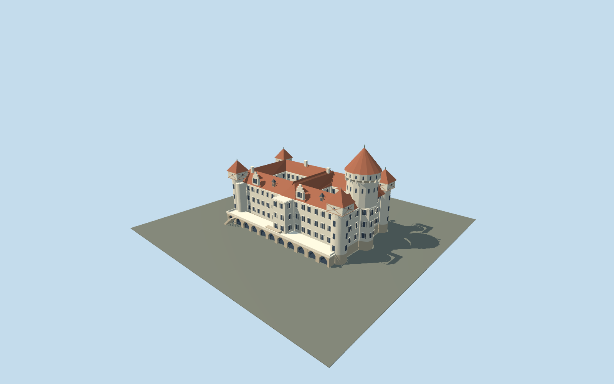

# Konopiště Castle

Cream quadrangular castle with two mapped open courts,terracotta pitched roofs,dominant round keep with corbelled upper gallery/red cone,square-topped corner rooms with broad timber crosses,stepped gabled dormers,stone terrace and open pointed courtyard loggia.

## Evidence and reconstruction

Published dimensions and reconstructed details are separated in spec.json. Primary references:

- [Reference](https://www.zamek-konopiste.cz/en/about/history)
- [Reference](https://www.zamek-konopiste.cz/en/photogalleries/10225-exteriors)
- [Reference](https://www.zamek-konopiste.cz/pamatky/konopiste/fotogalerie/exteriery/imu00001-2-.jpg)
- [Reference](https://www.zamek-konopiste.cz/pamatky/konopiste/fotogalerie/exteriery/IMG_9003.JPG)
- [Reference](https://www.zamek-konopiste.cz/pamatky/konopiste/fotogalerie/exteriery/IMG_8995.JPG)
- [Reference](https://www.zamek-konopiste.cz/pamatky/konopiste/fotogalerie/exteriery/img00l51.jpg)
- [Reference](https://commons.wikimedia.org/wiki/File:Konopiste_hlavni_vez.JPG)
- [Reference](https://commons.wikimedia.org/wiki/File:Konopiste_panorama_z_jizni_terasy.JPG)
- [Reference](https://commons.wikimedia.org/wiki/File:Konopiste_vych_cast_jizniho_pruceli_a_jv_narozni_vez.JPG)
- [Reference](https://commons.wikimedia.org/wiki/File:Konopiste_Castle_courtyard_-_Czech_Republic_-_panoramio.jpg)
- [Reference](https://www.openstreetmap.org/relation/282741)

No third-party geometry, photograph or bitmap texture is embedded. Shared surface graphs come from the central library; vertex tints carry model colors. Glazing uses PBR materials; transparent surfaces are declared per model.

## Model and axes

17,454 triangles; 52,362 vertices; 6 material groups; 2,098,088 bytes. Native bounds: -42.650, 0.000, -25.396 to 42.900, 49.500, 31.800. Source hash: `sha256:f50d844dfd4d4b97c5e379b65a0168348c507bae7dfcdb254c737e860cd1f446`.

{"up":"+Y","lateral":"+X approximately east along cached mapped axis; axis is undirected","longitudinal":"+Z interpreted as the photographed southern terrace side; signed registration pending","origin":"Cached map envelope center;Y0 estimated lower external footing,Y4.8 estimated courtyard/terrace deck."}

Current original approximate exterior on cached mapped wall rings;inactive until real-site review.

## Reproduce

Run `node packages/worldgen/scripts/generate-signature-towers.mjs --ids=N0288` (or add `--check`). The generator preserves manually edited masters by checking their baseline hashes. Import through the standard authored-model workflow with optimization disabled; then capture all QA cameras, including shared-surface views.

## Pending work

- Original approximate current exterior on the full cached mapped wall rings and two courtyard holes. Tower circles,upper rooms,roof ridges,dormers,terrace and loggia are estimated controls,not a measured architectural survey.
- All heights are estimates;modeled maximum49.5m. One mapped level is inconsistent with inspected facade and is not treated as documented storeys. North corner upper rooms and courtyard bay are less certain than the photographed southern facade/main keep.
- Four existing shared256²graphs:lime plaster,limestone,ceramic tile and timber. Linear palette tints,metricUVs,flat architecture and faceted round towers. No copied photographs,unique textures,baked shadows orAO.
- Thin balusters,spires/flags,shutter slats,masonry joints,statuary,lettering,microbevels and full interiors omitted. Railings are chunky panels;terrace arches contain opaque glass panes,upper court loggia is genuinely open.
- Synthetic Bohemian-townhouse neighbors and flat review ground are style comparisons,not real-site evidence. Inactive draft,replaceFootprint=false. Signed orientation,roof/tower/terrace fit,height datum and host terrain remain pending.
- Preloaded forced-LOD camera samples do not certify automatic selection,network upgrades,subframe shimmer or physical-device frame timing.

This bundle follows the medium-fi standard. Medium-fi appearance and geographic fit are reviewed separately. Hash-bound visual acceptance is recorded separately after capture inspection.

## Additional geographic data

© OpenStreetMap contributors;National Heritage Institute/official Konopiště operator;primary photographers Lukáš Kalista and Sergey Ashmarin (external references).
