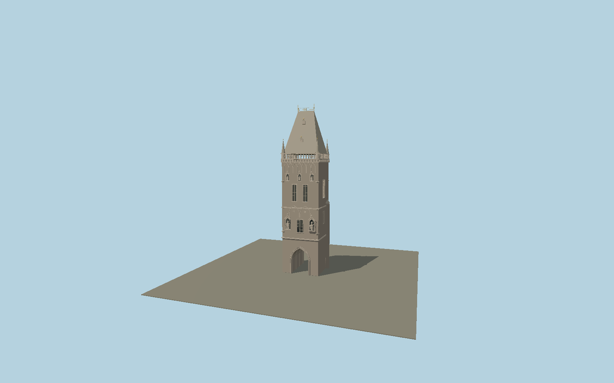

# Powder Tower

Prague’s current Gothic city gate: open pointed portal and ribbed passage, royal statues and canopies, heraldic gallery, corner spires, high chisel slate roof, paired dormers, golden ridgework and mapped stair turret.

## Identity and geometry

Catalog N0570, [Q1488700](https://www.wikidata.org/wiki/Q1488700). The municipal operator gives the total height, gallery elevation and corner spire dimensions. Exact mapped outline supplies the rectangular body, corner turrets and eccentric stair turret; current official photographs determine roof pitch, dormers, carved facade stages and weathered sandstone colors.

Exact-QID mapped centroid with the actual pavement at Y=0; the historical buried moat foundation is excluded. +Z is the east portal facing Náměstí Republiky; −Z is the Celetná Street portal; +Y is up. The geographic proposal identifies its anchor and orientation evidence separately from remaining terrain and azimuth uncertainty.

Source facts and measured references are recorded in spec.json. References: [1](https://prague.eu/en/objevujte/powder-gate-tower-prasna-brana/), [2](https://prague.eu/en/550-copy/), [3](https://www.openstreetmap.org/way/27124370). Reference pages and images are not redistributed.

## Original source and shared materials

Geometry is authored in `packages/worldgen/scripts/gothic-heritage-tower-models.mjs`. Shared material graphs with metric repeat UV0 and original vertex tints; GLB PBR fallback remains self-contained. No per-model texture duplication. No third-party mesh or photograph is embedded.

128,240 triangles; 262,636 vertices; 5 material groups; 10,996,920 source bytes. Source hash: `sha256:ffe24074f2f0e17162e4cf211cf9babf4b23fbf0d1ead17ca04979af1864c818`. Geometry validation checks finite Float32 coordinates, indices, triangle area and winding before export.

Regenerate with `node packages/worldgen/scripts/generate-heritage-towers.mjs N0570`; add `--check` for reproducibility. The generator refuses to overwrite a master whose hash differs from source.json. Import uses `--no-optimize` to preserve facade recesses.

## Remaining detail and review

- Royal figures and heraldic relief are original polygonal reconstructions based on the photographed facade rhythm, not reproductions of individual inscriptions or coats of arms.
- The present permanent exterior is modeled, including the nineteenth-century roof; temporary maintenance scaffolding is omitted.
- Near/far visual QA, shared-material inspection and maximum-fidelity approval remain pending.

Named near/far cameras are included for lit visual review. A valid export is not maximum-fidelity certification.
