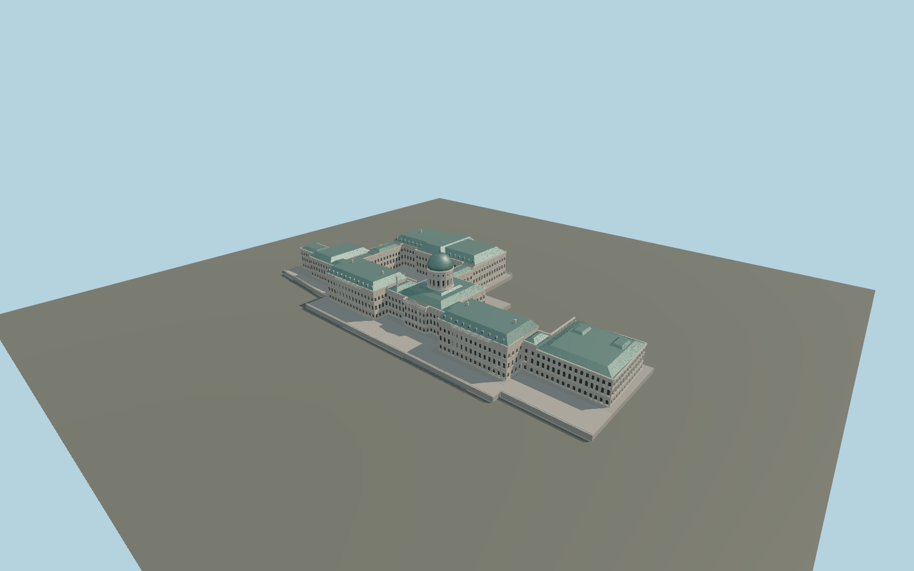

# Buda Castle

Six-wing Royal Palace exterior with long stepped Danube frontage, two tall river pavilions, the ribbed green postwar dome, open Lions Court, library wing, South Range and immediate stone terraces; documented 2021 reference state.

## Evidence and reconstruction

Published dimensions and reconstructed details are separated in spec.json. Primary references:

- [Reference](https://nemzetihauszmannprogram.hu/nhp-strategy-2021.pdf)
- [Reference](https://info.budavaripalotanegyed.hu/)
- [Reference](https://commons.wikimedia.org/wiki/File:Floor_plans_of_Buda_Castle_en.svg)
- [Reference](https://www.pestbuda.hu/en/cikk/20201117_a_bird_s_eye_view_of_the_royal_palace_of_buda_castle)
- [Reference](https://pestbuda.hu/en/cikk/20201121_masterpieces_with_a_view_a_visit_to_the_royal_palace_of_buda_castle)
- [Reference](https://www.openstreetmap.org/relation/6486918)

No third-party geometry, photograph or bitmap texture is embedded. Shared surface graphs come from the central library; vertex tints carry model colors. Glazing uses PBR materials; transparent surfaces are declared per model.

## Model and axes

394,698 triangles; 803,772 vertices; 9 material groups; 33,677,224 bytes. Native bounds: -174.000, 0.000, -94.200 to 175.019, 62.000, 78.200. Source hash: `sha256:96d12a760a6a61c59e37040aad4a25a1b9188ed8719d89b445c1b211ed56fffa`.

{"up":"+Y","longitudinal":"+X 48.909 degrees south of east","front":"Danube frontage toward native -Z; north A pavilion toward -X","origin":"Exact palace map anchor; provisional local terrace base"}

Exact mapped palace anchor and signed frame; current construction-state alignment and terrain fit remain pending.

## Reproduce

Run `node packages/worldgen/scripts/generate-signature-towers.mjs --ids=N0255` (or add `--check`). The generator preserves manually edited masters by checking their baseline hashes. Import through the standard authored-model workflow with optimization disabled; then capture all QA cameras, including shared-surface views.

## Pending work

- Maximum exterior fidelity remains pending: exact window rhythms, sculptural works, heraldry, roof junctions and library/A-wing roof details require additional bespoke reference work. Architectural ornament is modeled; figurative statues are not substituted with generic objects.
- The temporal reference is 2021. North-wing A/B reconstruction began in 2022; this asset is not a claim about the current construction site or a completed future restoration.
- Heights, dome profile and terrace elevations are inferred. In-world terrain fit and facade orientation review remain pending; replaceFootprint=false.
- Palace interiors, separate Guardhouse, Riding Hall, Mace/Karakash towers, Castle Garden Bazaar and whole Castle Hill terrain are outside this palace exterior asset.
- Master and four independent LODs share central stone, copper, wood and metal surface graphs without embedded images. Physical laptop/phone approval remains pending.

This bundle contains source geometry, not a claim of maximum-fidelity completion. Hash-bound visual acceptance is recorded separately after capture inspection.

## Additional geographic data

Map data © OpenStreetMap contributors, ODbL-1.0. Original deterministic geometry; reference photos and third-party meshes are not embedded.
