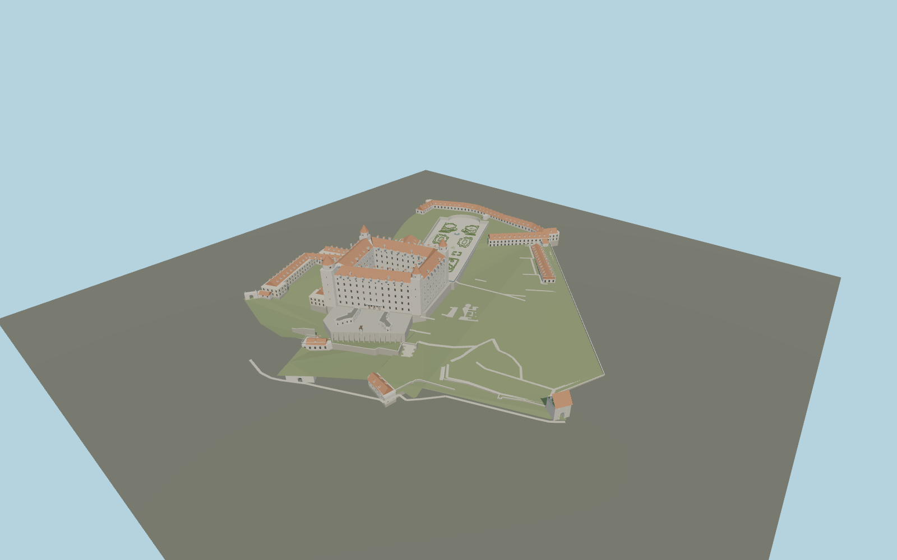

# Bratislava Castle

White four-wing palace around a real open courtyard, unequal square/octagonal corner towers and swept terracotta crowns; curved Court of Honour pavilions, separate gates, mapped barracks, riding hall and Baroque garden.

## Evidence and reconstruction

Published dimensions and reconstructed details are separated in spec.json. Primary references:

- [Reference](https://www.snm.sk/en/museums/museum-of-history/museum-of-history/visit/expositions?clanok=crown-tower-1)
- [Reference](https://www.visitbratislava.com/places/bratislava-castle/)
- [Reference](https://www.visitbratislava.com/wp-content/uploads/2020/01/4DL_hrad_2023_EN_web.pdf)
- [Reference](https://www.nrsr.sk/web/Dynamic/Download.aspx?DocID=448675)
- [Reference](https://www.openstreetmap.org/way/1128350263)
- [Reference](https://www.openstreetmap.org/relation/14610630)

No third-party geometry, photograph or bitmap texture is embedded. Shared surface graphs come from the central library; vertex tints carry model colors. Glazing uses PBR materials; transparent surfaces are declared per model.

## Model and axes

684,637 triangles; 1,388,547 vertices; 10 material groups; 58,208,900 bytes. Native bounds: -173.410, 0.000, -155.332 to 167.572, 57.650, 155.585. Source hash: `sha256:1e9b67723d4932c70c47afbe1a86850894ed9bc183b75aefafbb26deabd32802`.

{"up":"+Y","longitudinal":"+X east-northeast, 58.412 degrees north of east","front":"South entrance toward native -X/+Z; +Z southeast","origin":"Mapped grounds anchor; provisional lower Sigismund Gate datum"}

Draft horizontal map fit; vertical and terrain alignment remain unverified.

## Reproduce

Run `node packages/worldgen/scripts/generate-signature-towers.mjs --ids=N0253` (or add `--check`). The generator preserves manually edited masters by checking their baseline hashes. Import through the standard authored-model workflow with optimization disabled; then capture all QA cameras, including shared-surface views.

## Pending work

- Maximum exterior fidelity pending: detailed surveyed elevations are unavailable. Palace facades, tower clocks, dormers, chimneys, gate profiles and roof junctions need photographic refinement.
- Museum gives Crown Tower height 47 m; OSM tower parts say 31 m. The recipe uses the museum value above a provisional terrace, without claiming that its height datum is verified.
- Landscape field, supporting platforms and terrace heights are interpreted. The four historical garden terraces are not yet modeled to measured levels. Retaining walls, stairs and terrain contact require in-world fitting.
- The original equestrian sculpture is an interpretive silhouette, not a likeness of the Svätopluk artwork. Garden figures, St Elizabeth statue, ornamental carving, mature trees, interiors and underground remains are unfinished or omitted.
- Shared plaster, tile, stone, wood, gravel and metal carry materials; no embedded images. Detailed masters retain modeled tile courses, window joinery and trim. No physical-device benchmark approval is claimed.

This bundle contains source geometry, not a claim of maximum-fidelity completion. Hash-bound visual acceptance is recorded separately after capture inspection.

## Additional geographic data

Map data © OpenStreetMap contributors, ODbL-1.0. Official illustrations and photographs were inspected as architectural references; no third-party photograph or mesh is embedded.
