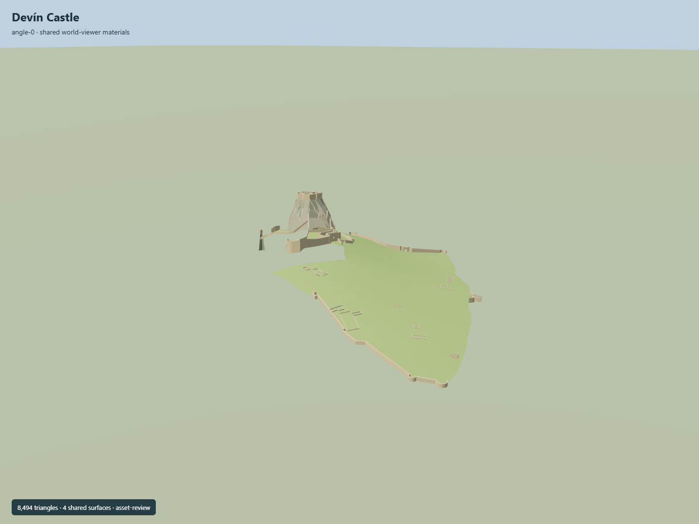

# Devín Castle

Roofless upper ruins raised on a faceted pale cliff, lower terrain-following curtains, Garay palace remnants, Bathory scalloped attic, open middle courtyard and the separate tiny octagonal Maiden Tower on a slender rock spur.

## Evidence and reconstruction

Published dimensions and reconstructed details are separated in spec.json. Primary references:

- [Reference](https://hraddevin.mmb.sk/wp-content/uploads/2025/02/Areal-Hradu-Devin-mapa.png)
- [Reference](https://hraddevin.mmb.sk/wp-content/uploads/2023/07/DJI_0584-1.jpg)
- [Reference](https://hraddevin.mmb.sk/wp-content/uploads/2023/07/Spoznajte-hrad-Devin-foto.png)
- [Reference](https://hraddevin.mmb.sk/en/castle-map/information-and-navigation-system/19-2/)
- [Reference](https://hraddevin.mmb.sk/en/castle-map/information-and-navigation-system/20-2/)
- [Reference](https://overpass-api.de/api/interpreter)
- [Reference](https://hraddevin.mmb.sk/en/castle-map/information-and-navigation-system/21-2/)
- [Reference](https://hraddevin.mmb.sk/en/castle-map/information-and-navigation-system/13-2/)
- [Reference](https://hraddevin.mmb.sk/en/castle-map/information-and-navigation-system/18-2/)
- [Reference](https://s3.amazonaws.com/elevation-tiles-prod/terrarium/14/8964/5683.png)
- [Reference](https://api.openstreetmap.org/api/0.6/map?bbox=16.976,48.1712,16.983,48.1751)
- [Reference](https://hraddevin.mmb.sk/en/castle-map/information-and-navigation-system/26-2/)
- [Reference](https://bucket-mmb-production.up.railway.app/strapi-uploads/hrad_Devin_47400516fa.JPG)
- [Reference](https://bucket-mmb-production.up.railway.app/strapi-uploads/F3_A7294_526f71ad3a.JPG)
- [Reference](https://bucket-mmb-production.up.railway.app/strapi-uploads/hrad_Devin_7bd760ef08.JPG)

No downloaded meshes or photo textures. Own attributed map traces are interpreted with original height controls. Detailed relative terrain is a source study,not a real-site height certification.

## Model and axes

8,494 triangles; 25,482 vertices; 5 material groups; 1,022,556 bytes. Native bounds: -257.288, 0.000, -189.998 to 176.211, 79.800, 186.841. Source hash: `sha256:4e1f74ac95f8b7b8862f5dde97188f631eee334b895805f0e11aceecfac65689`.

{"up":"+Y","longitudinal":"+X east","lateral":"+Z south","origin":"Mapped site frame anchor, Y0 terrain study minimum134.99m; not anchor ground height"}

Site boundary is not a building replacement. Terrain/cliff interpretation requires real-site placement and vertical datum review;inactive draft.

## Reproduce

Run `node packages/worldgen/scripts/generate-signature-towers.mjs --ids=N0292` (or add `--check`). The generator preserves manually edited masters by checking their baseline hashes. Import through the standard authored-model workflow with optimization disabled; then capture all QA cameras, including shared-surface views.

## Pending work

- Ground traces reproduce attributed OSM masonry geometry, not a licensed museum-map tracing. Heights, break profiles, surviving facade associations and stairs are interpretations of museum photographs.
- Coarse DEM smooths away the main cliff. Explicit rock platform and Maiden spur are original approximate forms; absolute datum and host terrain blend need verification.
- Schematic museum map is a navigation diagram and is not used as metric geometry. Research images stay private and are never textures.
- Roofless current ruins are modeled; lost towers, historic roofs, interiors, vegetation, paths outside the core and modern visitor infrastructure are excluded.
- Each level must retain upper cliff/castle, lower enclosure and independent slender Maiden Tower. Real-site terrain, collision, physical-device timing and moving LOD assessment remain pending.
- Five entrance-node associations and six major photo-informed wall openings are authored as real clipped geometry with masonry reveals. Exact aperture dimensions, gate naming association, surviving bay correspondence and modern door states still need review. Ground study is clipped to the attributed site boundary rather than a rectangular patch. Mapped approach routes replace the earlier straight stair guess.

This bundle follows the medium-fi standard. Medium-fi appearance and geographic fit are reviewed separately. Hash-bound visual acceptance is recorded separately after capture inspection.

## Additional geographic data

© OpenStreetMap contributors;Bratislava City Museum;Mapzen Terrain Tiles;Copernicus/EU-DEM.
