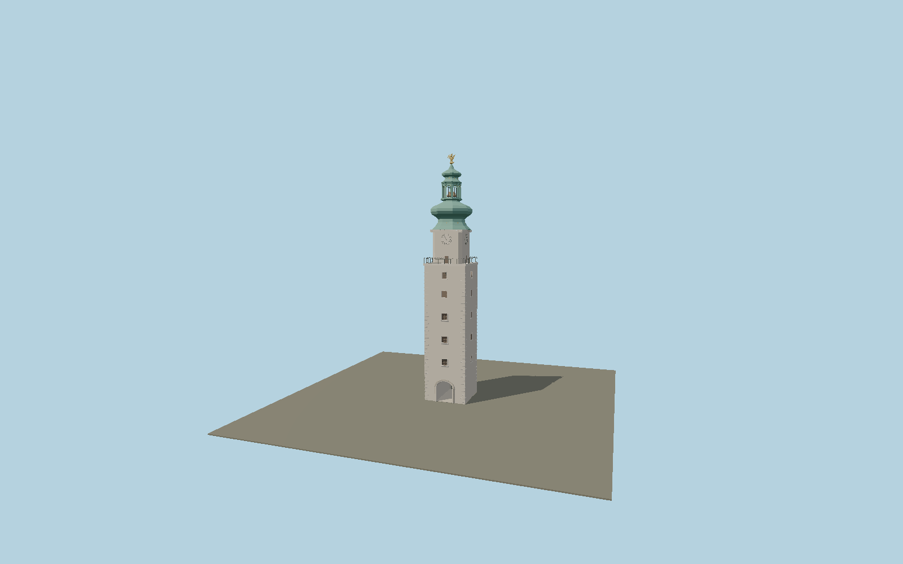

# Michael’s Gate

Bratislava’s restored white city-gate tower, with an open vaulted passage, deeply inset timber windows, fine iron viewing-gallery rail, four Roman clockfaces, an elaborate copper double-bulb lantern and gilded Michael-and-dragon finial.

## Identity and geometry

Catalog N0588, [Q1717975](https://www.wikidata.org/wiki/Q1717975). The municipal restoration announcement specifies approximately 51 m total height and conservation of the Michael statue and two bells. Museum-owned post-restoration overview and close photographs establish the present white facade, gallery, gilded trim, Roman numerals, open octagonal lantern and complex green copper profiles. The exact-identity map outline controls the 8.8 m plan; tier heights and ornament are reconstructed proportionally from the museum photographs.

Exact mapped tower center at passage pavement Y=0. +Z faces south-southeast down Michalská Street; the through passage runs along ±Z; +Y is up. The geographic proposal identifies its anchor and orientation evidence separately from remaining terrain and azimuth uncertainty.

Source facts and measured references are recorded in spec.json. References: [1](https://mmb.sk/lokality/michalska-veza), [2](https://muzeumbratislava.sk/node/104), [3](https://www.visitbratislava.com/places/michaels-gate/), [4](https://bratislava.sk/spravy/rekonstrukcia-michalskej-veze-je-spustena), [5](https://bucket-mmb-production.up.railway.app/strapi-uploads/Michalska_veza_cb7dbe1430.jpg), [6](https://muzeumbratislava.sk/sites/default/files/img_3386.jpg), [7](https://www.openstreetmap.org/way/39391573). Reference pages and images are not redistributed.

## Original source and shared materials

Geometry is authored in `packages/worldgen/scripts/civic-tower-models.mjs`. Shared material graphs with metric repeat UV0 and original vertex tints; GLB PBR fallback remains self-contained. No per-model texture duplication. No third-party mesh or photograph is embedded.

61,216 triangles; 123,736 vertices; 7 material groups; 5,069,436 source bytes. Source hash: `sha256:fb3fe0302cd81842f15bd77dd15fb89e1aa8ccdf56d158d5db02d85753498882`. Geometry validation checks finite Float32 coordinates, indices, triangle area and winding before export.

Regenerate with `node packages/worldgen/scripts/generate-heritage-towers.mjs N0588`; add `--check` for reproducibility. The generator refuses to overwrite a master whose hash differs from source.json. Import uses `--no-optimize` to preserve facade recesses.

## Remaining detail and review

- Sculpted wings, armour, shield and dragon are original polygonal reconstructions informed by the museum’s restoration close-up, not a scan of the historic sculpture.
- Exterior ornament and tier heights are photograph-derived within the published overall height; public clock hands are held at a fixed display time.
- Near/far visual QA, shared-material inspection and maximum-fidelity approval remain pending.

Named near/far cameras are included for lit visual review. A valid export is not maximum-fidelity certification.
