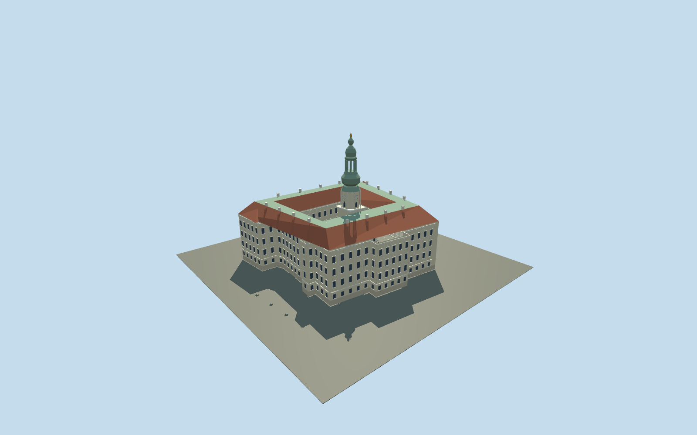

# Kroměříž Castle

Quadrangular Baroque palace with a real mapped open courtyard,cream pilastered facades,red lower roof pitches with broad green upper panels,garden arcade and84m stacked copper tower with an open lantern.

## Evidence and reconstruction

Published dimensions and reconstructed details are separated in spec.json. Primary references:

- [Reference](https://www.zamek-kromeriz.cz/en/tours/chateau-tower/)
- [Reference](https://www.zamek-kromeriz.cz/en/the-chateau-attractions/)
- [Reference](https://www.zamek-kromeriz.cz/wp-content/uploads/2023/12/dji-00013-1.jpg)
- [Reference](https://www.zamek-kromeriz.cz/wp-content/uploads/2023/12/dji-00011-1.jpg)
- [Reference](https://www.zamek-kromeriz.cz/wp-content/uploads/2024/04/bd9a9958.jpg)
- [Reference](https://www.zamek-kromeriz.cz/wp-content/uploads/2023/12/dji-0708-hdr-1-1.jpg)
- [Reference](https://www.zamek-kromeriz.cz/wp-content/uploads/2023/12/dji-0802-hdr-1.jpg)
- [Reference](https://www.zamek-kromeriz.cz/wp-content/uploads/2023/12/dji-0725-hdr-1.jpg)
- [Reference](https://www.openstreetmap.org/relation/33992)

No third-party geometry, photograph or bitmap texture is embedded. Shared surface graphs come from the central library; vertex tints carry model colors. Glazing uses PBR materials; transparent surfaces are declared per model.

## Model and axes

12,897 triangles; 38,691 vertices; 6 material groups; 1,551,244 bytes. Native bounds: -51.791, 0.000, -46.939 to 52.057, 84.000, 46.940. Source hash: `sha256:0213e6c9f0272d90b1e65ef8ae278cf52a049835ceff7b2883ce4c03c0d34dd8`.

{"up":"+Y","lateral":"+X along cached mapped axis; direction remains undirected","longitudinal":"+Z toward garden-facing wing in this original reconstruction","origin":"Cached envelope center; Y0 estimated local palace ground datum."}

Current original approximate exterior on cached mapped rings;inactive until real-site review.

## Reproduce

Run `node packages/worldgen/scripts/generate-signature-towers.mjs --ids=N0286` (or add `--check`). The generator preserves manually edited masters by checking their baseline hashes. Import through the standard authored-model workflow with optimization disabled; then capture all QA cameras, including shared-surface views.

## Pending work

- Original current-exterior approximation. Exact mapped outer/inner rings retained; roof plateau/pitches,palace heights,window rhythm,portico controls and separate tower footprint are estimates.
- Tower84m total and40m viewing-gallery datum documented. Other break heights/widths estimated. Finial rendered as broad symbolic cap;thin rails,clock hands,sculptures,ornament,chimney fittings,full interiors and neighboring cathedral/Mill Gate not authored.
- Shared256²lime plaster,limestone,tile and copper graphs. Linear vertex palettes/metricUVs;no embedded research imagery,unique textures,baked light orAO.
- Synthetic Central-European neighboring style/flat review ground is a style comparison,not Kroměříž site evidence. Inactive geographic draft,replaceFootprint=false; signed orientation,host terrain/base plane and real-site fit pending.
- Resident forced-LOD camera samples do not certify real adaptive selection,network upgrades,subframe shimmer or physical-device frame timing.

This bundle follows the medium-fi standard. Medium-fi appearance and geographic fit are reviewed separately. Hash-bound visual acceptance is recorded separately after capture inspection.

## Additional geographic data

© OpenStreetMap contributors;Archbishop’s Chateau Kroměříž primary factual/photo references.
