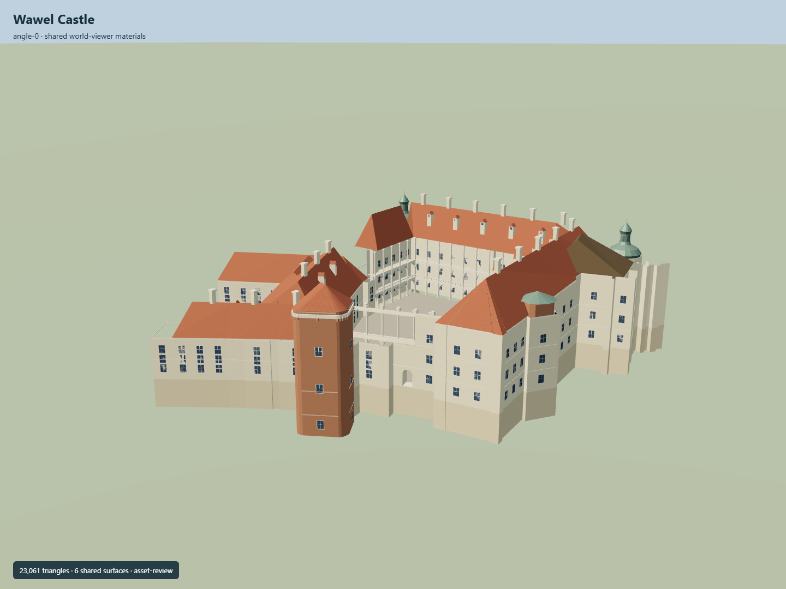

# Wawel Castle

Current Wawel royal palace with open irregular Renaissance courtyard, two arcaded gallery tiers and tall upper columns, steep red roofs, two copper Baroque corner helms, eastern Danish/Jordanka projections, adjacent brick Senator tower and physically open Berrecci gate.

## Evidence and reconstruction

Published dimensions and reconstructed details are separated in spec.json. Primary references:

- [Reference](https://api.openstreetmap.org/api/0.6/map?bbox=19.9319,50.0520,19.9385,50.0565)
- [Reference](https://wawel.krakow.pl/en/information-about-museum)
- [Reference](https://wawel.krakow.pl/en/exhibition-constant/viewing-platform/arcaded-galleries)
- [Reference](https://wawel.krakow.pl/en/architectural-accessibility)
- [Reference](https://www.krakow.pl/odwiedz_krakow/1461,artykul,zamek_krolewski_na_wawelu.html)
- [Reference](https://wawel.krakow.pl/en/exhibition-constant/viewing-platform/viewing-platform)
- [Reference](https://wawel.krakow.pl/media/galleryimage/photoPath/original/crop-g3a9663.jpg)
- [Reference](https://wawel.krakow.pl/media/galleryimage/photoPath/original/crop-dia05227.jpg)
- [Reference](https://wawel.krakow.pl/media/galleryimage/photoPath/original/crop-dia06889-2.jpg)
- [Reference](https://wawel.krakow.pl/media/galleryimage/photoPath/original/crop-092.jpg)
- [Reference](https://wawel.krakow.pl/media/galleryimage/photoPath/original/crop-mg-2580.jpg)
- [Reference](https://wawel.krakow.pl/media/galleryimage/photoPath/original/crop-0605-ii.jpg)
- [Reference](https://plikimpi.krakow.pl/zalacznik/396678/4.jpg)
- [Reference](https://wawel.krakow.pl/media/exhibitionpageslide/photoPath/original/nowa-baszta.jpg)

Six existing shared 256-square graphs, linear tints and central metric UV repeats. Flat glass. No embedded/new image, photo texture, downloaded model or traced printed drawing.

## Model and axes

23,061 triangles; 69,183 vertices; 7 material groups; 2,771,512 bytes. Native bounds: -69.008, 0.000, -67.400 to 63.862, 43.550, 64.550. Source hash: `sha256:585826749e3d3b2f6b5f6510528977aba9aab011b88b6d4c6b26459b7988ff15`.

{"up":"+Y","front":"West Berrecci entry; native +X east and +Z south","longitudinal":"+Z along eastern palace wing; coordinates bake all footprint angles","origin":"Palace research reference anchor. Provisional courtyard attachment Y8.2; Senator tower toe Y0. Actual sloped hill and floor datum unverified."}

Native East/South geometry bakes heading 0 from own attributed map traces. Provisional courtyard attachment Y8.2 and Senator toe Y0 require real terrain and vertical-datum review.

## Reproduce

Run `node packages/worldgen/scripts/generate-signature-towers.mjs --ids=N0299` (or add `--check`). The generator preserves manually edited masters by checking their baseline hashes. Import through the standard authored-model workflow with optimization disabled; then capture all QA cameras, including shared-surface views.

## Pending work

- Exact-QID palace relation and courtyard preserve building identity. Separate roof/tower/passages retain their own attribution; the whole-hill castle polygon is excluded as a building footprint.
- All vertical sections, copper helm profiles, courtyard bay counts, roof ridge placement and floor offsets are original estimates from primary current exterior views. No verified primary surveyed palace height.
- Open courtyard, two arcaded tiers and tall upper columns are modeled. Fine heraldry, courtyard frescoes, sculpture, interior rooms and roof construction details are simplified or excluded.
- Provisional courtyard attachment Y8.2 and Senator toe Y0 account for a lower defensive tower base. Real hill terrain, gate slope, stairs and all floor/deck contacts remain unverified. No embedded hill ground or walkable collision claim.
- Cathedral and its domes/bell towers, detached Sandomierska/Thieves towers, other Wawel Hill buildings and gardens require separate assets; no independent landmark is absorbed into this palace GLB.
- Six existing shared 256-square material graphs plus flat glass use linear tints and central metric UV repeats. No new or embedded image, photo texture or downloaded mesh.
- Synthetic Molen/Earth captures do not verify actual site fit, continuous streaming transitions or performance on physical ordinary laptops and phones.

This bundle follows the medium-fi standard. Medium-fi appearance and geographic fit are reviewed separately. Hash-bound visual acceptance is recorded separately after capture inspection.

## Additional geographic data

© OpenStreetMap contributors; Wawel Royal Castle; City of Kraków.
