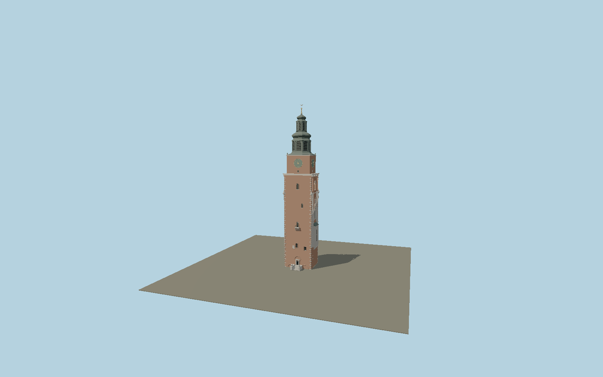

# Town Hall Tower (Kraków)

Kraków’s surviving Gothic town-hall tower with three richly dressed facades, projecting stone oriels, blind tracery and crocketed window gables, a plain north wall and lion stairway, four green Roman clocks, dark copper Baroque helmet and gilded crown with White Eagle.

## Identity and geometry

Catalog N0590, [Q1786361](https://www.wikidata.org/wiki/Q1786361). The museum’s published 75 m height sets the vertical envelope. The exact-identity mapped tower controls plan and orientation. Registry exterior photographs and the museum leaflet elevation establish storey proportions, asymmetric stone cladding, three reconstructed oriels, clock tier and compound octagonal copper roof.

Center of the surviving tower at ground level Y=0; entrance stair projects to native +Z. +Z is the plain north-north-east entrance facade; +Y is up. The geographic proposal identifies its anchor and orientation evidence separately from remaining terrain and azimuth uncertainty.

Source facts and measured references are recorded in spec.json. References: [1](https://muzeumkrakowa.pl/oddzialy/wieza-ratuszowa), [2](https://muzeumkrakowa.pl/oddzialy/historia-6), [3](https://muzeumkrakowa.pl/plik-do-pobrania/811), [4](https://sklep.muzeumkrakowa.pl/produkt/wieza-ratuszowa-przewodnik), [5](https://zabytek.pl/pl/obiekty/krakow-wieza-ratuszowa), [6](https://www.openstreetmap.org/way/25122842). Reference pages and images are not redistributed.

## Original source and shared materials

Geometry is authored in `packages/worldgen/scripts/civic-tower-more-models.mjs`. Shared material graphs with metric repeat UV0 and original vertex tints; GLB PBR fallback remains self-contained. No per-model texture duplication. No third-party mesh or photograph is embedded.

100,224 triangles; 204,064 vertices; 6 material groups; 8,552,612 source bytes. Source hash: `sha256:d9b94bfd15bde66fa59fc142c957f17c951317be85867ed3cebc4e7b0cbcc81a`. Geometry validation checks finite Float32 coordinates, indices, triangle area and winding before export.

Regenerate with `node packages/worldgen/scripts/generate-heritage-towers.mjs N0590`; add `--check` for reproducibility. The generator refuses to overwrite a master whose hash differs from source.json. Import uses `--no-optimize` to preserve facade recesses.

## Remaining detail and review

- Stone tracery, corbels and lions are original polygonal reconstructions from current published views; tiny tool marks, individual damage patches and inscriptions are not transcribed.
- The historical lean magnitude is documented, but its direction is unresolved and not guessed. Clock hands are fixed, and the tower interior and demolished adjoining town hall are outside the exterior asset.
- Near/far visual QA, shared-material inspection and maximum-fidelity approval remain pending.

Named near/far cameras are included for lit visual review. A valid export is not maximum-fidelity certification.
