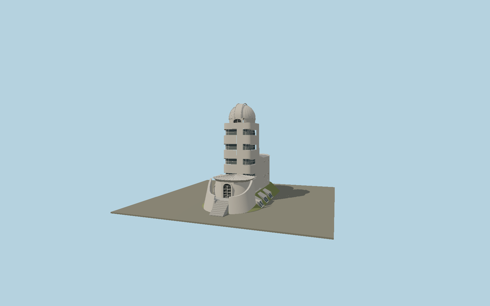

# Einstein Tower

Mendelsohn’s current ochre observatory after the 2023 restoration: sculpted window breasts, wraparound white-framed windows, asymmetric rounded workroom and entrance, flared terrace parapets, stairs, basement hoods and zinc dome with shutter rails.

## Identity and geometry

Catalog N0567, [Q321789](https://www.wikidata.org/wiki/Q321789). Wüstenrot Foundation’s reproductions of Mendelsohn’s 1930 completed-building plans and sections determine stage proportions and asymmetry. The current 2023 exterior photographs determine restored color, windows, terrace and roof details. The modeled exterior begins at the front stair foot and is approximately 18 m tall. The roughly 20 m published height is consistent with including the lower laboratory datum in the drawing; this datum reconciliation is an inference, not an explicit statement in the source.

Mapped main-body center in plan, entrance-stair foot at Y=0; architect’s underground laboratory datum is about 1.7 m below this point. +Z is the northern entrance terrace; −Z is the rounded southern workroom; +Y is up. The geographic proposal identifies its anchor and orientation evidence separately from remaining terrain and azimuth uncertainty.

Source facts and measured references are recorded in spec.json. References: [1](https://www.einsteinturm.com/en/construction-start), [2](https://www.einsteinturm.com/en/renewed-restoration), [3](https://wuestenrot-stiftung.de/wp-content/uploads/2023/10/02_Pressemappe_Einsteinturm_Potsdam.pdf), [4](https://www.aip.de/en/institute/locations/einstein-tower/), [5](https://www.openstreetmap.org/way/27139591). Reference pages and images are not redistributed.

## Original source and shared materials

Geometry is authored in `packages/worldgen/scripts/next-heritage-tower-more-models.mjs`. Shared material graphs with metric repeat UV0 and original vertex tints; GLB PBR fallback remains self-contained. No per-model texture duplication. No third-party mesh or photograph is embedded.

37,135 triangles; 73,991 vertices; 6 material groups; 3,112,916 source bytes. Source hash: `sha256:195288c410f2a06178a3d524735e231b7d90c4dcc085c406472d06f91ac1a46e`. Geometry validation checks finite Float32 coordinates, indices, triangle area and winding before export.

Regenerate with `node packages/worldgen/scripts/generate-heritage-towers.mjs N0567`; add `--check` for reproducibility. The generator refuses to overwrite a master whose hash differs from source.json. Import uses `--no-optimize` to preserve facade recesses.

## Remaining detail and review

- The source follows the 2023 ochre roof/dome appearance, replacing the outdated white-wall/green-dome color combination. Small handmade plaster variations are reconstructed geometrically from photographs.
- The observing shutter is represented in its closed weather state. The photographed earth bank and its sloping daylight windows are included because they define the exterior silhouette; underground telescope/laboratory apparatus is outside this asset.
- Near/far visual QA, shared-material inspection and maximum-fidelity approval remain pending.

Named near/far cameras are included for lit visual review. A valid export is not maximum-fidelity certification.
