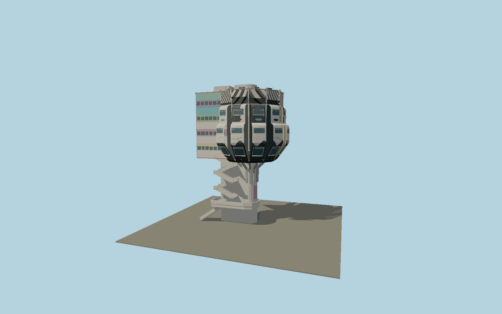

# Bierpinsel

Nine radial aluminum restaurant capsules above a D-shaped lift shaft, branching steel ribs, a rectangular service wing, exposed dogleg stairs, roof machinery and the surviving street-art facade.

## Identity and geometry

Catalog N0614, [Q520281](https://www.wikidata.org/wiki/Q520281). The exact OSM outline and original architect floor plan govern the nine radial capsules and rectangular rear wing. Berlin’s March 2026 LoD2 building DEBE06YYB0000lX5 gives local ground 45.816 m and maximum roof 88.33 m, or 42.514 m above ground; this measured exterior envelope is used instead of silently stretching to the undatumed tourism height 47 m. Occupied tiers and details follow contemporary and September 2026 district photographs. The generalized LoD2 mesh is evidence only, not redistributed geometry.

Center fitted to the nine mapped radial capsule faces; Y=0 at local street level. +X points southeast, away from the northwest rectangular service wing; +Z is southwest; +Y is up. The geographic proposal identifies its anchor and orientation evidence separately from remaining terrain and azimuth uncertainty.

Source facts and measured references are recorded in spec.json. References: [1](https://denkmaldatenbank.berlin.de/daobj.php?obj_dok_nr=09097832), [2](https://www.bauwelt.de/dl/1733389/artikel.pdf), [3](https://www.moderne-regional.de/interview-ursulina-schueler-witte-zum-bierpinsel/), [4](https://gdi.berlin.de/data/a_lod2/atom/LoD2_386_5813.zip), [5](https://www.berlin.de/ba-steglitz-zehlendorf/aktuelles/pressemitteilungen/2026/pressemitteilung.1717697.php), [6](https://www.berlin.de/sehenswuerdigkeiten/5514897-3558930-bierpinsel.html), [7](https://www.tagesspiegel.de/berlin/berliner-chronik-2-juli-1976-808588.html), [8](https://www.openstreetmap.org/way/28503881). Reference pages and images are not redistributed.

## Original source and shared materials

Geometry is authored in `packages/worldgen/scripts/bierpinsel-model.mjs`. Shared material graphs with metric repeat UV0 and original vertex tints; GLB PBR fallback remains self-contained. No per-model texture duplication. No third-party mesh or photograph is embedded.

104,857 triangles; 286,649 vertices; 3 material groups; 11,293,348 source bytes. Source hash: `sha256:7bd4dcc07c1630f9d49e016634adf6ab06dc5cca6d3ad8440c8f856cb862ae81`. Geometry validation checks finite Float32 coordinates, indices, triangle area and winding before export.

Regenerate with `node packages/worldgen/scripts/generate-heritage-towers.mjs N0614`; add `--check` for reproducibility. The generator refuses to overwrite a master whose hash differs from source.json. Import uses `--no-optimize` to preserve facade recesses.

## Remaining detail and review

- Current September 2026 exterior; the restaurant is closed and the district reports recent facade-panel loss. This model does not claim the proposed restoration or reopening has occurred.
- Berlin’s measured 42.514 m exterior envelope differs from the tourism description of 47 m. The difference is preserved in the source evidence; no unverified foundation or roof extension is invented to reconcile it.
- Facade cassette profiles, stair landings and occupied-floor heights are proportionally reconstructed from primary photographs and the architect plan. The street-art mural retains broad color fields and forms without reproducing every painted face, tag, stain or missing panel.
- Adjacent road bridge, subway entrances, commercial signs and interiors are outside the tower asset. The attached street stair and pedestrian landing are included; their connection elevation remains a local photographic reconstruction.
- Near/far visual QA, shared-material inspection and maximum-fidelity approval remain pending.

Named near/far cameras are included for lit visual review. A valid export is not maximum-fidelity certification.
