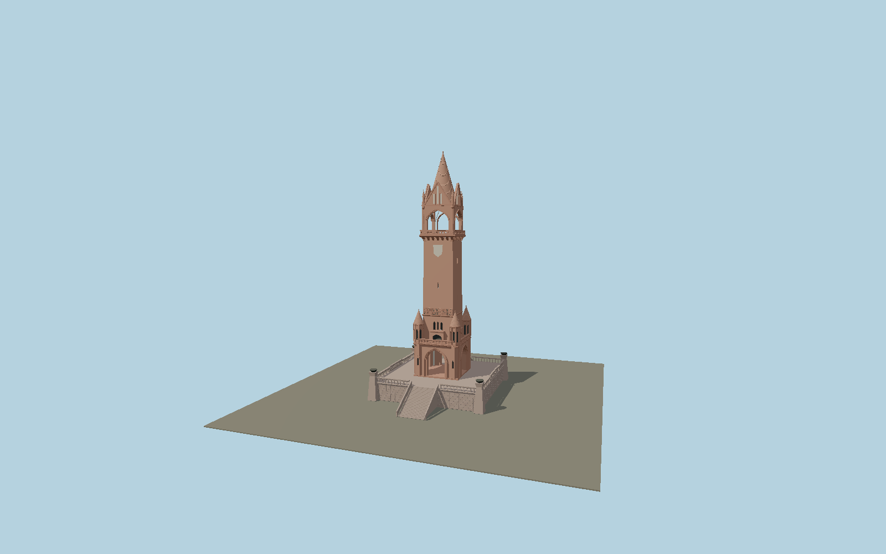

# Grunewald Tower

Red-brick memorial and observation tower on a raised porphyry terrace, with four open pointed memorial-hall arches, clustered corner turrets, pierced gallery rails, tapered inscribed shaft, corbelled upper viewing hall, four decorated gables and a course-built conical brick roof.

## Identity and geometry

Catalog N0616, [Q833787](https://www.wikidata.org/wiki/Q833787). Berlin’s official visitor and district records give a 55 m tower and 36 m viewing floor. The 1899 section supplies proportions, with a four-metre terrace confirmed by the contemporary Gartenlaube account. The mapped 26.068 × 26.045 m outline describes the broad terrace, not the slender shaft. Unreferenced catalog height 56 m is not used.

Tower axis at the lower terrace-stair ground datum; platform is four metres higher. +Z faces the principal stair and the Koenig Wilhelm inscription; signed azimuth awaits review; +Y is up. The geographic proposal identifies its anchor and orientation evidence separately from remaining terrain and azimuth uncertainty.

Source facts and measured references are recorded in spec.json. References: [1](https://www.berlin.de/ba-charlottenburg-wilmersdorf/ueber-den-bezirk/bauwerke/tuerme/artikel.1129193.php), [2](https://www.berlin.de/sehenswuerdigkeiten/3560626-3558930-grunewaldturm.html), [3](https://denkmaldatenbank.berlin.de/daobj.php?obj_dok_nr=09046482), [4](https://commons.wikimedia.org/wiki/File:1899_Grunewaldturm2.gif), [5](https://commons.wikimedia.org/wiki/File:1899_Grunewaldturm1.gif), [6](https://commons.wikimedia.org/wiki/File:Berlin_Grunewaldturm.JPG), [7](https://de.wikisource.org/wiki/Die_Gartenlaube_(1899)/Heft_8), [8](https://www.openstreetmap.org/way/23722446). Reference pages and images are not redistributed.

## Original source and shared materials

Geometry is authored in `packages/worldgen/scripts/grunewald-tower-model.mjs`. Shared material graphs with metric repeat UV0 and original vertex tints; GLB PBR fallback remains self-contained. No per-model texture duplication. No third-party mesh or photograph is embedded.

296,070 triangles; 591,706 vertices; 7 material groups; 24,858,436 source bytes. Source hash: `sha256:89e17f28c7d30c22c0dd80f0ae2a8ab84894d5daee4ebcad82f8642b21877cb4`. Geometry validation checks finite Float32 coordinates, indices, triangle area and winding before export.

Regenerate with `node packages/worldgen/scripts/generate-heritage-towers.mjs N0616`; add `--check` for reproducibility. The generator refuses to overwrite a master whose hash differs from source.json. Import uses `--no-optimize` to preserve facade recesses.

## Remaining detail and review

- Architectural reconstruction in progress; maximum-fidelity and placement approval remain pending.
- The memorial statue, heraldic eagle reliefs, bronze portrait medallions and mosaic vault have not yet been authored. Shield fields are intentionally plain pending source-backed relief work.
- Balustrade motifs, portal profiles, terrace side stairs, lantern fixtures and roof equipment need detailed comparison. The historical woodcut is not proof of the current post-restoration configuration.
- Inscriptions use original line glyphs with the documented wording; they do not reproduce the historic letter carving or casing. The inaccessible internal stair and basement rooms are outside this first exterior pass.
- Near/far visual QA, shared-material inspection and maximum-fidelity approval remain pending.

Named near/far cameras are included for lit visual review. A valid export is not maximum-fidelity certification.
