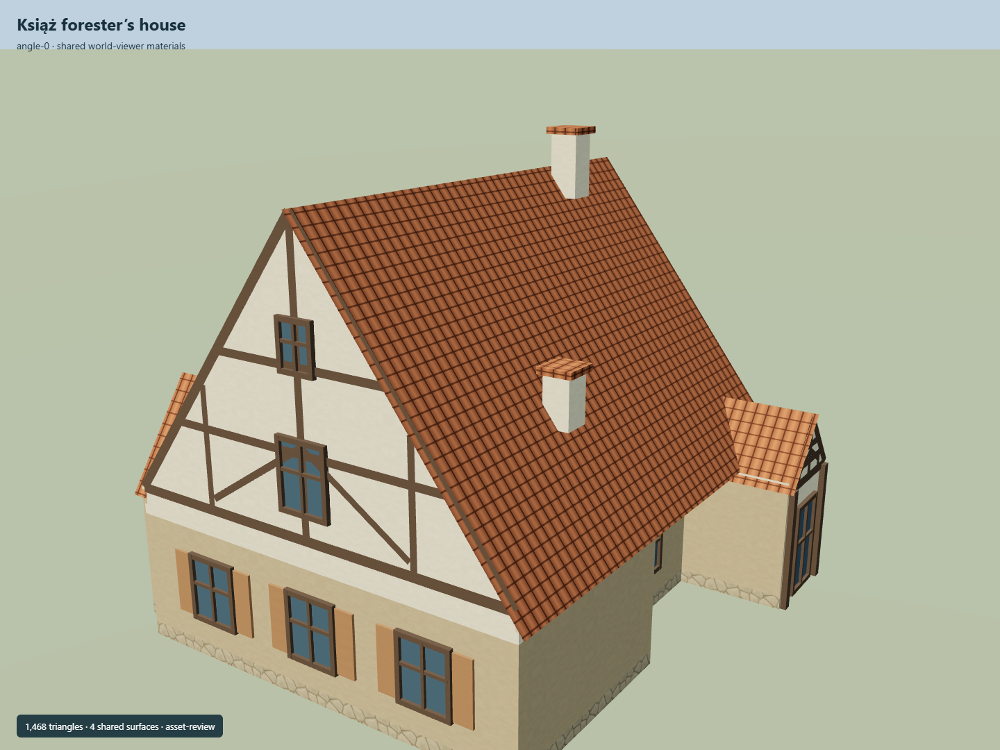

# Książ forester’s house

Own jogged footprint with a steep red tiled roof, cream timber-framed main gable, side dormer, small entrance gable, shutters and two masonry chimneys.

Independent component of [Książ Castle and park complex](../n0291_ksiaz_castle_and_park_complex/README.md). Full site scope and geographic activation remain pending.

## Sources and reconstruction

- [Reference](https://eli.gov.pl/api/acts/DU/2025/1089/text.pdf)
- [Reference](https://commons.wikimedia.org/wiki/File:Le%C5%9Bnicz%C3%B3wka_(Ksi%C4%85%C5%BC).jpg)
- [Reference](https://www.flickr.com/photos/124589265@N07/14162255536/)
- [Reference](https://www.openstreetmap.org/way/262236292)

Original authored geometry under repository license. Mapped outline © OpenStreetMap contributors,ODbL-1.0;linked research photographs are not redistributed.

Own map footprint; native Y0 is estimated local ground contact. Heights, roof profiles, openings and unseen elevations are interpretations. An independent Wikidata identity is not asserted. Facade azimuth and actual geographic fit remain pending.

## Build

Run node packages/worldgen/scripts/generate-ksiaz-service-structures.mjs --ids=KSI_S01 (or --check).

1468 triangles;179376 source bytes;5 merged material groups;no embedded images. Four existing shared plaster, tile, rubble and timber graphs use metric UVs and linear palette tints. Flat muted glazing adds one material. Runtime LODs are separate generated outputs.

Source hash: sha256:40e324c15a97feec647f7960fee5eb3bf365eb2b3ba0fb0b659bbd6cc61488bd
