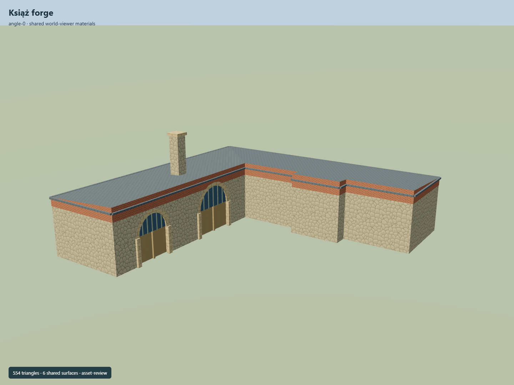

# Książ forge

L-shaped service building with rubble stone walls, brick upper band, two arched timber double doors, shallow roof and a tall masonry chimney.

Independent component of [Książ Castle and park complex](../n0291_ksiaz_castle_and_park_complex/README.md). Full site scope and geographic activation remain pending.

## Sources and reconstruction

- [Reference](https://eli.gov.pl/api/acts/DU/2025/1089/text.pdf)
- [Reference](https://www.flickr.com/photos/124589265@N07/14185032925/)
- [Reference](https://www.openstreetmap.org/way/281941091)

Original authored geometry under repository license. Mapped outline © OpenStreetMap contributors,ODbL-1.0;linked research photographs are not redistributed.

Own map footprint; native Y0 is estimated local ground contact. Heights, roof profiles, openings and unseen elevations are interpretations. Only the mausoleum has a mapped independent Wikidata identity. Entry azimuth and actual geographic fit remain pending.

## Build

Run node packages/worldgen/scripts/generate-ksiaz-park-structures.mjs --ids=KSI_P02 (or --check).

554 triangles;70568 source bytes;7 merged material groups;no embedded images. Shared plaster, tile, sandstone, rubble, brick, timber and metal use metric UVs and linear palette tints as appropriate to each building. Runtime LODs are separate generated outputs.

Source hash: sha256:995c57accb804a35a20e80da5940be526a0c4833615935952bd61306ce36ca7d
