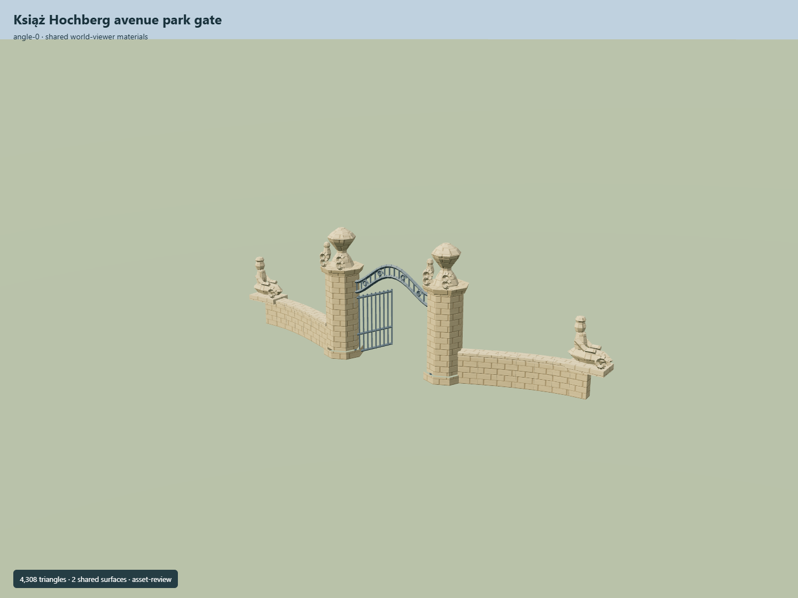

# Książ Hochberg avenue park gate

Chamfered sandstone pillars and urns, curved iron opening and low curved wing walls ending in simplified sphinx-like sculptures.

Independent component of [Książ Castle and park complex](../n0291_ksiaz_castle_and_park_complex/README.md). Full site scope and geographic activation remain pending.

## Sources and reconstruction

- [Reference](https://eli.gov.pl/api/acts/DU/2025/1089/text.pdf)
- [Reference](https://www.flickr.com/photos/124589265@N07/14182699172/)
- [Reference](https://www.ksiaz.walbrzych.pl/turystyka/aktualnosci/renowacja-drugiej-bramy-w-parku)
- [Reference](https://www.openstreetmap.org/node/2858843969)

Original authored geometry under repository license. Mapped point/path controls © OpenStreetMap contributors,ODbL-1.0;linked research photographs are not redistributed.

Own mapped gate point/path axis; native Y0 is estimated local ground contact. Heights, roof profiles, openings and unseen elevations are interpretations. Neither gate claims an independent Wikidata identifier. Exact dimensions, facade sign and geographic fit remain pending.

## Build

Run node packages/worldgen/scripts/generate-ksiaz-park-gates.mjs --ids=KSI_G02 (or --check).

4308 triangles;518944 source bytes;2 merged material groups;no embedded images. Shared sandstone and painted metal use metric UVs and linear palette tints. Runtime LODs are separate generated outputs.

Source hash: sha256:258fee358efca9e1269825c62c3d59f8fb721fab21d9a8230d07848aa58d6b93
