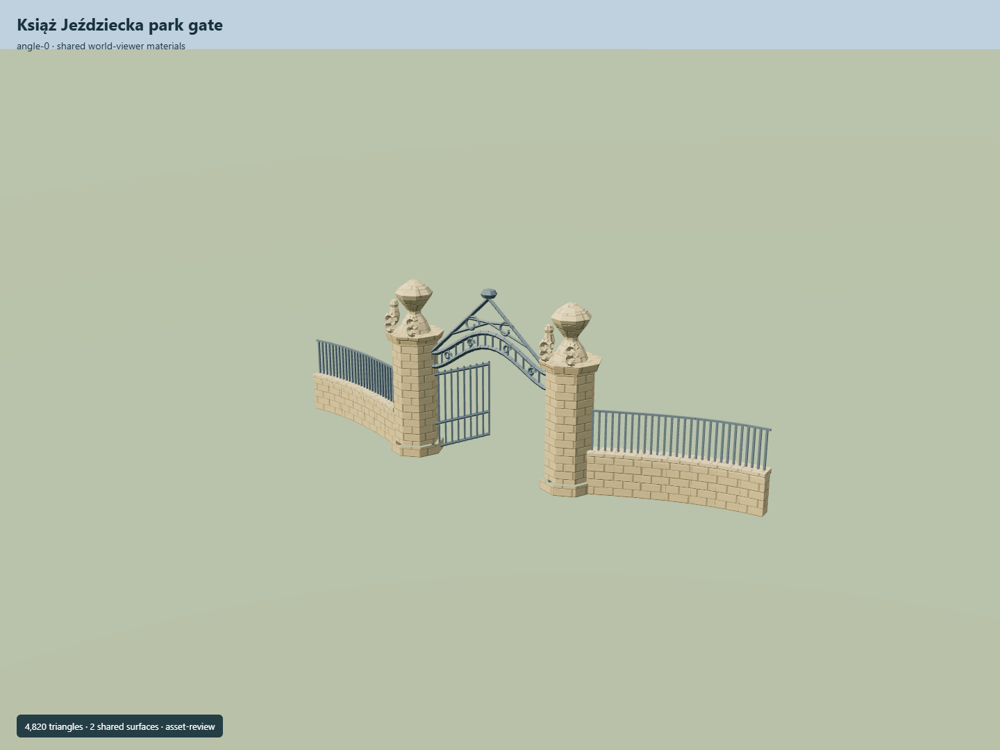

# Książ Jeździecka park gate

Chamfered sandstone pillars and urns supporting a curved iron opening, crowned scroll crest, open leaves and tall wing railings.

Independent component of [Książ Castle and park complex](../n0291_ksiaz_castle_and_park_complex/README.md). Full site scope and geographic activation remain pending.

## Sources and reconstruction

- [Reference](https://eli.gov.pl/api/acts/DU/2025/1089/text.pdf)
- [Reference](https://www.flickr.com/photos/124589265@N07/13998711268/)
- [Reference](https://www.openstreetmap.org/node/2858843981)

Original authored geometry under repository license. Mapped point/path controls © OpenStreetMap contributors,ODbL-1.0;linked research photographs are not redistributed.

Own mapped gate point/path axis; native Y0 is estimated local ground contact. Heights, roof profiles, openings and unseen elevations are interpretations. Neither gate claims an independent Wikidata identifier. Exact dimensions, facade sign and geographic fit remain pending.

## Build

Run node packages/worldgen/scripts/generate-ksiaz-park-gates.mjs --ids=KSI_G01 (or --check).

4820 triangles;580380 source bytes;2 merged material groups;no embedded images. Shared sandstone and painted metal use metric UVs and linear palette tints. Runtime LODs are separate generated outputs.

Source hash: sha256:fb8da12f948fdc96e916023d5941c43adc571f1825e5ae6b10b8131cc79ac7fa
