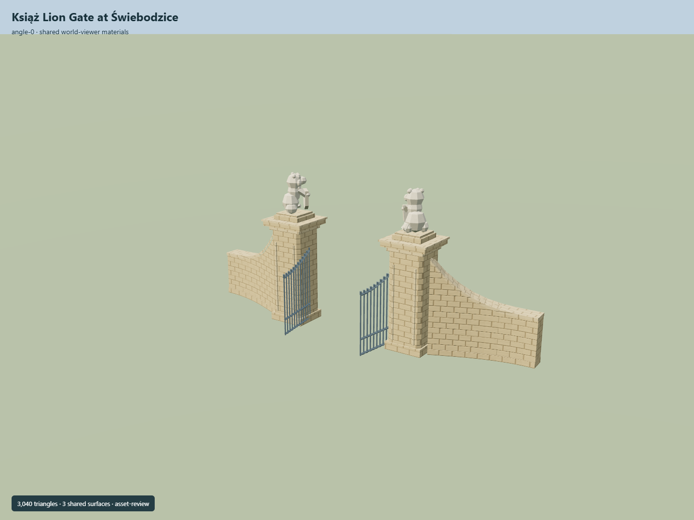

# Książ Lion Gate at Świebodzice

Tall square sandstone piers with broad cornices, seated lions holding shields, rising curved wing walls and open iron leaves; clear sky above the passage.

Independent component of [Książ Castle and park complex](../n0291_ksiaz_castle_and_park_complex/README.md). Full site scope and geographic activation remain pending.

## Sources and reconstruction

- [Reference](https://eli.gov.pl/api/acts/DU/2025/1089/text.pdf)
- [Reference](https://commons.wikimedia.org/wiki/File:PL,_%C5%9Awiebodzice_brama_do_parku_Ksi%C4%85%C5%BC_DSC_0008-001.JPG)
- [Reference](https://www.openstreetmap.org/node/2618881852)

Original authored geometry under repository license. Mapped point/path controls © OpenStreetMap contributors,ODbL-1.0;linked research photographs are not redistributed.

Own mapped gate point/path axis; native Y0 is estimated local ground contact. Widths, heights, lion facing and wall curves are photographic interpretations. No independent Wikidata identity is claimed. Exact dimensions, signed facing and terrain fit remain pending.

## Build

Run node packages/worldgen/scripts/generate-ksiaz-park-gates.mjs --ids=KSI_G03 (or --check).

3040 triangles;367248 source bytes;3 merged material groups;no embedded images. Shared coursed sandstone, raw sandstone carvings and painted metal use metric UVs and linear palette tints. Runtime LODs are separate generated outputs.

Source hash: sha256:85c07fbab93204b8c3c36cf789d163a4c3bbff45187657c676a6b01bc0610ccf
