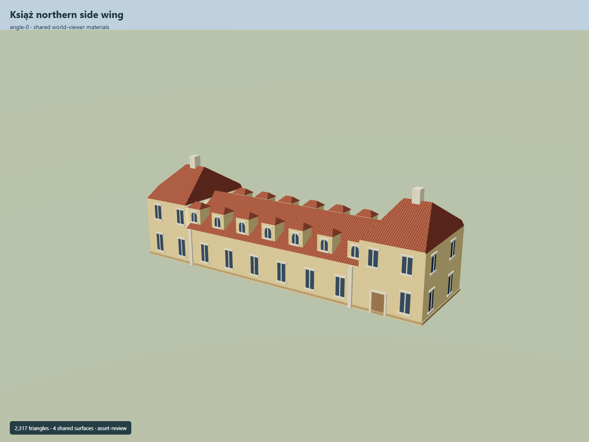

# Książ northern side wing

Pale yellow elongated side wing:lower central range with repeated dormers and raised two-floor end pavilions beneath red tile roofs.

Independent component of [Książ Castle and park complex](../n0291_ksiaz_castle_and_park_complex/README.md). Full site scope and geographic activation remain pending.

## Sources and reconstruction

- [Reference](https://eli.gov.pl/api/acts/DU/2025/1089/text.pdf)
- [Reference](https://www.ksiazhotel.pl/hotel)
- [Reference](https://ksiazhotel.pl/pokoj-2os-komfort-oficyna)
- [Reference](https://commons.wikimedia.org/wiki/File:Ksiaz_w_jesiennej_scenerii.jpg)
- [Reference](https://www.openstreetmap.org/way/236837153)

Original authored geometry under repository license. Mapped outline © OpenStreetMap contributors,ODbL-1.0;linked research photographs are not redistributed.

Own map footprint;native Y0 is estimated local ground contact. Heights,roof profiles,openings and facade facing are interpretations. No independent Wikidata identity is assigned. Hotel Zamkowy membership is unconfirmed.

## Build

Run node packages/worldgen/scripts/generate-ksiaz-entrances.mjs --ids=KSI_A02 (or --check).

2317 triangles;281256 source bytes;5 merged material groups;no embedded images. Shared plaster,tile,sandstone and gatehouse bronze use metric UVs and linear palette tints. Runtime LODs are separate generated outputs.

Source hash: sha256:3ab5df30de3718dd8552a6ef0fdb55bbee4c3713deb28897d8f4cdd71bf4d01f
