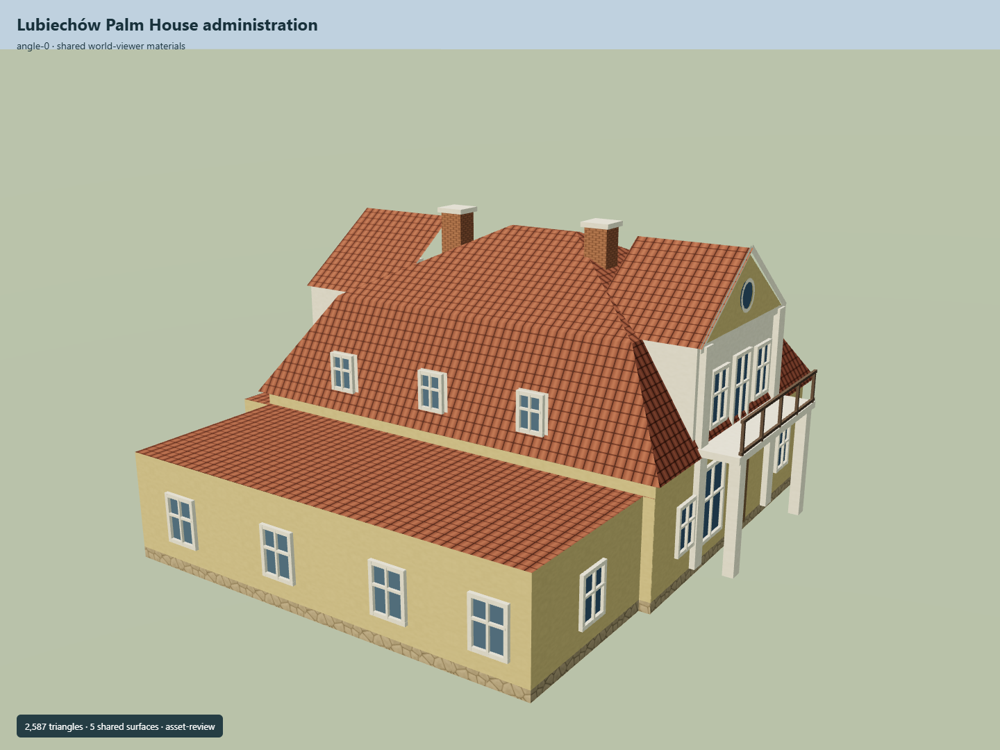

# Lubiechów Palm House administration

Own office outline with southern extension, broken hip roof, east oculus pediment and balcony, west arched pediment and pale pilasters.

Independent component of [Książ Castle and park complex](../n0291_ksiaz_castle_and_park_complex/README.md). Full site scope and geographic activation remain pending.

## Sources and reconstruction

- [Reference](https://eli.gov.pl/api/acts/DU/2025/1089/text.pdf)
- [Reference](https://zabytek.pl/en/obiekty/g-259451)
- [Reference](https://zabytek.pl/en/obiekty/g-259451/dokumenty/PL.1.9.ZIPOZ.NID_N_02_EN.224651/1)
- [Reference](https://www.openstreetmap.org/way/263010003)

Original authored geometry under repository license. Mapped outline © OpenStreetMap contributors,ODbL-1.0;linked research photographs are not redistributed.

Own map footprints; native Y0 is estimated local ground contact. Original exterior interpretation follows the individual NID 1994 cards and official ensemble plan. Heights, roof profiles, openings, adjoining component associations, present condition and real terrain fit remain pending. An independent Wikidata identity is not asserted.

## Build

Run node packages/worldgen/scripts/generate-ksiaz-palm-services.mjs --ids=KSI_L02 (or --check).

2587 triangles;314112 source bytes;6 merged material groups;no embedded images. Five existing shared plaster, tile, rubble, brick and timber graphs use metric UVs and linear palette tints. Flat muted glazing adds one material. Runtime LODs are separate generated outputs. Research scans and photographs are not redistributed or used as textures.

Source hash: sha256:5c11c192891b6cbffb272b2de252cb335d9e03fb5e44a9dc03a91622c06e52fa
