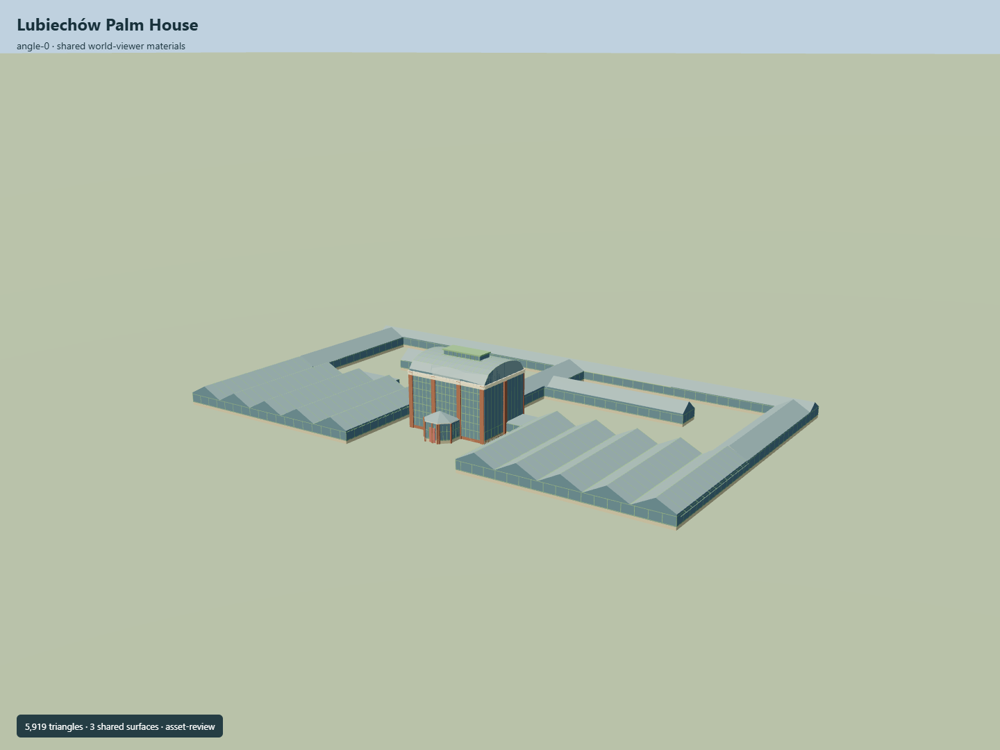

# Lubiechów Palm House

Tall brick-and-glass Palm House with green barrel roof, roof lantern and glazed polygonal porch; connected low glasshouse ranges enclose two true open courtyards.

Independent component of [Książ Castle and park complex](../n0291_ksiaz_castle_and_park_complex/README.md). Full site scope and geographic activation remain pending.

## Sources and reconstruction

- [Reference](https://eli.gov.pl/api/acts/DU/2025/1089/text.pdf)
- [Reference](https://www.ksiaz.walbrzych.pl/turystyka/palmiarnia)
- [Reference](https://www.openstreetmap.org/relation/3532583)

Original authored geometry under repository license. Mapped outline © OpenStreetMap contributors,ODbL-1.0;linked research photographs are not redistributed.

Own Palm House multipolygon retains both courtyards and mapped entrance. Central brick piers, barrel roof, lantern and porch interpreted from primary operator photos; surrounding single-storey glasshouses follow mapped outer/inner rings. Published15m central height is retained to the lantern apex. Roof partitions, pane counts, unseen elevations and real terrain fit remain pending.

## Build

Run node packages/worldgen/scripts/generate-ksiaz-palm-house.mjs --ids=KSI_L01 (or --check).

5919 triangles;713020 source bytes;4 merged material groups;no embedded images. Three existing shared brick, lime plaster and painted metal graphs use metric UVs and linear palette tints. Flat muted glazing adds one material. Two courtyards remain truly open; no embedded images. Runtime LODs are separate generated outputs.

Source hash: sha256:a247e90653e5fddc75a30c42e7cbe41effe296d187a4c9449a488b3d193334e1
