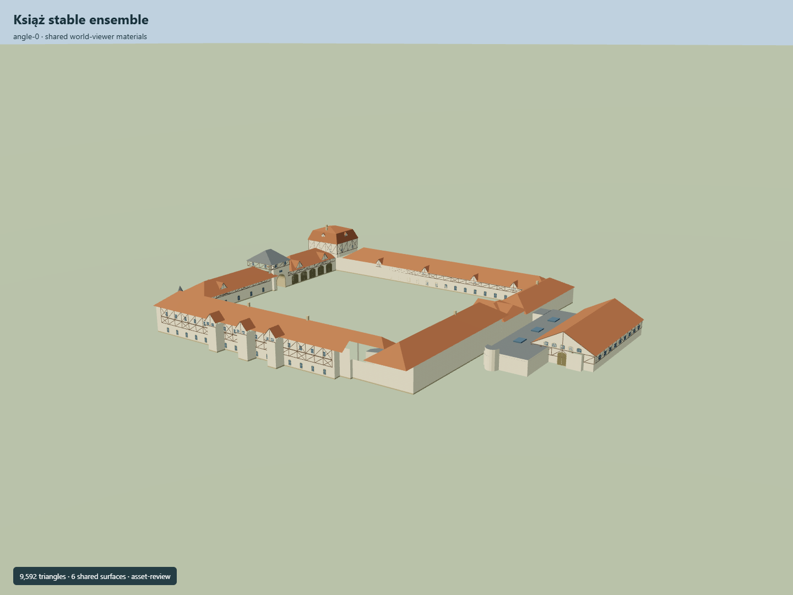

# Książ stable ensemble

Open stable quadrangle with five distinct ranges, arched gate tower, carriage-house bays, red mansard residence tower, cream administration gable, timber framing and the separate covered riding hall with connecting annexes.

Independent component of [Książ Castle and park complex](../n0291_ksiaz_castle_and_park_complex/README.md). Full site scope and geographic activation remain pending.

## Sources and reconstruction

- [Reference](https://eli.gov.pl/api/acts/DU/2025/1089/text.pdf)
- [Reference](https://pcbj.pl/wp-content/uploads/Stado-ogierow-Ksiaz-2005-Izabela-Rajca-Pisz.pdf)
- [Reference](https://www.stadoksiaz.pl/zwiedzanie)
- [Reference](https://www.openstreetmap.org/way/276970733)
- [Reference](https://www.openstreetmap.org/way/238999226)

Original authored geometry under repository license. Mapped outline © OpenStreetMap contributors,ODbL-1.0;linked research photographs are not redistributed.

Own stable quadrangle and adjacent hall rings; Y0 estimated shared contact. Roof profiles, component boundaries and facades interpreted from primary sources. No independent Wikidata identity asserted. Hall association and real geographic/terrain fit remain pending.

## Build

Run node packages/worldgen/scripts/generate-ksiaz-stables.mjs --ids=KSI_E01 (or --check).

9592 triangles;1155164 source bytes;7 merged material groups;no embedded images. Six existing shared plaster, tile, slate, rubble, timber and limestone graphs use metric UVs and linear palette tints. Flat muted glazing adds one material. Open courtyard, secondary entrance and main through-passage retained. Runtime LODs are separate generated outputs.

Source hash: sha256:0ce6a963f22a75546a2485ebe1cd646452208fb272b1889948241440579a3e31
