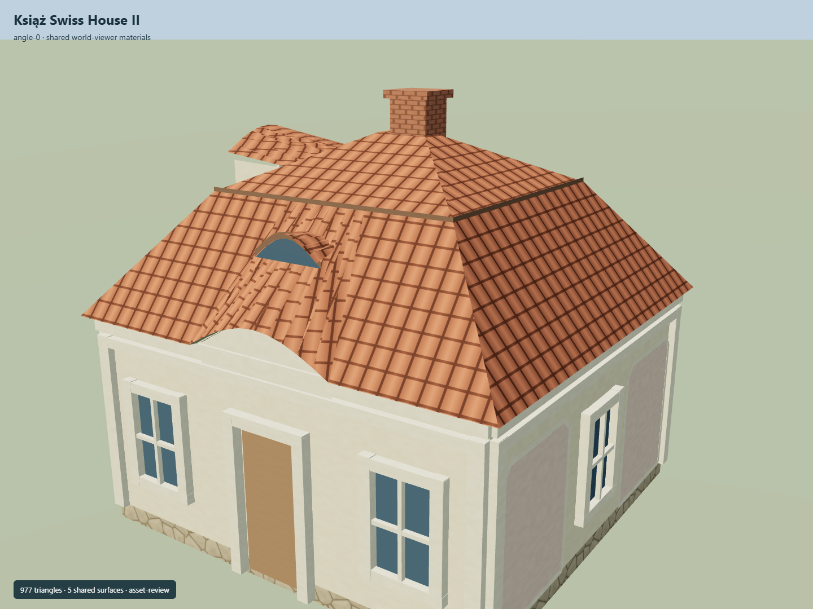

# Książ Swiss House II

Own four-vertex plaster pavilion with pink blind panels, red hipped mansard roof, oval-window dormer, side eyebrow rooflight, curved entry cornice and brick chimney.

Independent component of [Książ Castle and park complex](../n0291_ksiaz_castle_and_park_complex/README.md). Full site scope and geographic activation remain pending.

## Sources and reconstruction

- [Reference](https://eli.gov.pl/api/acts/DU/2025/1089/text.pdf)
- [Reference](https://zabytek.pl/pl/obiekty/g-221860)
- [Reference](https://commons.wikimedia.org/wiki/File:PL,_%C5%9Awiebodzice_dom_szwajcarski_46_DSC_0017.JPG)
- [Reference](https://www.openstreetmap.org/way/255269530)

Original authored geometry under repository license. Mapped outline © OpenStreetMap contributors,ODbL-1.0;linked research photographs are not redistributed.

Own map footprint; native Y0 is estimated local ground contact. Heights, roof profiles, openings and unseen elevations are interpretations. An independent Wikidata identity is not asserted. Facade azimuth and actual geographic fit remain pending.

## Build

Run node packages/worldgen/scripts/generate-ksiaz-swiss-houses.mjs --ids=KSI_S03 (or --check).

977 triangles;120896 source bytes;6 merged material groups;no embedded images. Five existing shared plaster, tile, rubble, brick and timber graphs use metric UVs and linear palette tints. Flat muted glazing adds one material. Runtime LODs are separate generated outputs.

Source hash: sha256:6df3393421d166c74600de0b25129de39016a6b3e775f681e14ae0d76e660a76
