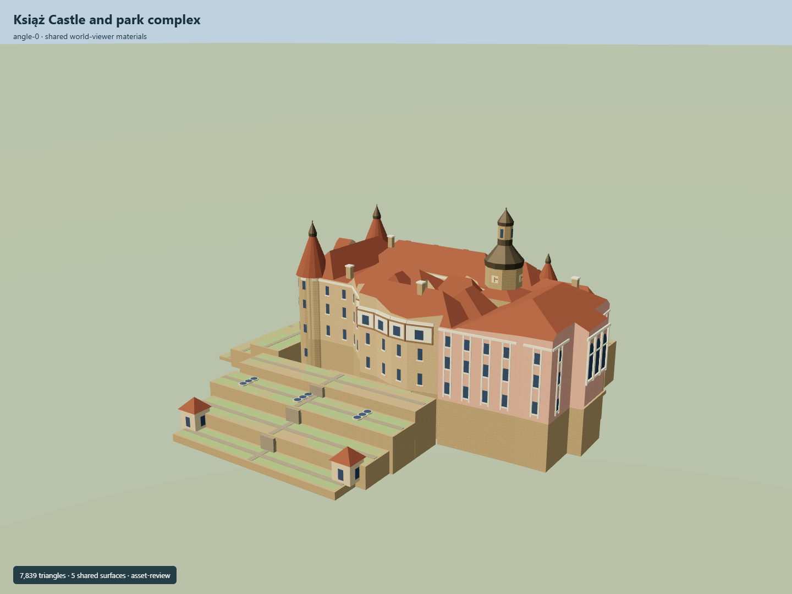

# Książ Castle and park complex

Castle/terrace core:coral-pink Baroque entrance wing,tall domed central lantern tower,paired western steep red roof towers,buff neoRenaissance stone ranges,open courts,half-timber gallery and stepped gardens. Wider heritage ensemble remains incomplete.

## Evidence and reconstruction

Published dimensions and reconstructed details are separated in spec.json. Primary references:

- [Reference](https://www.ksiaz.walbrzych.pl/en/turystyka/zamek)
- [Reference](https://www.ksiaz.walbrzych.pl/en/turystyka/aktualnosci/bajkowy-ogrod-na-skale-czyli-tarasy-zamku)
- [Reference](https://eli.gov.pl/api/acts/DU/2025/1089/text.pdf)
- [Reference](https://architectus.pwr.edu.pl/files/numery/82_01.pdf)
- [Reference](https://www.ksiaz.walbrzych.pl/data/dokumenty/without_car.pdf)
- [Reference](https://commons.wikimedia.org/wiki/File:Ksiaz_w_jesiennej_scenerii.jpg)
- [Reference](https://commons.wikimedia.org/wiki/File:Zamek_ksi%C4%85%C5%BC.jpg)
- [Reference](https://www.openstreetmap.org/relation/9821066)

Mapped castle/court rings reproduce attributed OSM data underODbL. Other geometry is original approximate authoring. Research photographs/maps remain private evidence;no downloaded geometry or unique textures embedded.

## Model and axes

7,839 triangles; 23,517 vertices; 7 material groups; 944,716 bytes. Native bounds: -79.000, 0.000, -55.000 to 49.650, 60.000, 69.000. Source hash: `sha256:450e52235e1bb5e3b91f8576aa0afaefc32aa99c67f9257fc439df355244ca0e`.

{"up":"+Y","lateral":"+X approximately east-north-east;Baroque entrance faces +X","longitudinal":"+Z approximately south-south-east","origin":"Cached castle envelope center;Y0 lowest estimated garden footing,Y13 inferred courtyard. Signed orientation and terrain datum pending."}

Castle/terrace core only;inactive until full site coverage and geographic review.

## Reproduce

Run `node packages/worldgen/scripts/generate-signature-towers.mjs --ids=N0291` (or add `--check`). The generator preserves manually edited masters by checking their baseline hashes. Import through the standard authored-model workflow with optimization disabled; then capture all QA cameras, including shared-surface views.

## Pending work

- Current asset is the castle and an approximate terraced-garden core. Full named park complex is explicitly incomplete;site-parts.json preserves every heritage component group. No whole-complex fidelity approval.
- Mapped castle/courtyard rings retained near;upper geometry and all terrace shapes,levels,roof pitches,facade rhythms and tower positions are original estimates. No common surveyed height datum;operator47m tower runs from inferred courtY13 toY60.
- Three identity features:central domed lantern tower,paired western steep roof towers,and pink Baroque eastwing over stone garden terraces. Street adds half-timber gallery,tall hall windows,selected arcades and terrace pavilions. Interiors,statue likenesses,microjoints,balusters and lettering omitted.
- Five existing shared256²sandstone,lime plaster,ceramic tile,bronze and timber graphs. Metric UVs and linear tints;actual graph means applied to skyline colors. No photographs,unique textures,AO or baked shadows.
- Garden/rock footing and Central-European procedural neighbors are review context,not a surveyed landscape. Garden12levels and27fountain facts inform a simplified preview rather than a precise topographic reconstruction.
- Inactive geographic proposal,replaceFootprint=false. Real-site facing,common datum,full scope and terrain/attachment fit remain pending;resident LOD review does not certify adaptive streaming,network upgrades or physical device timing.

This bundle follows the medium-fi standard. Medium-fi appearance and geographic fit are reviewed separately. Hash-bound visual acceptance is recorded separately after capture inspection.

## Additional geographic data

© OpenStreetMap contributors;Książ Castle operator;Polish official heritage designation;Chorowska/Mruczek;primary photographers.
