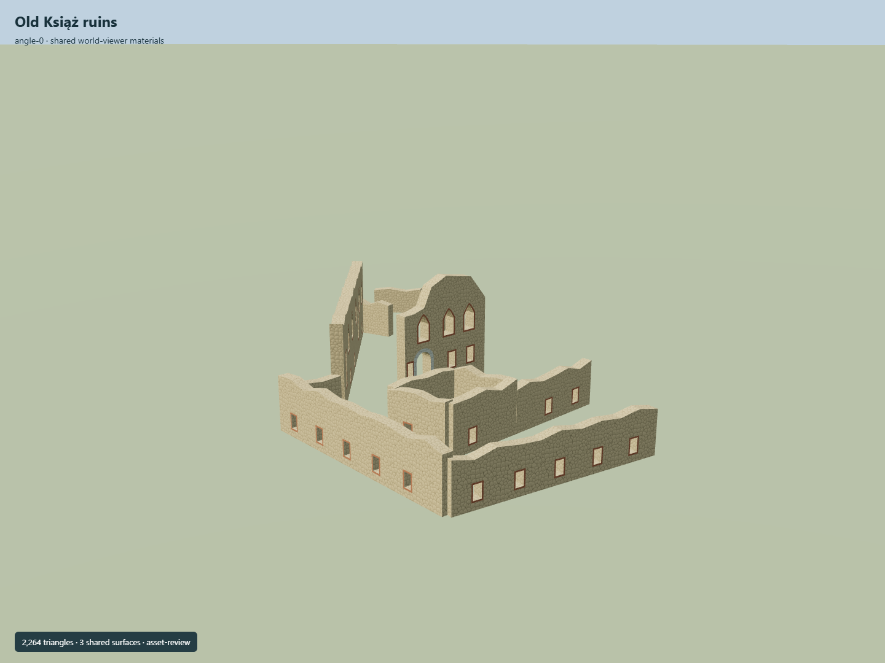

# Old Książ ruins

Roofless romantic ruin with its own mapped masonry traces, broken high facade, real pointed openings, lower rectangular windows, dressed-stone arched portal and low open courtyard walls.

Independent component of [Książ Castle and park complex](../n0291_ksiaz_castle_and_park_complex/README.md). Full site scope and geographic activation remain pending.

## Sources and reconstruction

- [Reference](https://eli.gov.pl/api/acts/DU/2025/1089/text.pdf)
- [Reference](https://www.ksiaz.walbrzych.pl/turystyka/zamek)
- [Reference](https://commons.wikimedia.org/wiki/File:Old_Ksi%C4%85%C5%BC_Castle_02.JPG)
- [Reference](https://commons.wikimedia.org/wiki/File:Stary_Ksi%C4%85%C5%BC_8.jpg)
- [Reference](https://www.openstreetmap.org/way/239074431)

Original authored geometry under repository license. Mapped outline © OpenStreetMap contributors,ODbL-1.0;linked research photographs are not redistributed.

Own mapped ruin envelope and four surviving wall centerlines; the envelope is not filled. Y0 is estimated lowest wall contact. Wall heights, breaks, openings and photo-to-wall associations are interpretations. Mapped Q9386558 is independent of the parent castle. Real terrain fit and current condition remain pending.

## Build

Run node packages/worldgen/scripts/generate-old-ksiaz.mjs --ids=KSI_R01 (or --check).

2264 triangles;274080 source bytes;3 merged material groups;no embedded images. Three existing shared rubble, brick and limestone graphs use metric UVs and linear palette tints. Openings are real through-holes, not opaque panes. No roof or terrain fill is generated. Runtime LODs are separate generated outputs.

Source hash: sha256:49ef03d30f3f36ea4460a0d4d00fc41c0263523c652d116eb03eeddbc848dcc2
