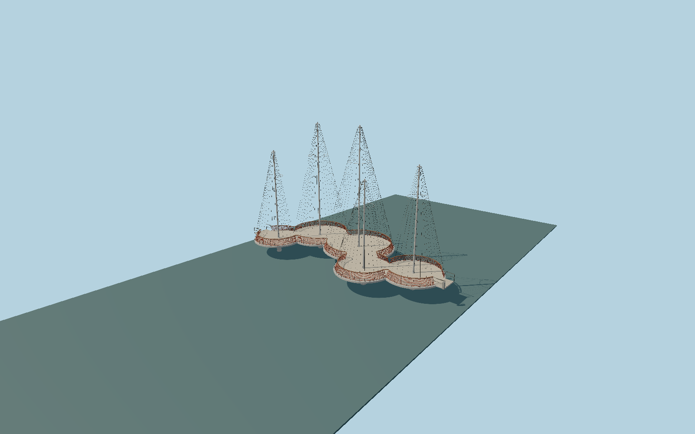

# Circle Bridge (Cirkelbroen)

Five staggered cream decks, white trumpet-shaped supports and tapered masts, ring-supported stainless stays, tomato-red diamond rails and Guariuba handrails; original closed-state Copenhagen exterior.

## Evidence

- [Primary reference](https://olafureliasson.net/artwork/cirkelbroen-2015/)
- [Primary reference](https://olafureliasson.net/press/cirkelbroen)
- [Primary reference](https://steelinfo.dk/files/pdf/dsi/steelday_2012/11.%20Cirkelbroen.pdf)
- [Primary reference](https://cdn.archilovers.com/projects/ebb80424-9531-4fd0-811e-656a4b4de7a1.pdf)

Published dimensions and reconstruction assumptions are separated in spec.json. Source photos were consulted; no photos or third-party geometry are embedded. Map plan attribution: © OpenStreetMap contributors, ODbL-1.0.

## Source

166522 triangles; 12745196 bytes; 4 material groups. SHA256: sha256:15417d6bfa6e0d93de9fbf5a08dafcd1dfcfeb3c48d521765b3458f8bde37257.

Shared surfaces (concrete_plain, metal_painted, wood_plain, metal_stainless) are loaded through the central library; any transparent materials use local PBR parameters. Axis and provisional vertical datum are in spec.json.

Regenerate with node packages/worldgen/scripts/generate-researched-bridges.mjs --ids=N0033; append --check to verify. Import and capture through the standard next-1000 scripts. Geometry validation does not substitute for current-frame visual review.

## Reconstruction limits

- The2012 engineering presentation is a design-stage reference.2015 photos/material fact sheet control visible appearance; as-built shop drawings were not available.
- Individual mast heights, circle-edge offsets,118-stay distribution and small hardware are proportional reconstructions. Maximum fidelity remains pending measured as-built confirmation.
- Sea-level Y0 and2.8m deck datum are provisional. The2.25m published navigation clearance is not a uniform underside height; real quay and water-level fit require site validation.
- The bridge is closed and static. Internal hydraulics, concealed ribs and buried piles are outside this exterior asset; submerged pontoon dimensions are approximate.
- Only short shore connection stubs are included. The20–23m granite-clad quay ramps, adjacent buildings and harbor furniture belong to site context.
- Shared concrete grain approximates the non-slip Matacryl coating; no proprietary product texture or photograph is embedded. Lights are modeled in unlit daytime state.
