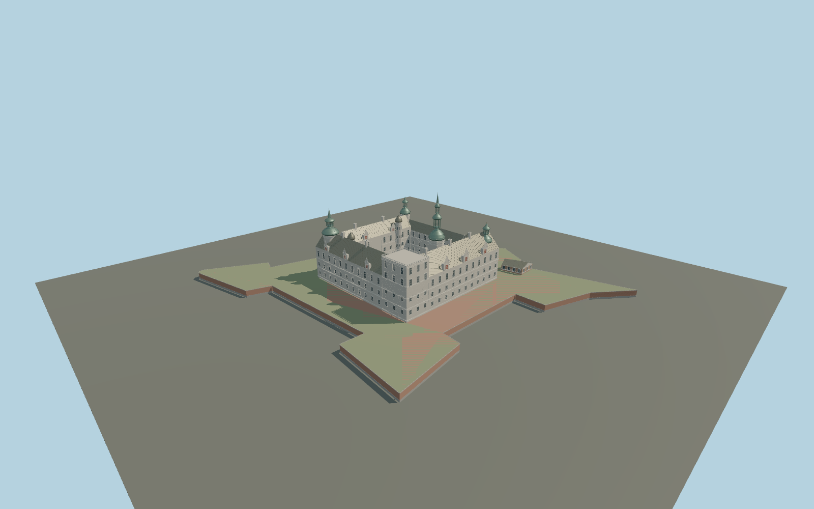

# Kronborg Castle

Four sandstone Renaissance wings around an open courtyard; distinct Trumpeter, Cannon, Kings, lighthouse and Pigeon towers, copper roofs, domed stair turrets, ornate gables, north passage and mapped bastion edges.

## Evidence and reconstruction

Published dimensions and reconstructed details are separated in spec.json. Primary references:

- [Reference](https://www.openstreetmap.org/relation/1588209)
- [Reference](https://kronborg.dk/en/experiences/the-castle-courtyard)
- [Reference](https://kronborg.dk/en/history-of-kronborg)
- [Reference](https://research-api.cbs.dk/ws/portalfiles/portal/58852980/Lise_Llyck.pdf)
- [Reference](https://commons.wikimedia.org/wiki/File:Kronborg_-_Schlossplan.jpg)
- [Reference](https://commons.wikimedia.org/wiki/File:KronborgCastleDenmarkOct152022_03.jpg)
- [Reference](https://commons.wikimedia.org/wiki/File:Kronborg_flygfoto_1,_2021.jpg)
- [Reference](https://commons.wikimedia.org/wiki/File:Kronborg_Courtyard_2018a.jpg)
- [Reference](https://commons.wikimedia.org/wiki/File:Kronborg_Courtyard_2018b.jpg)

No third-party geometry, photograph or bitmap texture is embedded. Shared surface graphs come from the central library; vertex tints carry model colors. Glazing uses PBR materials; transparent surfaces are declared per model.

## Model and axes

337,000 triangles; 672,132 vertices; 10 material groups; 28,246,264 bytes. Native bounds: -109.648, 0.000, -92.368 to 104.678, 64.000, 91.818. Source hash: `sha256:19d963e651b26285ce37f136aac82dd41fe21fb689ca37b4cd863a8501e18e9a`.

{"up":"+Y","longitudinal":"+X approximately north","front":"+Z approximately east","origin":"Cached OSM anchor at provisional fortress wall foot"}

Draft geographic placement; keep courtyard open, preserve source orientation, and verify vertical datum against terrain before activation.

## Reproduce

Run `node packages/worldgen/scripts/generate-signature-towers.mjs --ids=N0244` (or add `--check`). The generator preserves manually edited masters by checking their baseline hashes. Import through the standard authored-model workflow with optimization disabled; then capture all QA cameras, including shared-surface views.

## Pending work

- Maximum fidelity remains pending. Individual exterior reconstruction uses measured horizontal map coordinates and a referenced Trumpeter height; other heights and exact facade openings are proportional estimates.
- Royal heraldic reliefs and figurative sculpture are represented by abstract stonework, not faithful sculptural replicas. Exact gable scrolls, clock faces, roof junctions and copper replacement patches need refinement.
- Fortress edges follow selected mapped moat and embankment lines. Wall height is reconstructed. Full crownwork, ravelins, coastal batteries, moat excavation and surrounding garrison buildings are outside the present source scope.
- Four courtyard stair turrets and corner spires require further dimension checks. The five-meter courtyard datum is provisional and must not be treated as terrain-verified.
- No interiors, temporary scaffolding, photographic textures or recreation of the removed Renaissance fountain. Shared sandstone, limestone, copper, granite, brick, timber, metal and local PBR glazing/turf.

This bundle contains source geometry, not a claim of maximum-fidelity completion. Hash-bound visual acceptance is recorded separately after capture inspection.

## Additional geographic data

Map geometry © OpenStreetMap contributors, ODbL-1.0. Linked photographs are reference only; no third-party mesh or pixels distributed.
