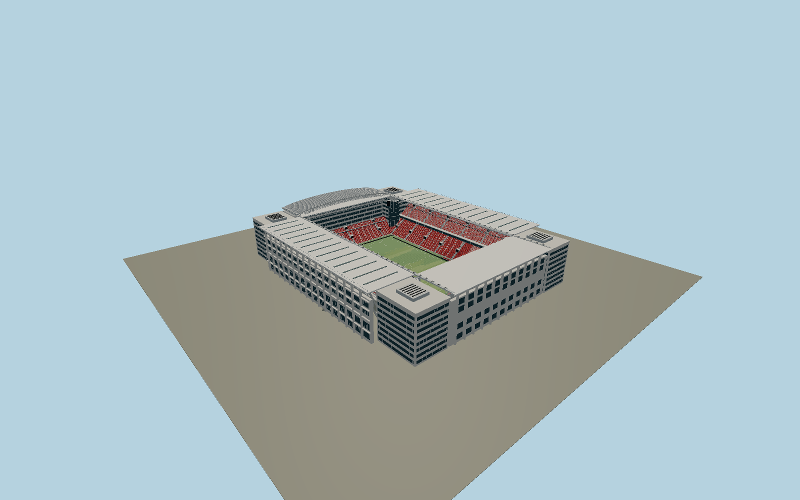

# Parken Stadium — N0707

A rectilinear Danish national stadium with three steep double-tier red stands, the lower 2009 telescopic D stand beneath glazed offices, four cream corner office blocks with field-facing curved stair glazing, original flat canopies and thirteen parked arched roof girders. Open central pitch and visible folded fabric preserve its normal match-day silhouette.

## Identity and evidence

Exact catalog identity **Q33003**. Source facts: `{"published":"Operator:105x68m field; A/B/C have two levels and D one; four corner office towers. The 2026 roof renewal describes13000m2 fabric at35m height on13 girders. Roof engineer gives140x94m opening system. C.F.Moller describes8-storey office corners. The club documents the2009 fixed-plus-telescopic D replacement.","reconstructed":"Street widths and pitch axis follow exact OSM identities; mapped turf polygon includes broad side runoff and is not treated as an84m playing field. Concrete bays, tier rows, roof-truss sections, curved stair radii and glazed office proportions are reconstructed from primary photos. The2009 D stand replaces the historic open end visible in1992 architect photography."}`. The source specification keeps published dimensions separate from reconstructed details.

- https://www.parkenstadion.dk/om-parken-stadion/om-parken
- https://www.parkenstadion.dk/om-parken-stadion/stadions-historie
- https://www.parkenstadion.dk/dit-besog-i-parken/tribune-indgangsoversigt
- https://www.parkenstadion.dk/nyhed/ny-tagdug-pa-parken
- https://knas.dk/projekter/parken/
- https://www.cfmoller.com/p/Parken-Denmarks-National-Stadium-i34.html
- https://www.fck.dk/nyhed/superbest-tribune-staar-klar-medio-2009
- https://www.fck.dk/nyhed/vaeggen-vaek
- https://www.openstreetmap.org/way/26263036
- https://www.openstreetmap.org/way/171015425

Original geometry from public primary dimensions and reference photographs, which are not embedded. Coordinate derivatives ©OpenStreetMap contributors, ODbL1.0.

## Authored geometry and materials

663,256 triangles, 1,212,788 vertices, 7 surface groups; 50,410,504 source bytes. SHA-256: `sha256:ea2b321a316d7498d00f908318cd4b7e5e20d6a4e959f7d0d5afb0f8c98bf84f`. Actual bounds: -82.000, -0.358, -99.500 to 82.000, 40.550, 103.000 m.

Shared canonical material graphs with metric UV repeats in extras.molenSurface; portable glTF PBR factors and vertex colors remain. Dark recesses/lantern panels retain local fallback materials. Shared references: `matgraph:molen.worldgen.material.membrane` (4 × 4 m), `matgraph:molen.worldgen.material.metal_painted` (2 × 2 m), `matgraph:molen.worldgen.material.concrete_plain` (2 × 2 m). Model-native axes: {"up":"+Y","front":"+Z","origin":"Mapped playing enclosure centre at Y0; +Z points northwest to the D family stand, +X southwest toward Oster Alle and the C stand."}.

## Placement proposal

Exact mapped pitch axis determines the northwest/southeast direction; operator street/stand plan places the D end northwest and C along Oster Alle southwest, resolving axis sign. Y0 is the field and street contact datum. Roof and office reconstruction fits the mapped whole stadium envelope. Proposed anchor 12.572352175, 55.702671675 (longitude, latitude), heading -2.334509554594961 radians. Elevation policy: **terrain-contact**. See qa.json for the geographic review status and scope; this placement proposal does not claim surveyed site accuracy. Native ground and pitch datums follow the individual geographic proposal; depressed bowls require their declared terrain cutout.

## Limitations and review

- Static detailed exterior with roof parked open; retractable roof and telescopic stand animation, individual private rooms, sponsor graphics and exact chair inventory are excluded. Unpublished local sections and facade modules are photo-reconstructed rather than as-built measurements.

Portable review uses a flat ground contact fixture.

Near/far fixtures are in `spec.qaCameras`. Float32 finite geometry, triangle degeneracy and winding are checked by the generator. The hash-bound qa.json and capture reports record the scope and status of rendering, shared-material, exterior-fidelity and geographic reviews.

Regenerate with `node packages/worldgen/scripts/generate-stadium-models.mjs --ids=N0707`; add `--check` for reproducibility. Editable component recipes are registered by the imports and study list in `packages/worldgen/scripts/generate-stadium-models.mjs`. The generator protects artist-edited master hashes and preserves import/capture/shared-capture/QA documents.
