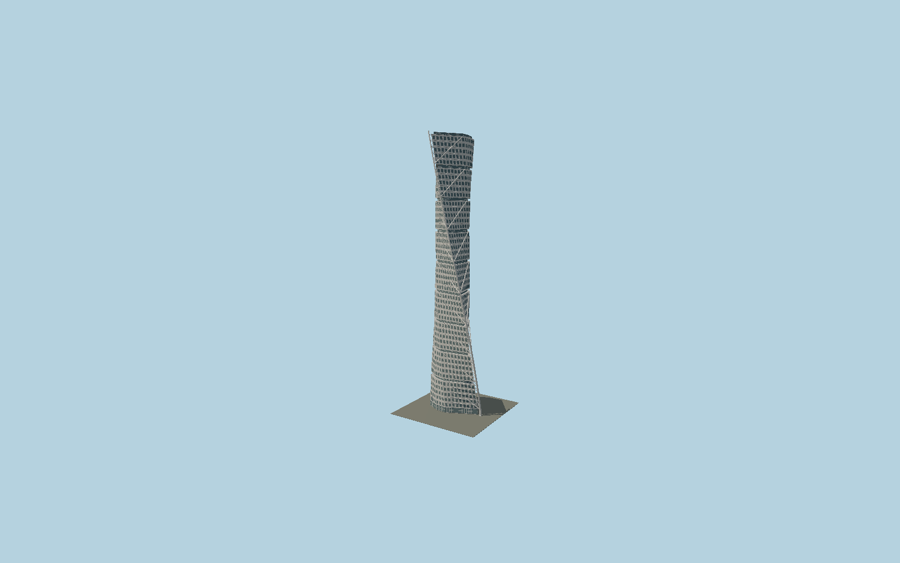

# Turning Torso

Calatrava’s nine twisting five-storey units with discrete blue-gray windows in white aluminum cladding, recessed interstitial floors, circular concrete core and a separate spiraling steel spine with major diagonal and minor floor struts.

## Evidence and reconstruction

Published dimensions and reconstructed details are separated in spec.json. Primary references:

- [Reference](https://calatrava.com/projects/turning-torso-malmoe.html)
- [Reference](https://www.hsb.se/turningtorso/)
- [Reference](https://www.hsb.se/omhsb/goda-exempel/hsb-malmo---turning-torso-certifierad-med-miljobyggnad-idrift-silver/)
- [Reference](https://www.openstreetmap.org/way/30926877)

No third-party geometry, photograph or bitmap texture is embedded. Shared surface graphs come from the central library; vertex tints carry model colors. Glass is an opaque PBR approximation.

## Model and axes

69,986 triangles; 174,602 vertices; 4 material groups; 6,953,720 bytes. Native bounds: -19.882, 0.000, -16.264 to 21.916, 190.071, 24.893. Source hash: `sha256:ac1f133ba378121a997bd7b34c87e60688e49e4c21b846f678ce5ac18ed378fe`.

{"up":"+Y","longitudinal":"+X along the mapped building long axis","front":"+Z","origin":"Ground-level center of exact-QID mapped footprint frame"}

The geographic proposal uses exact-QID OpenStreetMap evidence. Map-derived orientation and estimated architectural details require real-site visual review; preview eligibility is distinct from geographic/fidelity approval. Map attribution: © OpenStreetMap contributors, ODbL-1.0.

## Reproduce

Run `node packages/worldgen/scripts/generate-signature-towers.mjs --ids=N0158` (or add `--check`). The generator preserves manually edited masters by checking their baseline hashes. Import through the standard authored-model workflow with optimization disabled; then capture all QA cameras, including shared-surface views.

## Pending work

- Exterior geometry uses published overall dimensions and map evidence; panel subdivision, connection dimensions and local entrance details are reconstructed. Glazing uses opaque PBR with explicit geometry; no copied facade photograph is embedded.
- Window schedules and exact aluminum-panel curvature are reconstructed. The external truss is detailed but its connections are simplified. The separate gallery/parking building and reflecting pool are excluded.

This bundle contains source geometry, not a claim of maximum-fidelity completion. Hash-bound visual acceptance is recorded separately after capture inspection.
