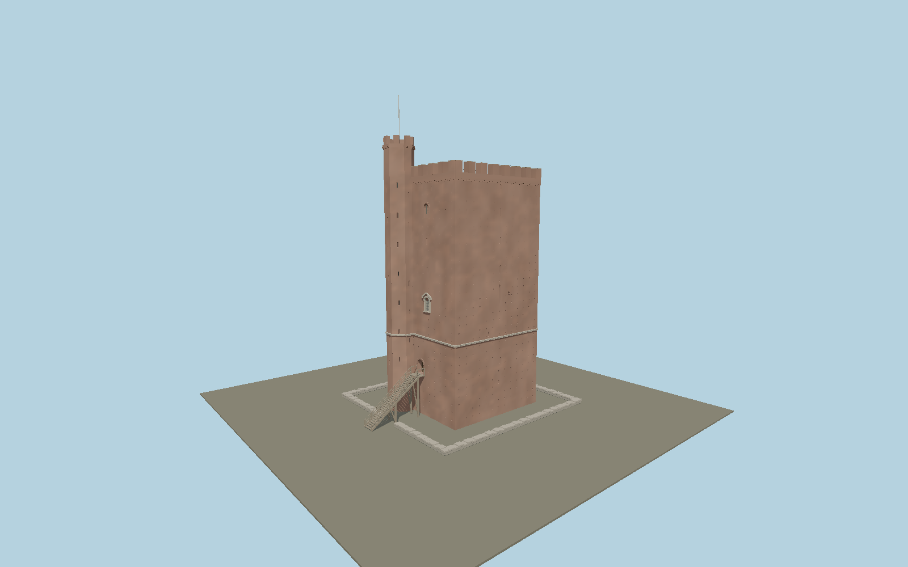

# Kärnan

Helsingborg’s brick keep with its asymmetric octagonal stair turret, eight merlons per main elevation, recessed windows and putlog holes, sandstone belt, raised timber entrance, projecting northwest privy shaft, open roof terrace and low collar-wall remnants. Shared metric materials and original continuous brick weathering.

## Identity and geometry

Catalog N0620, [Q1779457](https://www.wikidata.org/wiki/Q1779457). Mapped main plan is about15.8×16.3 m, compared with the city’s approximately15 m description. Main crenellations reach the mapped34.5 m. Current photographs establish the taller turret and individual facade layouts; turret38.5 m and5.8 m entrance are provisional proportional reconstruction. The1893 section predates restoration, and operator floor labels are not substituted for surveyed exterior datums.

Mapped main footprint frame, including its offset stair turret; Y=0 is reconstructed surrounding ground.. Native -X faces southwest toward the city and sea; native -Z is the northwest privy elevation, +Z southeast.; +Y is up. The geographic proposal identifies its anchor and orientation evidence separately from remaining terrain and azimuth uncertainty.

Source facts and measured references are recorded in spec.json. References: [1](https://helsingborg.se/uppleva-och-gora/kultur-och-museer/the-keep-of-helsingborg/), [2](https://karnan.se/om-karnan/utforska-karnan/), [3](https://stadslexikon.helsingborg.se/krnan/), [4](https://tidsskrift.dk/Hikuin/article/download/149897/192728/330000), [5](https://media.helsingborg.se/uploads/networks/1/2015/02/Bevprogram_HBG_Stadskarna_AtillJ_2002_sbf.pdf), [6](https://www.flickr.com/photos/helsingborgsmuseer/28102443388/in/album-72157690814895900), [7](https://commons.wikimedia.org/wiki/File:K%C3%A4rnan_1.jpg), [8](https://commons.wikimedia.org/wiki/File:K%C3%A4rnan_7.jpg), [9](https://commons.wikimedia.org/wiki/File:K%C3%A4rnan_2025.jpg), [10](https://www.openstreetmap.org/way/236992894). Reference pages and images are not redistributed.

## Original source and shared materials

Geometry is authored in `packages/worldgen/scripts/karnan-model.mjs`. Shared material graphs with metric repeat UV0 and original vertex tints; GLB PBR fallback remains self-contained. No per-model texture duplication. No third-party mesh or photograph is embedded.

76,762 triangles; 91,398 vertices; 7 material groups; 4,215,664 source bytes. Source hash: `sha256:61cf21c5bf16a87254076fb19933f193888cbe3ad4b121e93fd049b16f1b05cb`. Geometry validation checks finite Float32 coordinates, indices, triangle area and winding before export.

Regenerate with `node packages/worldgen/scripts/generate-heritage-towers.mjs N0620`; add `--check` for reproducibility. The generator refuses to overwrite a master whose hash differs from source.json. Import uses `--no-optimize` to preserve facade recesses.

## Remaining detail and review

- Current restored turret height, flagpole height, roof terrace furniture and exterior opening elevations are proportional reconstructions; a measured restoration survey is still required.
- The putlog-hole field and repair tint distribution are original approximations, not a brick-for-brick measured reconstruction. The oratory openings have visible physical reveals; interior rooms are not modeled.
- The low collar-wall remnants and entrance stair are study dimensions. The archaeological predecessor outline, distant Terrasstrapporna, medieval interiors and mobile visitor equipment are outside this exterior asset.
- Near/far visual QA, shared-material inspection and maximum-fidelity approval remain pending.

Named near/far cameras are included for lit visual review. A valid export is not maximum-fidelity certification.
