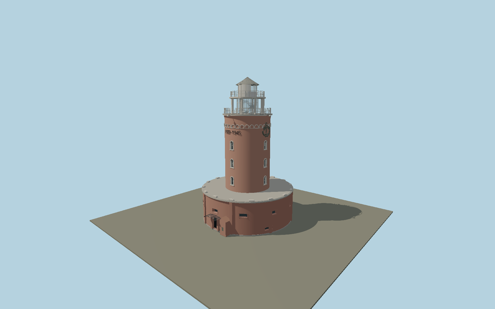

# Kołobrzeg Lighthouse — N0677

Current red-brick lighthouse rising from a broad circular Fort Ujście redoubt, with recessed gun ports, buttresses, stone-capped roof terrace, narrow round-headed tower windows, blind arcade, two raised wartime date inscriptions, maritime memorial relief, white open colonnade, two galleries and a pointed metal lantern cap.

## Identity and evidence

Exact catalog identity **Q11309665**. Source facts: `{"heightMeters":26,"mappedRedoubtDiameterMeters":16.85,"mappedShaftDiameterMeters":8.32,"basis":"Municipal operator publishes26m total and1945 construction on the1770–1774fort. Exact-QID tower and underlying redoubt outlines supply plan sizes. Operator current close and aerial photographs control the colonnade, arcaded frieze, date lettering, entrance canopy, booth and fort openings; internal tier heights and small relief details are photo-proportioned."}`. The source specification keeps published dimensions separate from reconstructed details.

- https://latarnia.kolobrzeg.eu/kontaktlatarnia
- https://latarnia.kolobrzeg.eu/historia
- https://latarnia.kolobrzeg.eu/
- https://latarnia.kolobrzeg.eu/media/photos/10800/xxl.jpg
- https://latarnia.kolobrzeg.eu/media/photos/10790/xxl.jpg
- https://latarnia.kolobrzeg.eu/media/photos/10798/xxl.jpg
- https://www.openstreetmap.org/way/300384923
- https://www.openstreetmap.org/way/294823599
- https://www.openstreetmap.org/node/4426764796

Original geometry and shared procedural materials. Official photographs are research references only; no reference imagery or third-party mesh is embedded or redistributed.

## Authored geometry and materials

94,682 triangles, 174,530 vertices, 9 surface groups; 7,249,720 source bytes. SHA-256: `sha256:1f4dd2ddeaaa9232bd187120e500715a1c72022f7634bdd7984924ea59382633`. Actual bounds: -8.580, 0.000, -8.580 to 8.580, 26.000, 9.685 m.

Shared canonical material graphs with metric UV repeats in extras.molenSurface; portable glTF PBR factors and vertex colors remain. Dark recesses/lantern panels retain local fallback materials. Shared references: `matgraph:molen.worldgen.material.brick` (1.92 × 0.9 m), `matgraph:molen.worldgen.material.plaster_lime` (2 × 2 m), `matgraph:molen.worldgen.material.stone_limestone` (2.4 × 1.6 m), `matgraph:molen.worldgen.material.tile_ceramic` (2.4 × 2.4 m), `matgraph:molen.worldgen.material.metal_painted` (2 × 2 m), `matgraph:molen.worldgen.material.stone_granite` (2 × 2 m), `matgraph:molen.worldgen.material.wood_plain` (2 × 0.25 m). Model-native axes: {"up":"+Y","front":"+Z","origin":"Authored main tower center at local base level; attached ensembles are offset from this origin."}.

## Placement proposal

Exact-QID lighthouse circle and central fort redoubt share the model origin. Explicit main-entry node4426764796 fixes native+Z toward south-southeast; booth and canopy follow the operator entry photograph. Ground datum is the surrounding fort terrace, not the lower quay. Wider fort retaining walls and the river remain map/site context. Proposed anchor 15.554236107, 54.186390113 (longitude, latitude), heading 0.5013149260676516 radians. Elevation policy: **terrain-contact**. This is a reviewable proposal, not a completed site-fit certification. Ordinary ground models use terrain contact; Kiipsaare requires an offshore water/base-height check.

## Limitations and review

- The modeled exterior follows the cited published facts and inspected photographs. Unpublished dimensions and local fittings are explicitly photo-proportioned; no claim of engineering survey accuracy is made.
- Portable PBR and shared metric surfaces are provided. Surface weathering, material color under local lighting and fine facade relief require close render review before maximum-detail acceptance.
- Published26m total and mapped diameters constrain a component reconstruction. Brick course tint, minor restored masonry, service lights and relief linework use shared Molen material style; the maritime memorial is original simplified raised geometry, not a scan. Outer fort landscape terraces, market stalls and detached harbor buildings are not duplicated. Navigational lens performance and historic light bearings are not simulated.

Near/far fixtures are in `spec.qaCameras`. Float32 finite geometry, triangle degeneracy and winding are checked by the generator. Rendering, shared-material alignment, maximum-fidelity and geographic reviews remain pending until their hash-bound reports exist.

Regenerate with `node packages/worldgen/scripts/generate-lighthouse-models.mjs --ids=N0677`; add `--check` for reproducibility. Editable component recipes are in `packages/worldgen/scripts/lighthouse-models.mjs`. The generator protects artist-edited master hashes and preserves import/capture/shared-capture/QA documents.
