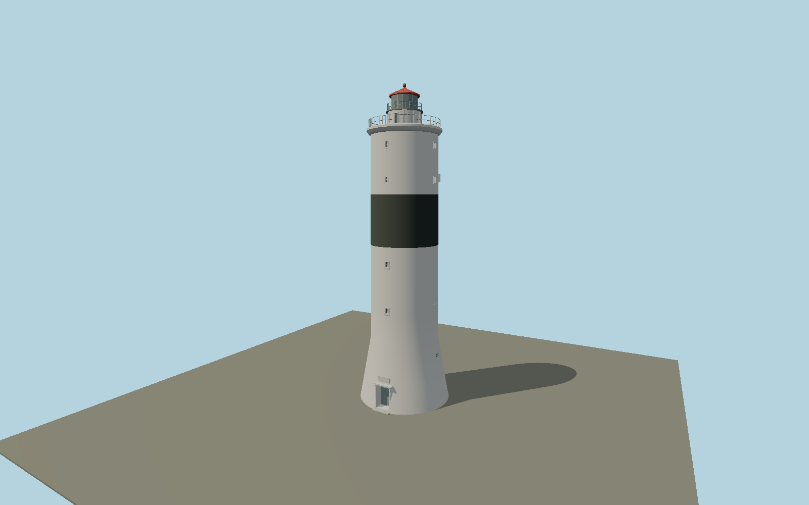

# Långe Jan — N0664

Broad flared limewashed base, deep segmental entrance portal, four ranks of small windows, low oculi, nearly cylindrical shaft with black central daymark, molded white gallery, raised watchroom and red-roofed lantern with exterior cleaning rail.

## Identity and evidence

Exact catalog identity **Q712299**. Source facts: `{"heightMeters":41.6,"baseDiameterApproxMeters":12,"basis":"Sjöfartsverket and the lighthouse-society brochure establish 41.6 m height and approximately 12 m base diameter. Original Göran Andersson and Esbjörn Hillberg photographs establish the flared lower stage, black band, recessed portal, gallery and red cap. Intermediate heights and fine detail are scaled to those photographs."}`. The source specification keeps published dimensions separate from reconstructed details.

- https://www.sjofartsverket.se/sv/om-oss/fyrar-och-kulturfastigheter/visningsfyrar/olands-sodra-udde--lange-jan/
- https://fyr.org/assets/pdf/broschyr/olands_sodra_udde.pdf
- https://www.oland.se/fyren-lange-jan-olands-sodra-udde
- https://www.openstreetmap.org/way/304266662
- https://www.openstreetmap.org/node/5866598197

Original geometry and shared procedural materials. Official photographs are research references only; no reference imagery or third-party mesh is embedded or redistributed.

## Authored geometry and materials

26,764 triangles, 50,456 vertices, 5 surface groups; 2,140,800 source bytes. SHA-256: `sha256:29113479b6eab77d5bcf092d47202f070c9132fb1e1feead9a4926a0992b2ff5`. Actual bounds: -6.000, 0.000, -6.000 to 6.000, 41.600, 6.240 m.

Shared canonical material graphs with metric UV repeats in extras.molenSurface; portable glTF PBR factors and vertex colors remain. Dark recesses/lantern panels retain local fallback materials. Shared references: `matgraph:molen.worldgen.material.plaster_lime` (2 × 2 m), `matgraph:molen.worldgen.material.stone_limestone` (2.4 × 1.6 m), `matgraph:molen.worldgen.material.metal_painted` (2 × 2 m), `matgraph:molen.worldgen.material.wood_plain` (2 × 0.25 m). Model-native axes: {"up":"+Y","front":"+Z","origin":"Authored main tower center at local base level; attached ensembles are offset from this origin."}.

## Placement proposal

Exact-QID mapped tower replaces the catalog coordinate about 214 m north. Mapped main entrance northwest of tower center fixes authored +Z portal. The approximately 9.7 m mapped circle is smaller than the operator’s approximately 12 m flared base; physical operator dimensions govern model size. Proposed anchor 16.398528877, 56.196057454 (longitude, latitude), heading -2.2748968630941637 radians. Elevation policy: **terrain-contact**. This is a reviewable proposal, not a completed site-fit certification. Ground models require terrain contact; offshore models also require water-datum and base-height checks.

## Limitations and review

- The modeled exterior follows the cited published facts and inspected photographs. Unpublished dimensions and local fittings are explicitly photo-proportioned; no claim of engineering survey accuracy is made.
- Portable PBR and shared metric surfaces are provided. Surface weathering, material color under local lighting and fine facade relief require close render review before maximum-detail acceptance.
- Small facade details and the auxiliary sector-light housing are reconstructed from original photographs. Adjacent detached station buildings and site cannons remain separate features; the portal tablet is represented in relief without a copied inscription texture.

Near/far fixtures are in `spec.qaCameras`. Float32 finite geometry, triangle degeneracy and winding are checked by the generator. Current rendering, shared-material, maximum-fidelity and geographic review results are recorded in `qa.json` and the readiness ledger; source generation alone does not approve a model.

Regenerate with `node packages/worldgen/scripts/generate-lighthouse-models.mjs --ids=N0664`; add `--check` for reproducibility. Editable component recipes are in `packages/worldgen/scripts/lighthouse-swedish-models.mjs`. The generator protects artist-edited master hashes and preserves import/capture/shared-capture/QA documents.
