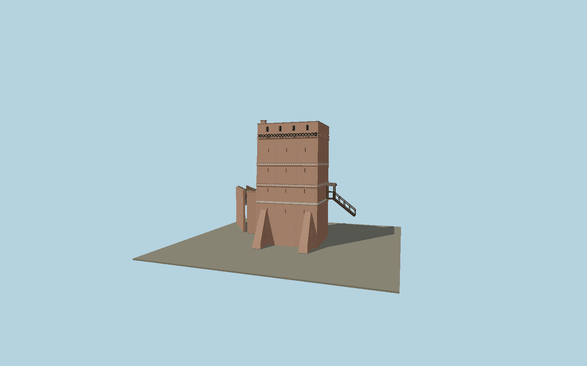

# Leaning Tower of Toruń

Leaning medieval brick tower with the asymmetric jettied timber north wall, measured floor tiers, slit windows and Gothic friezes, zinc shed roof, south buttresses, west garderobe and gallery, and the roofed east timber stair.

## Identity and geometry

Catalog N0595, [Q2234463](https://www.wikidata.org/wiki/Q2234463). The municipal 2019 restoration record supplies plans, section, north elevation and photographs of every exterior. The exact-identity OSM outline establishes its horizontal frame; the section supplies the floor levels and roof slope. Published street/slope height descriptions refer to different ground levels: the visible southern base is preserved below the north street. The 1.46 m northward lean is applied above that street reference, with continuation through the exposed basement.

Mapped tower footprint center at north street level in plan; Y=0 is the exposed south-slope foundation, with north street at Y=4 m. +Z faces the Vistula-side south brick elevation; the half-timbered entrance is on -Z toward the town; +Y is up. The geographic proposal identifies its anchor and orientation evidence separately from remaining terrain and azimuth uncertainty.

Source facts and measured references are recorded in spec.json. References: [1](https://bip.tak.torun.pl/bip_att.php?id=749), [2](https://zabytek.pl/pl/obiekty/torun-baszta-miejska-tzw-krzywa-wieza), [3](https://visittorun.com/en/node/53), [4](https://www.openstreetmap.org/way/81882855). Reference pages and images are not redistributed.

## Original source and shared materials

Geometry is authored in `packages/worldgen/scripts/torun-leaning-tower-model.mjs`. Shared material graphs with metric repeat UV0 and original vertex tints; GLB PBR fallback remains self-contained. No per-model texture duplication. No third-party mesh or photograph is embedded.

45,782 triangles; 99,758 vertices; 6 material groups; 4,144,396 source bytes. Source hash: `sha256:c5c86fdcafa19a24c65d1a76be3550aba29d05dcbde8a48f3c3fba07e6944789`. Geometry validation checks finite Float32 coordinates, indices, triangle area and winding before export.

Regenerate with `node packages/worldgen/scripts/generate-heritage-towers.mjs N0595`; add `--check` for reproducibility. The generator refuses to overwrite a master whose hash differs from source.json. Import uses `--no-optimize` to preserve facade recesses.

## Remaining detail and review

- Facade massing, visible exterior openings, floor tiers, lean direction and attached timber circulation are reconstructed from the municipal measured record. Fine brick weathering, hand-painted frieze strokes and individual timber repairs use original polygonal and shared-material approximations.
- The north-street versus south-slope datum is explicit. Terrain contact must retain the raised northern street; the source does not contain a fake flat ground platform. The broader city-wall network and neighboring buildings remain separate features.
- No visitor interior or surrounding vegetation is included. The documented restored zinc roof is represented rather than copying corrosion from the pre-restoration photographs.
- Near/far visual QA, shared-material inspection and maximum-fidelity approval remain pending.

Named near/far cameras are included for lit visual review. A valid export is not maximum-fidelity certification.
