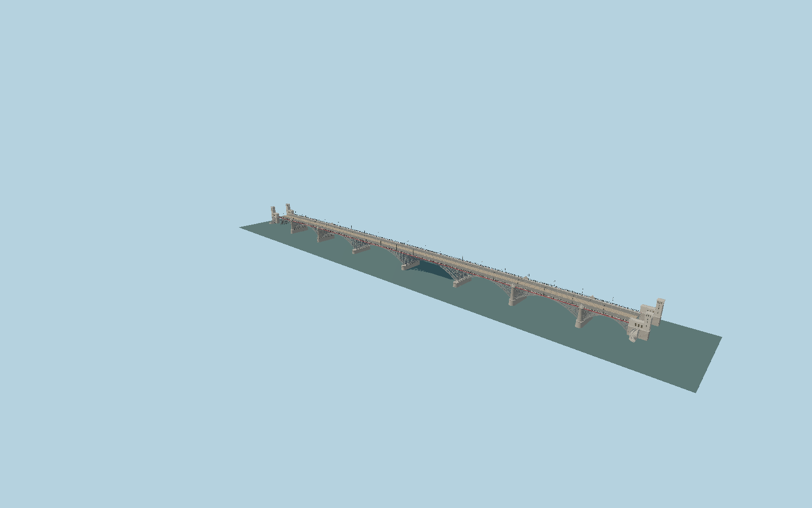

# Poniatowski Bridge

The present eight-span Warsaw river crossing: four N-truss outer spans and four rebuilt arch spans, seven ribs across, short central pier caps and four tall surviving stone pylons, eight distinct heraldic benches, four Renaissance bank towers and curved stairs, red fascia, ornate iron railings and twin tram tracks with overhead wires.

## Evidence

- [Primary reference](https://commons.wikimedia.org/wiki/Category:Most_i_wiadukt_imienia_ks._J%C3%B3zefa_Poniatowskiego_przez_rzek%C4%99_Wis%C5%82%C4%99_w_Warszawie_(1927))
- [Primary reference](https://mbc.cyfrowemazowsze.pl/Content/83246/PDF/00090666_-_Zycie-Srodmiescia-bezpl-2021-nr-6-43-czerwiec-_-.pdf)
- [Primary reference](https://commons.wikimedia.org/wiki/File:Most_Poniatowskiego_w_Warszawie_2021.jpg)
- [Primary reference](https://bedeker.waw.pl/index.php/2020/07/18/most-ksiecia-jozefa-poniatowskiego-plaskorzezby/)
- [Primary reference](https://www.warszawa1939.pl/galeria-powiazany/most-poniatowskiego-f/galeria-powiazana-1960-kartusze-zdobiace-most)
- [Primary reference](https://www.openstreetmap.org/way/368095449)

Published dimensions and reconstruction assumptions are separated in spec.json. Source photos were consulted; no photos or third-party geometry are embedded. Map plan attribution: © OpenStreetMap contributors, ODbL-1.0.

## Source

3326408 triangles; 275435960 bytes; 6 material groups. SHA256: sha256:e4b2c3677dcf39f9c9c34050921dca95f79ea4c9d6733edca1c2428bc1df2b8d.

Shared surfaces (metal_painted, stone_granite, concrete_plain, stone_limestone_raw) are loaded through the central library; any transparent materials use local PBR parameters. Axis and provisional vertical datum are in spec.json.

Regenerate with node packages/worldgen/scripts/generate-researched-bridges.mjs --ids=N0029; append --check to verify. Import and capture through the standard next-1000 scripts. Geometry validation does not substitute for current-frame visual review.

## Reconstruction limits

- GUGiK NMT/NMPT fixes current road and bank elevations; bearings hidden beneath the deck remain photograph-based. Runtime terrain and approach captures are required before geographic approval.
- The separate 701m western approach viaduct lies outside this river-bridge asset.
- Current steel section thicknesses, connection schedules and tower elevations are photograph-based reconstructions, not fabrication or conservation survey dimensions.
- Detailed reliefs depict the eight surviving heraldic subjects; carving depths and stair sections are original photographic reconstructions, not scans.
