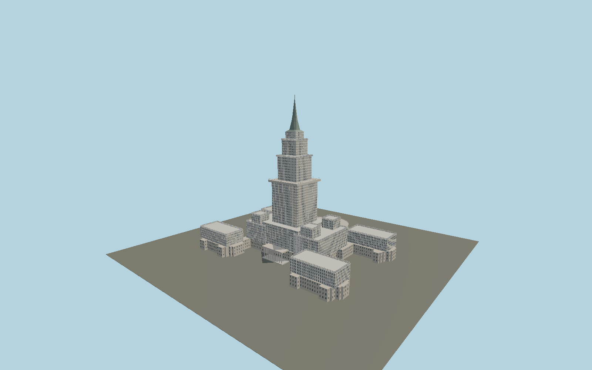

# Palace of Culture and Science

A mapped, courtyard-preserving palace complex with low ceremonial wings, four corner blocks, Renaissance-style crenellated crowns, a stepped central shaft,114 m terrace, four clock faces, green metal spire and the semicircular Congress Hall.

## Evidence and reconstruction

Published dimensions and reconstructed details are separated in spec.json. Primary references:

- [Reference](https://pkin.pl/informacje-o-pkin/)
- [Reference](https://pkin.pl/galeria-zdjec/)
- [Reference](https://www.openstreetmap.org/relation/1319250)

No third-party geometry, photograph or bitmap texture is embedded. Shared surface graphs come from the central library; vertex tints carry model colors. Glazing uses PBR materials; transparent surfaces are declared per model.

## Model and axes

183,246 triangles; 439,312 vertices; 4 material groups; 18,016,896 bytes. Native bounds: -133.670, 0.000, -108.096 to 133.679, 237.000, 108.031. Source hash: `sha256:464474e166074775c4b2f78c708f55073d22bed0d6dff69eb9f9b48c10988063`.

{"up":"+Y","longitudinal":"+X along the mapped building long axis","front":"Native-Z ceremonial entrance; Congress Hall at native+Z","origin":"Ground-level center of exact-QID mapped footprint frame"}

The geographic proposal uses exact-QID OpenStreetMap evidence. Map-derived orientation and estimated architectural details require real-site visual review; preview eligibility is distinct from geographic/fidelity approval. Map attribution: © OpenStreetMap contributors, ODbL-1.0.

## Reproduce

Run `node packages/worldgen/scripts/generate-signature-towers.mjs --ids=N0146` (or add `--check`). The generator preserves manually edited masters by checking their baseline hashes. Import through the standard authored-model workflow with optimization disabled; then capture all QA cameras, including shared-surface views.

## Pending work

- Exterior geometry uses published overall dimensions and map evidence; panel subdivision, connection dimensions and local entrance details are reconstructed. Glazing uses opaque PBR with explicit geometry; no copied facade photograph is embedded.
- Main tier dimensions and window schedules are reconstructed. Sculpture figures in the niches, precise ceramic ornament and clock mermaid emblems are not fabricated; these small facade ornaments remain a fidelity gap. Native ground follows the operator zero datum, while published street-level height datums differ.

This bundle contains source geometry, not a claim of maximum-fidelity completion. Hash-bound visual acceptance is recorded separately after capture inspection.
