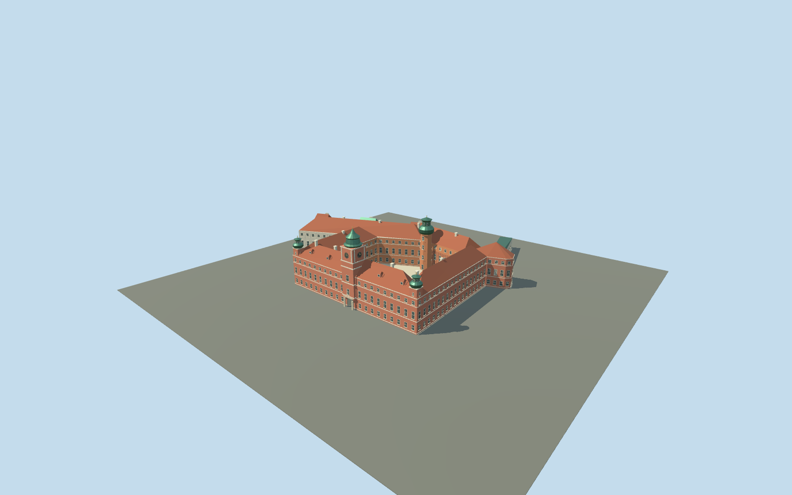

# Royal Castle in Warsaw

Mapped five-wing palace and courtyard, red Castle Square facade, pale river pavilions, Clock Tower, corner turrets and Wladyslaw courtyard tower. Present-day reconstructed exterior with tiled roofs and patinated copper crowns.

## Evidence and reconstruction

Published dimensions and reconstructed details are separated in spec.json. Primary references:

- [Reference](https://biuroprasowe.zamek-krolewski.pl/en/presskit/category/28345)
- [Reference](https://www.zamek-krolewski.pl/strona/historia/603-zamek-wazow-i-krolow-rodakow-1587-1696)
- [Reference](https://zamek-krolewski.pl/en/strona/accessibility/2508-description-architectural-accessibility-royal-castle)
- [Reference](https://www.openstreetmap.org/relation/64436)

No third-party geometry, photograph or bitmap texture is embedded. Shared surface graphs come from the central library; vertex tints carry model colors. Glazing uses PBR materials; transparent surfaces are declared per model.

## Model and axes

27,495 triangles; 57,565 vertices; 6 material groups; 2,406,004 bytes. Native bounds: -98.456, 0.000, -98.544 to 55.638, 45.200, 51.310. Source hash: `sha256:098fc682a3c9db2045c141d0331b88d51144ed2007d9b8188ed5c24b9924c852`.

{"up":"+Y","longitudinal":"+X south along city facade","front":"+Z west toward Castle Square","origin":"Mapped bounding-frame center; courtyard and city-side ground Y=0"}

Native coordinates preserve the mapped courtyard and outer wings; heading faces the Clock Gate toward Castle Square. Heights, facade offsets and river-side terrain contact require real-site review. Draft cannot replace mapped palace automatically.

## Reproduce

Run `node packages/worldgen/scripts/generate-signature-towers.mjs --ids=N0261` (or add `--check`). The generator preserves manually edited masters by checking their baseline hashes. Import through the standard authored-model workflow with optimization disabled; then capture all QA cameras, including shared-surface views.

## Pending work

- Small mapped steps, roof hips, facade bays and tower heights are reconstructed from photographs. Sculpture, heraldry, clocks and copper crowns are abstracted for medium-fi.
- Clock Gate remains open. Other visitor portals are represented externally; room interiors and a navigable museum layout are outside scope.
- The lower river garden and Kubicki Arcades have different terrain levels and are excluded. A flat native Y=0 datum needs escarpment-aware placement review.
- Context review uses procedural neighbors. Real geographic fit, continuous motion and physical-device performance remain separate checks.

This bundle follows the medium-fi standard. Medium-fi appearance and geographic fit are reviewed separately. Hash-bound visual acceptance is recorded separately after capture inspection.

## Additional geographic data

Footprint © OpenStreetMap contributors, ODbL-1.0. Museum photographs are linked visual evidence only; no third-party images or meshes are redistributed.
