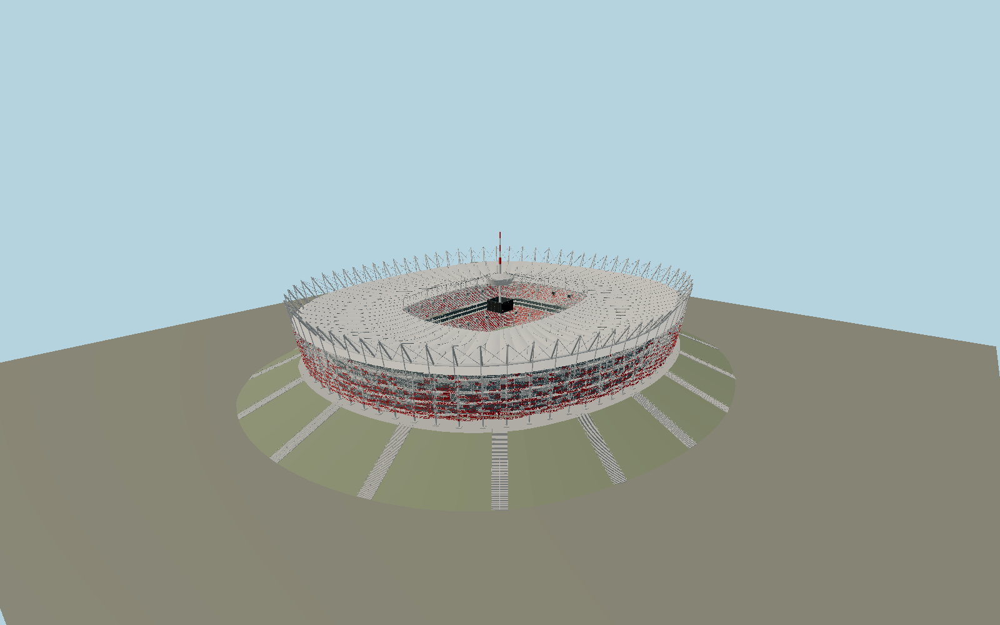

# Kazimierz Górski National Stadium — N0702

Warsaw’s red-and-white woven expanded-metal basket on the inherited earth berm;72independent columns, an undulating compression ring, projecting crown struts and façade ties; two radial cable levels joined by504hangers, inner flying masts, clear glazed inner roof ring, a floating red/white needle and parked central membrane garage with four video screens. Two distinct red/white seating tiers, double hospitality ribbons, concourse stairs and fixed scalloped PTFE roof remain visible.

## Identity and evidence

Exact catalog identity **Q179693**. Source facts: `{"published":"SBP:310×280m principal structure,72columns and inclined struts,72upper+72lower cables,72×7hangers,60flying masts and60retractable-roof cables. Primary SBP2013maintenance manual printedpp26–39 shows load paths,4lower needle ties,56%open expanded aluminium and a4.6m membrane garage. Columns1016mm, compression ring1820mm and facade ties508mm are documented steel sizes. GMP completed photographs and scaled cross/longitudinal sections define the berm and bowl.","reconstructed":"OSM roof5173816, glass rings311295050/51 and72column/tip footprints define plan. The roof PCA fixes the northwest major axis. Published geodesic zero and local street differ;8m pitch/street and18m main-concourse/street offsets are reconstructed from architect section scale. Mild roof-ring undulation, cable sag, seating row counts, red/white panel distribution and detailed stairs are photograph reconstructions. Diamond0.12×0.04m pitch is reconstructed;56% openness is measured evidence. Retractable roof shown parked, static."}`. The source specification keeps published dimensions separate from reconstructed details.

- https://www.gmp.de/en/projects/519/national-stadium-in-warsaw
- https://www.sbp.de/en/project/national-stadium-warsaw/
- https://www.jskarchitects.com/projekty/sportowe/stadion-narodowy%2C5
- https://www.hsh.info/varsav12.htm
- https://www.pgenarodowy.pl/upload/editor/file/20190911_Zalacznik_2_OPZ_Podrecznik_uzytkownika_konstrukcja_dachu_i_fasady.pdf
- https://www.openstreetmap.org/way/5173816
- https://www.openstreetmap.org/relation/4166727

Primary engineer/architect photographs and drawings consulted, not embedded. Original geometry and canonical procedural surfaces; OSM-derived coordinates ©OpenStreetMap contributors,ODbL1.0.

## Authored geometry and materials

1,489,974 triangles, 2,822,476 vertices, 8 surface groups; 116,674,284 source bytes. SHA-256: `sha256:71231e770248ff26af5c52a83e136ddfb8e63996ee8dbd783eda9ba0eec6eeab`. Actual bounds: -168.582, 0.000, -188.877 to 168.553, 108.000, 188.751 m.

Shared canonical material graphs with metric UV repeats in extras.molenSurface; portable glTF PBR factors and vertex colors remain. Dark recesses/lantern panels retain local fallback materials. Shared references: `matgraph:molen.worldgen.material.metal_expanded_diamond` (0.12 × 0.04 m), `matgraph:molen.worldgen.material.membrane` (4 × 4 m), `matgraph:molen.worldgen.material.metal_painted` (2 × 2 m), `matgraph:molen.worldgen.material.concrete_plain` (2 × 2 m). Model-native axes: {"up":"+Y","front":"+Z","origin":"Mapped roof centre at external street datum. +Z follows the roof major axis northwest. Field8m and main entry18m above street follow the scaled architect sections."}.

## Placement proposal

Exact fixed-roof footprint replaces the577m leisure estate polygon. Roof PCA establishes the major axis, and architect plan supplies the symmetric northwest +Z pitch convention. The retained earth berm is reconstructed as a continuous sloped envelope from published sections; the separate mapped base contains ramp/service cut-ins and is preserved as reference, not copied as a jagged slope. Remote estate paving and service buildings remain ordinary map geometry. Proposed anchor 21.045713795833333, 52.23947214305556 (longitude, latitude), heading -2.6209856174063297 radians. Elevation policy: **terrain-contact**. See qa.json for the geographic review status and scope; this placement proposal does not claim surveyed site accuracy. Native ground and pitch datums follow the individual geographic proposal; depressed bowls require their declared terrain cutout.

## Limitations and review

- Permanent exterior and visible bowl; detailed member/seat inventories, mesh fabrication pitch and red/white panel mosaic are reconstructed. Closed rooms, temporary event graphics, sponsor lettering and retractable roof motion are excluded.

Portable review uses a flat ground contact fixture.

Near/far fixtures are in `spec.qaCameras`. Float32 finite geometry, triangle degeneracy and winding are checked by the generator. The hash-bound qa.json and capture reports record the scope and status of rendering, shared-material, exterior-fidelity and geographic reviews.

Regenerate with `node packages/worldgen/scripts/generate-stadium-models.mjs --ids=N0702`; add `--check` for reproducibility. Editable component recipes are registered by the imports and study list in `packages/worldgen/scripts/generate-stadium-models.mjs`. The generator protects artist-edited master hashes and preserves import/capture/shared-capture/QA documents.
