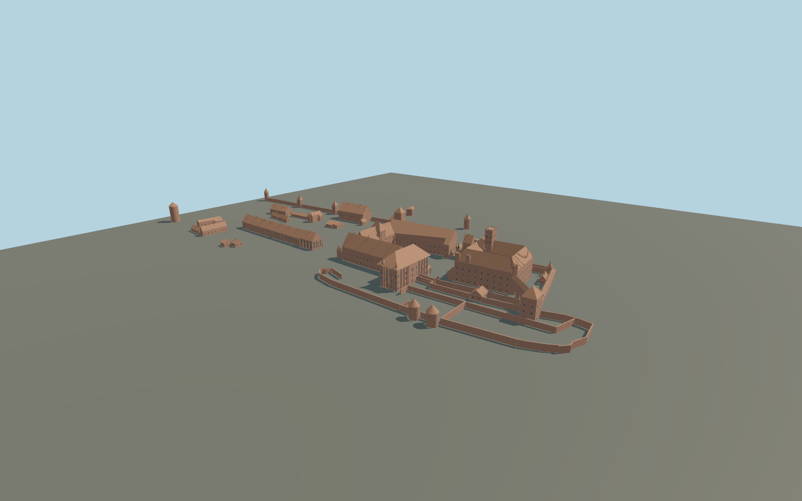

# Malbork Castle

Three-part brick Gothic Malbork: High Castle with an open cloister court, crenellated keep and church; elevated Dansker passage; U-shaped Middle Castle with an open gate, Grand Masters Palace; Lower Castle armoury, St Lawrence chapel, service ranges and named defensive towers.

## Evidence and reconstruction

Published dimensions and reconstructed details are separated in spec.json. Primary references:

- [Reference](https://www.openstreetmap.org/relation/6436433)
- [Reference](https://zamek.malbork.pl/en/home/visit/history-of-the-castle/)
- [Reference](https://bilety.zamek.malbork.pl/trasy-zwiedzania.html)
- [Reference](https://commons.wikimedia.org/wiki/File:Malbork_zamek_zblizenie.jpg)
- [Reference](https://commons.wikimedia.org/wiki/File:Malbork_-_Zamek_Średni_-_Dziedziniec.JPG)
- [Reference](https://commons.wikimedia.org/wiki/File:Zamek_wysoki_wieza_glowna.jpg)
- [Reference](https://commons.wikimedia.org/wiki/File:Malbork_Castle_Exterior_1.jpg)
- [Reference](https://commons.wikimedia.org/wiki/File:Malborg_plan_przyziemia_zamku.jpg)

No third-party geometry, photograph or bitmap texture is embedded. Shared surface graphs come from the central library; vertex tints carry model colors. Glazing uses PBR materials; transparent surfaces are declared per model.

## Model and axes

516,537 triangles; 1,059,079 vertices; 7 material groups; 44,329,516 bytes. Native bounds: -138.089, 0.000, -86.486 to 446.399, 46.000, 187.029. Source hash: `sha256:7edaf912ea66d093c514a74df624f5802008ee0b261c05a1f1b0217653515193`.

{"up":"+Y","longitudinal":"+X from High Castle toward Lower Castle","front":"+Z toward eastern fortifications","origin":"Cached exact-QID map anchor at provisional local ground"}

Draft geographic placement only. Site elevations, the tower datum and eastern fortifications require additional verification; no footprint replacement.

## Reproduce

Run `node packages/worldgen/scripts/generate-signature-towers.mjs --ids=N0243` (or add `--check`). The generator preserves manually edited masters by checking their baseline hashes. Import through the standard authored-model workflow with optimization disabled; then capture all QA cameras, including shared-surface views.

## Pending work

- Maximum fidelity pending: this is an individual exterior reconstruction, not a surveyed as-built model. Vertical dimensions, irregular roof junctions and exact fenestration require further comparison.
- The museum ticket site describes the tower as nearly 70 m without a datum. The current 46 m ground-relative keep is provisional; do not treat it as a verified measured height.
- The church Madonna mosaic and figurative sculpture are not reproduced. Their recess is preserved. Exact tracery, gate decoration, decorative gables and rooftop dormers need further work.
- Lower Castle is represented by selected existing mapped structures and eastern walls; ruins, archaeological foundations, contemporary ticket facilities and complete outer earthworks are not included.
- No interiors, moat excavation, landscape, temporary works or photographic textures. The High Castle courtyard and Middle Castle court remain open.
- Shared brick, ceramic tile, timber, limestone, granite and painted-metal surfaces; local PBR glazing. Fine brick bonds and roof seams stay in the source master.

This bundle contains source geometry, not a claim of maximum-fidelity completion. Hash-bound visual acceptance is recorded separately after capture inspection.

## Additional geographic data

Map geometry © OpenStreetMap contributors, ODbL-1.0. Photographs linked for reference; no photographic textures or third-party meshes copied.
