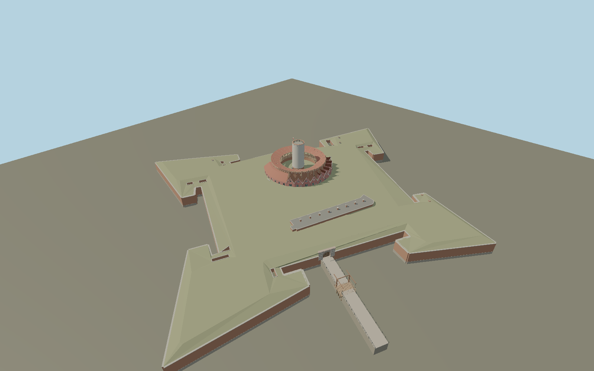

# Wisłoujście Fortress — N0666

Current restored Fort Carré: mapped four-bastion brick enclosure, pierced gun wells and ventilation shafts, white-over-brick flat-topped watchtower with cartouche, open circular timber gallery under its restored tile roof, ten salmon gabled officers’ houses, curved commander house and balcony, inner barracks, rusticated arched gate and timber balance-beam drawbridge with causeways.

## Identity and evidence

Exact catalog identity **Q1409002**. Source facts: `{"towerHeightMeters":23,"historicRingDiameterMeters":31,"currentMappedRingDiameterApproxMeters":34,"towerDiameterMappedMeters":7.7,"exteriorReconstruction":"Mapped bastion/gun-well/vent/ancillary-building plans and the museum panorama govern the wider compound. The bridge is a short, broad lifting leaf: mapped road way39965892 controls its axis rather than assuming the longest rectangle edge is longitudinal. Gate rustication, portal voussoirs, gallery joinery and drawbridge balance arms follow museum close photographs.","basis":"Museum2020 architectural brief gives23m restored tower, historic31m ring, ten gabled officers’ houses and four-module commander house. Posted1:100 ground/upper floor plans and developed elevations govern bay sequence and gallery structure. Current2023 museum photographs govern white tower, salmon walls, green joinery and reconstructed timber gallery roof. Exact mapped tower and Fort Carré wall/earthwork paths govern ground dimensions; the current mapped ring is wider than the historical31m description."}`. The source specification keeps published dimensions separate from reconstructed details.

- https://bip.muzeumgdansk.pl/en/zamowienia-publiczne/zamowienia-do-ktorych-nie-stosuje-sie-przepisow-prawa-zamowien-publicznych/szczegoly-zamowienia/news/muzeum-gdanska-prosi-o-przygotowanie-oferty-na-badania-architektoniczne-twierdzy-wisloujscie/
- https://bip.muzeumgdansk.pl/fileadmin/user_upload/zal1._Rzut_parteru.pdf
- https://bip.muzeumgdansk.pl/fileadmin/user_upload/zal2._Rzut_baszty_i_wienca.pdf
- https://bip.muzeumgdansk.pl/fileadmin/user_upload/zal3._Rzut_dzialobitni_i_elewacje.pdf
- https://media.muzeumgdansk.pl/komunikaty/817511/nowe-oblicze-twierdzy-wisloujscie
- https://wirtualne.muzeumgdansk.pl/oddzialy/twierdza-wisloujscie
- https://www.openstreetmap.org/way/640670283
- https://www.openstreetmap.org/way/640670274
- https://www.openstreetmap.org/way/640674957
- https://www.openstreetmap.org/way/39965892
- https://www.openstreetmap.org/way/185876662
- https://www.openstreetmap.org/relation/19455901

Original geometry and shared procedural materials. Official photographs are research references only; no reference imagery or third-party mesh is embedded or redistributed.

## Authored geometry and materials

107,446 triangles, 211,076 vertices, 11 surface groups; 8,894,136 source bytes. SHA-256: `sha256:38ad824542d260d9eb3a4bf9a5b75ee1f122940dbbcc59b3acfdefb1b5d73f38`. Actual bounds: -78.826, -4.350, -89.175 to 115.716, 27.430, 122.814 m.

Shared canonical material graphs with metric UV repeats in extras.molenSurface; portable glTF PBR factors and vertex colors remain. Dark recesses/lantern panels retain local fallback materials. Shared references: `matgraph:molen.worldgen.material.brick` (1.92 × 0.9 m), `matgraph:molen.worldgen.material.plaster_lime` (2 × 2 m), `matgraph:molen.worldgen.material.stone` (2 × 2 m), `matgraph:molen.worldgen.material.stone_limestone` (2.4 × 1.6 m), `matgraph:molen.worldgen.material.tile_ceramic` (2.4 × 2.4 m), `matgraph:molen.worldgen.material.fabric_canvas` (0.25 × 0.25 m), `matgraph:molen.worldgen.material.metal_painted` (2 × 2 m), `matgraph:molen.worldgen.material.wood_plain` (2 × 0.25 m), `matgraph:molen.worldgen.material.concrete_plain` (2 × 2 m), `matgraph:molen.worldgen.material.gravel` (2 × 2 m). Model-native axes: {"up":"+Y","front":"+Z","origin":"Authored main tower center at local base level; attached ensembles are offset from this origin."}.

## Placement proposal

Origin is the actual tower circle, with +X east and +Z south. Exact mapped bastion paths and house arc establish world orientation; the commander house is southwest and the bridge southeast. Courtyard contact is modelY0; retaining walls descend4.35m toward the moat. This wider compound should suppress underlying mapped duplicate buildings. Host water and terrain supply the moat and surrounding island. Proposed anchor 18.67913896842105, 54.39584601578949 (longitude, latitude), heading 0 radians. Elevation policy: **terrain-contact**. This is a reviewable proposal, not a completed site-fit certification. Ground models require terrain contact; offshore models also require water-datum and base-height checks.

## Limitations and review

- The modeled exterior follows the cited published facts and inspected photographs. Unpublished dimensions and local fittings are explicitly photo-proportioned; no claim of engineering survey accuracy is made.
- Portable PBR and shared metric surfaces are provided. Surface weathering, material color under local lighting and fine facade relief require close render review before maximum-detail acceptance.
- Model scope is Fort Carré and its eastern bridge; detached buildings and the outer seventeen-hectare eastern earthworks are separate map/environment features. Current roof/restoration details are taken from2023 museum photographs; the unbuilt historical spire is intentionally absent. Small ornaments and bay dimensions are authored from published elevations and photographs rather than copied texture images; inscription lettering is represented as plaque relief. Earthwork elevations are photo-scaled between mapped plan controls.

Near/far fixtures are in `spec.qaCameras`. Float32 finite geometry, triangle degeneracy and winding are checked by the generator. Current rendering, shared-material, maximum-fidelity and geographic review results are recorded in `qa.json` and the readiness ledger; source generation alone does not approve a model.

Regenerate with `node packages/worldgen/scripts/generate-lighthouse-models.mjs --ids=N0666`; add `--check` for reproducibility. Editable component recipes are in `packages/worldgen/scripts/wisloujscie-model.mjs`. The generator protects artist-edited master hashes and preserves import/capture/shared-capture/QA documents.
