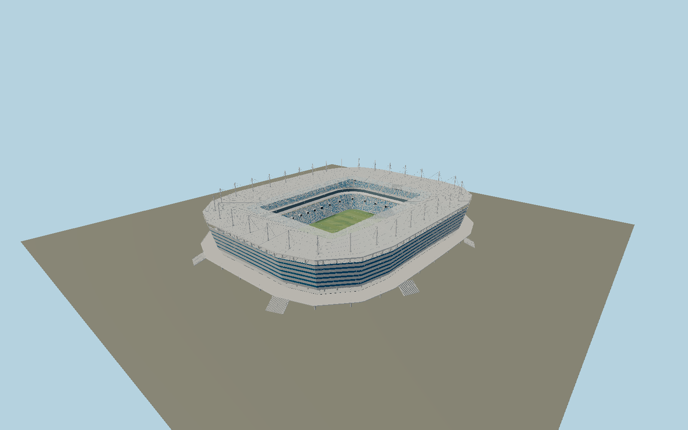

# Rostec Arena — N0700

As-built Kaliningrad stadium with angular rounded rectangle footprint, flared six-course white and deep-blue microperforated sheet cladding, open lower arcade and raised deck with broad stair banks,32needle masts with forward rod stays and backstays, box-section radial and ring trusses, opaque metal roof with clear polycarbonate inner strip, two blue-white mosaic seating tiers, glazed hospitality ribbon, suspended goal-end screens and dugouts.

## Identity and evidence

Exact catalog identity **Q4439098**. Source facts: `{"published":"Operator47m maximum height and35,000 capacity. P.G.Yeremeyev, Metal structures of football stadiums of World Cup2018, NIC Construction journal3(18),pp50–51:166.65×203.65m structural axes,126.9×89.4m roof opening,32radial box-section stayed trusses with38.2m cantilevers, Macalloy ties, profiled steel roof and transparent polycarbonate inner strip.","reconstructed":"Actual outer way552139952 and pitch623571034 establish plan and geographic direction. Mapped outer skin is about189×231m, larger than published structural axes; mast line is inset10.2m. Contractor completed2018 photographs establish six white/blue stripes, folded angular corners, raised circulation deck, truss depth and blue-white seats. Exact band waviness, perforation fabrication schedule, concourse levels, stair inventory, row counts and member sections are reconstructed. Original abandoned retractable-roof designs are explicitly excluded."}`. The source specification keeps published dimensions separate from reconstructed details.

- https://www.rostec-arena.ru/pages/about-stadium
- https://www.steelcon.ru/products/kaliningrad/
- https://smartal.ru/stroitelstvo-stadiona-v-kaliningrade/
- https://www.crocusgroup.ru/projects/civil-construction/stadiony-k-chempionatu-mira-po-futbolu-2018-goda-v-kaliningrade-i-rostove-na-donu/
- https://www.normacs.info/uploads/ckeditor/attachments/4750/%D0%92%D0%B5%D1%81%D1%82%D0%BD%D0%B8%D0%BA_3_18_2018.pdf
- https://www.openstreetmap.org/relation/8940837
- https://www.openstreetmap.org/way/623571034

Reference photographs and drawings used only for architectural research. No reference imagery or downloaded mesh embedded. Original geometry and reusable procedural surfaces; OSM coordinate attribution OpenStreetMap contributors, ODbL1.0.

## Authored geometry and materials

685,662 triangles, 1,318,980 vertices, 8 surface groups; 54,398,700 source bytes. SHA-256: `sha256:9a0c3dcccf5a237808737a4a43d0450ecc92799d48e2e5b87a4460bb0b7dfed2`. Actual bounds: -110.283, -0.126, -131.303 to 108.539, 47.049, 128.098 m.

Shared canonical material graphs with metric UV repeats in extras.molenSurface; portable glTF PBR factors and vertex colors remain. Dark recesses/lantern panels retain local fallback materials. Shared references: `matgraph:molen.worldgen.material.metal_perforated_round` (0.012 × 0.012 m), `matgraph:molen.worldgen.material.metal_painted` (2 × 2 m), `matgraph:molen.worldgen.material.concrete_plain` (2 × 2 m). Model-native axes: {"up":"+Y","front":"+Z","origin":"Mapped pitch center at field/street datumY0. Native+Z north-northwest end; +X west-southwest side."}.

## Placement proposal

Exact pitch long sides averaged to direct+Z north-northwest; model retains asymmetric mapped perimeter. Existing polygon hole marks grass margins, not roof aperture; roof aperture uses primary structural dimensions. Ground-floor piers and pitch are placed on terrainY0, raised circulation deck stands above it. Site landscaping and perimeter security buildings remain separate map features. Proposed anchor 20.53384385, 54.698021025 (longitude, latitude), heading -2.8622991850460333 radians. Elevation policy: **terrain-contact**. See qa.json for the geographic review status and scope; this placement proposal does not claim surveyed site accuracy. Native ground and pitch datums follow the individual geographic proposal; depressed bowls require their declared terrain cutout.

## Limitations and review

- Permanent current exterior with fixed roof; no fictitious retractable panel or abandoned2012architectural scheme. Exact panel fabrication/perforation and seat inventory, ramp/stair sub-layout, internal rooms and event sponsor dressing are not claimed. Microscopic hole schedule uses the canonical4mm/12mm reusable surface as a documented visual reconstruction.

Portable review uses a flat ground contact fixture.

Near/far fixtures are in `spec.qaCameras`. Float32 finite geometry, triangle degeneracy and winding are checked by the generator. The hash-bound qa.json and capture reports record the scope and status of rendering, shared-material, exterior-fidelity and geographic reviews.

Regenerate with `node packages/worldgen/scripts/generate-stadium-models.mjs --ids=N0700`; add `--check` for reproducibility. Editable component recipes are registered by the imports and study list in `packages/worldgen/scripts/generate-stadium-models.mjs`. The generator protects artist-edited master hashes and preserves import/capture/shared-capture/QA documents.
