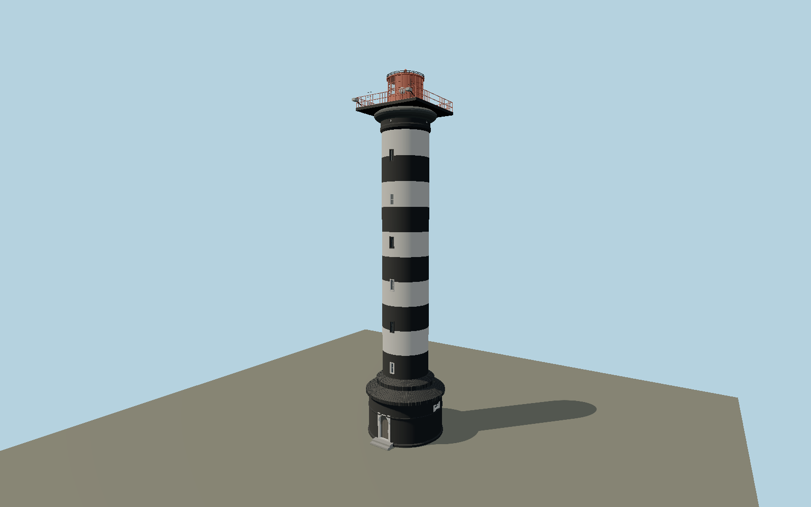

# Klaipėda Lighthouse — N0676

Black and white banded stair cylinder rising from a broad older plinth and stepped folded-metal collar; molded rounded capital beneath a square iron gallery, narrow shaft windows, arched entry, orange partly enclosed lantern, circular roof guard, optic-side glazing and published gallery hardware.

## Identity and evidence

Exact catalog identity **Q5764622**. Source facts: `{"heightMeters":40,"focalElevationMeters":44,"mappedBaseDiameterMeters":8.46,"photoApproxShaftDiameterMeters":5.16,"basis":"LTSA repair announcement supplies 40m structural height. The city tourism page identifies the 44m value as elevation above sea level. Exact-QID OSM footprint fixes the broad base. Public library contemporary photos and historic aerial control the separate plinth/collar, square gallery, rounded capital and orange lantern; minor dimensions are reconstructed from their proportions."}`. The source specification keeps published dimensions separate from reconstructed details.

- https://ltsa.lrv.lt/lt/naujienos/netrukus-prasides-klaipedos-svyturio-remonto-darbai/
- https://ltsa.lrv.lt/lt/naujienos/klaipedos-svyturi-siekiama-atverti-lankytojams-ieskoma-saugaus-patekimo-sprendimo-qx4/
- https://klaipedatravel.lt/place/svyturys/
- https://klaipedatravel.lt/wp-content/uploads/2023/07/svyturys-KEPA.jpg
- https://www.krastogidas.lt/en/objects/klaipedos-svyturys-klaipeda-lighthouse?route=17595
- https://wp.krastogidas.lt/wp-content/uploads/media/public/klaipedos_svyturys/vidunofoto.lt-11.jpg
- https://wp.krastogidas.lt/wp-content/uploads/media/public/klaipedos_svyturys/svyturys_1.jpg
- https://wp.krastogidas.lt/wp-content/uploads/media/public/klaipedos_svyturys/svyturys_9.jpg
- https://www.openstreetmap.org/way/350070453

Original geometry and shared procedural materials. Official photographs are research references only; no reference imagery or third-party mesh is embedded or redistributed.

## Authored geometry and materials

64,018 triangles, 118,892 vertices, 6 surface groups; 5,051,940 source bytes. SHA-256: `sha256:8f0f2c1b13d2af6e4d6891f1a1b32fdae77d8d2204644b642fa428b35fb885c4`. Actual bounds: -4.456, 0.000, -4.456 to 4.456, 40.000, 5.000 m.

Shared canonical material graphs with metric UV repeats in extras.molenSurface; portable glTF PBR factors and vertex colors remain. Dark recesses/lantern panels retain local fallback materials. Shared references: `matgraph:molen.worldgen.material.plaster_lime` (2 × 2 m), `matgraph:molen.worldgen.material.metal_painted` (2 × 2 m), `matgraph:molen.worldgen.material.wood_plain` (2 × 0.25 m), `matgraph:molen.worldgen.material.concrete_plain` (2 × 2 m). Model-native axes: {"up":"+Y","front":"+Z","origin":"Authored main tower center at local base level; attached ensembles are offset from this origin."}.

## Placement proposal

Exact-QID base center corrects the catalog coordinate approximately58m southwest. Entry faces the southeastern/eastern station forecourt, reconstructed from the public-library aerial and present mapped service court. Square gallery and the seaward glazed lantern share this station axis; facade angle is a photographed quadrant, not a survey bearing. Proposed anchor 21.095725009, 55.727682701 (longitude, latitude), heading 1.06 radians. Elevation policy: **terrain-contact**. This is a reviewable proposal, not a completed site-fit certification. Ground models require terrain contact; offshore models also require water-datum and base-height checks.

## Limitations and review

- The modeled exterior follows the cited published facts and inspected photographs. Unpublished dimensions and local fittings are explicitly photo-proportioned; no claim of engineering survey accuracy is made.
- Portable PBR and shared metric surfaces are provided. Surface weathering, material color under local lighting and fine facade relief require close render review before maximum-detail acceptance.
- Component proportions below the 40m total are reference-photo reconstructions. The exact restored2025 paint tone and movable communications equipment may change; temporary flags, cables spanning the site and detached service buildings remain outside this tower model. The preserved broad base is modeled separately from the modern shaft. No claim of optical-sector navigational accuracy.

Near/far fixtures are in `spec.qaCameras`. Float32 finite geometry, triangle degeneracy and winding are checked by the generator. Current rendering, shared-material, maximum-fidelity and geographic review results are recorded in `qa.json` and the readiness ledger; source generation alone does not approve a model.

Regenerate with `node packages/worldgen/scripts/generate-lighthouse-models.mjs --ids=N0676`; add `--check` for reproducibility. Editable component recipes are in `packages/worldgen/scripts/lighthouse-south-baltic-models.mjs`. The generator protects artist-edited master hashes and preserves import/capture/shared-capture/QA documents.
