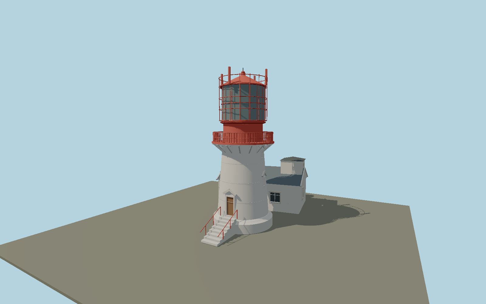

# Lindesnes Lighthouse — N0660

White short cast-iron tower on a concrete foot, north entrance stair, pedimented small windows and pierced white gallery brackets. Tall red watchroom/lantern assembly, fine cleaning cage and red antenna panels, plus connected white clapboard machinery house with slate roof, rooftop horn and twin pressure tanks.

## Identity and evidence

Exact catalog identity **Q773320**. Source facts: `{"heightMeters":16.1,"mainHousePlanMeters":[10.4,6],"year":1915,"basis":"Kystverket2020 conservation planpp19–22 contains original1913 cast-plate/section drawings and cardinally labeled photographs; p28 dimensions machinery house10.4x6m and p29 shows horn/tanks. Official lighthouse list and museum give16.1m tower. Exact-QID node31289203, tower172893413 and mapped main entrance7453360612 establish position and azimuth."}`. The source specification keeps published dimensions separate from reconstructed details.

- https://www.kystverket.no/globalassets/om-kystverket/kystkultur/fyr/sorost/lindesnes-fyrstasjon_forvaltningsplan_14.-oktober-2020_red_sec_kort.pdf
- https://www.visitnorway.no/listings/lindesnes-fyr/16446/
- https://lindesnesfyr.no/en/staying-overnight/
- https://www.openstreetmap.org/node/31289203
- https://www.openstreetmap.org/node/7453360612
- https://www.openstreetmap.org/way/172893415

Original geometry and shared procedural materials. Official photographs are research references only; no reference imagery or third-party mesh is embedded or redistributed.

## Authored geometry and materials

57,082 triangles, 103,150 vertices, 7 surface groups; 4,299,420 source bytes. SHA-256: `sha256:1b71182260c7a875f84f4d3c75647efcc2afe6762710ec432f333ddee60c05c8`. Actual bounds: -7.086, 0.000, -13.735 to 4.646, 16.100, 6.041 m.

Shared canonical material graphs with metric UV repeats in extras.molenSurface; portable glTF PBR factors and vertex colors remain. Dark recesses/lantern panels retain local fallback materials. Shared references: `matgraph:molen.worldgen.material.wood_painted_lap` (2 × 1.6 m), `matgraph:molen.worldgen.material.slate` (1.5 × 1.6 m), `matgraph:molen.worldgen.material.metal_painted` (2 × 2 m), `matgraph:molen.worldgen.material.stone_granite` (2 × 2 m), `matgraph:molen.worldgen.material.wood_plain` (2 × 0.25 m), `matgraph:molen.worldgen.material.concrete_plain` (2 × 2 m). Model-native axes: {"up":"+Y","front":"+Z","origin":"Authored main tower center at local base level; attached ensembles are offset from this origin."}.

## Placement proposal

Exact-QID node is the tower center. Measured vector to mapped main entrance fixes authored+Z north-slightly-west. Machinery house is independently rotated0.157rad to its mapped walls and extends south. Host terrain supplies the coastal rock contact. Proposed anchor 7.0466733, 57.9824978 (longitude, latitude), heading -3.064754643641 radians. Elevation policy: **terrain-contact**. This is a reviewable proposal, not a completed site-fit certification. Ordinary ground models use terrain contact; Kiipsaare requires an offshore water/base-height check.

## Limitations and review

- The modeled exterior follows the cited published facts and inspected photographs. Unpublished dimensions and local fittings are explicitly photo-proportioned; no claim of engineering survey accuracy is made.
- Portable PBR and shared metric surfaces are provided. Surface weathering, material color under local lighting and fine facade relief require close render review before maximum-detail acceptance.
- Exterior components use conservation drawings and2020 operator/museum appearance; exact bolt instances and internal lens mechanism are omitted at this shared-style exterior scope. Site houses farther down the rock and old beacon ruin are separate structures.

Near/far fixtures are in `spec.qaCameras`. Float32 finite geometry, triangle degeneracy and winding are checked by the generator. Rendering, shared-material alignment, maximum-fidelity and geographic reviews remain pending until their hash-bound reports exist.

Regenerate with `node packages/worldgen/scripts/generate-lighthouse-models.mjs --ids=N0660`; add `--check` for reproducibility. Editable component recipes are in `packages/worldgen/scripts/lighthouse-models.mjs`. The generator protects artist-edited master hashes and preserves import/capture/shared-capture/QA documents.
