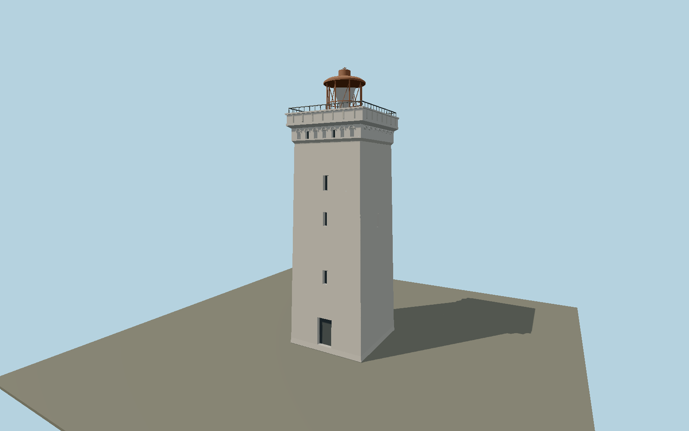

# Rubjerg Knude lighthouse — N0645

Isolated pale tapering square tower with sparse narrow windows, recessed arch frieze, paneled stone gallery, open rust-colored lantern cage, faceted reflector and vented cap.

## Identity and evidence

Exact catalog identity **Q2206180**. Source facts: `{"heightMeters":23,"relocation":"Moved approximately 70 m inland on 22 October 2019; only the tower survives.","currentExterior":"2025 Danish Nature Agency photograph; proposed stair/lantern installation renewal is not presumed completed."}`. The source specification keeps published dimensions separate from reconstructed details.

- https://naturstyrelsen.dk/nyheder/2019/november/nu-bliver-rubjerg-knude-fyr-genaabnet
- https://naturstyrelsen.dk/nyheder/2025/marts/danmarksberoemt-fyr-renoveres-med-stoette-fra-realdania
- https://naturstyrelsen.dk/media/y5bd2clw/design-uden-navn-14.png
- https://www.openstreetmap.org/way/110889245
- https://www.openstreetmap.org/node/9353718244

Original geometry and shared procedural materials. Official photographs are research references only; no reference imagery or third-party mesh is embedded or redistributed.

## Authored geometry and materials

8,270 triangles, 15,790 vertices, 4 surface groups; 654,672 source bytes. SHA-256: `sha256:08dc1393e907635b507e3fc50dc0109dab25bba7bccdf778ed552e8da2e0498d`. Actual bounds: -3.480, 0.000, -3.480 to 3.480, 23.000, 3.480 m.

Shared canonical material graphs with metric UV repeats in extras.molenSurface; portable glTF PBR factors and vertex colors remain. Dark recesses/lantern panels retain local fallback materials. Shared references: `matgraph:molen.worldgen.material.plaster_lime` (2 × 2 m), `matgraph:molen.worldgen.material.metal_painted` (2 × 2 m), `matgraph:molen.worldgen.material.stone_granite` (2 × 2 m). Model-native axes: {"up":"+Y","front":"+Z","origin":"Authored main tower center at local base level; attached ensembles are offset from this origin."}.

## Placement proposal

Current relocated exact-QID footprint sets the shaft axes. Entrance node9353718244 on the east face resolves square symmetry: authored +Z door faces east with a slight north component. Proposed anchor 9.775489023, 57.449045721 (longitude, latitude), heading 1.819090002472 radians. Elevation policy: **terrain-contact**. This is a reviewable proposal, not a completed site-fit certification. Ordinary ground models use terrain contact; Kiipsaare requires an offshore water/base-height check.

## Limitations and review

- The modeled exterior follows the cited published facts and inspected photographs. Unpublished dimensions and local fittings are explicitly photo-proportioned; no claim of engineering survey accuracy is made.
- Portable PBR and shared metric surfaces are provided. Surface weathering, material color under local lighting and fine facade relief require close render review before maximum-detail acceptance.
- Window elevations, frieze relief and reflector folds are photo-proportioned. Eroding dune surface and former keeper buildings are excluded. The 2025 restoration announcement is a future project, so no unverified replacement installation is invented.

Near/far fixtures are in `spec.qaCameras`. Float32 finite geometry, triangle degeneracy and winding are checked by the generator. Rendering, shared-material alignment, maximum-fidelity and geographic reviews remain pending until their hash-bound reports exist.

Regenerate with `node packages/worldgen/scripts/generate-lighthouse-models.mjs --ids=N0645`; add `--check` for reproducibility. Editable component recipes are in `packages/worldgen/scripts/lighthouse-models.mjs`. The generator protects artist-edited master hashes and preserves import/capture/shared-capture/QA documents.
