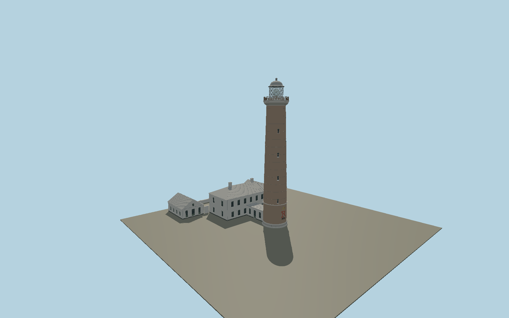

# Skagen Lighthouse — N0678

Unpainted tapered Dutch-clinker tower on a dressed-granite foot, external iron hoops, staggered round-headed windows, FrederickVII crown/monogram and1858 date, molded stone gallery, diamond-braced clear lantern with visible large optic, bell-shaped metal roof; restored white keeper house, attached glazed entrance corridor and two rear service wings.

## Identity and evidence

Exact catalog identity **Q12000806**. Source facts: `{"heightMeters":46,"mappedBaseDiameterMeters":7.49,"mainHousePlanMeters":[20.94,10.94],"sideWingPlanMeters":[8.22,11.14],"basis":"Owner Realdania and operator publish46m height. Owner restoration photographs identify bare clinker, granite footing, diamond lantern bars, current white facades/green frames and standing-seam roofs; the owner monograph supplies historical material/ensemble facts. OSM exact-identity circle and attached-house/wing footprints control all building centers and axes. Tier heights and smaller fenestration dimensions are photo-proportioned."}`. The source specification keeps published dimensions separate from reconstructed details.

- https://realdania.dk/projekter/skagen-graa-fyr
- https://realdania.dk/viden-og-laering/vidensbibliotek/publikationer/realdania-by-og-byg/skagen-graa-fyr
- https://realdania.dk/-/media/realdaniadk/publikationer/by-og-byg/by-og-byg-publikationer/skagen-graa-fyr.pdf
- https://detgraafyr.dk/english/about-us
- https://www.visitdenmark.com/denmark/plan-your-trip/det-gra-fyr-lighthouse-gdk600368
- https://files.guidedanmark.org/files/483/311561_Det_Gr_Fyr_i_Skagen.jpg
- https://cdn.realdania.dk/media/tgcbpxug/4-fyrmesterbolig-og-sidebygninger.jpg
- https://cdn.realdania.dk/media/kgydvdix/frederik-7-monogramjpg.jpg
- https://cdn.realdania.dk/media/tzmddmte/foden-af-fyretjpg.jpg
- https://www.openstreetmap.org/way/288783225
- https://www.openstreetmap.org/way/484406023
- https://www.openstreetmap.org/way/211634779
- https://www.openstreetmap.org/way/211634781

Original geometry and shared procedural materials. Official photographs are research references only; no reference imagery or third-party mesh is embedded or redistributed.

## Authored geometry and materials

198,236 triangles, 363,102 vertices, 8 surface groups; 15,455,052 source bytes. SHA-256: `sha256:870b0dd67f0708a60642989430c75ae733da5c8c62467f2f4740e766d3f0aa6d`. Actual bounds: -21.376, 0.000, -4.150 to 21.247, 46.000, 34.311 m.

Shared canonical material graphs with metric UV repeats in extras.molenSurface; portable glTF PBR factors and vertex colors remain. Dark recesses/lantern panels retain local fallback materials. Shared references: `matgraph:molen.worldgen.material.brick` (1.92 × 0.9 m), `matgraph:molen.worldgen.material.plaster_lime` (2 × 2 m), `matgraph:molen.worldgen.material.stone_limestone` (2.4 × 1.6 m), `matgraph:molen.worldgen.material.metal_painted` (2 × 2 m), `matgraph:molen.worldgen.material.stone_granite` (2 × 2 m), `matgraph:molen.worldgen.material.wood_plain` (2 × 0.25 m). Model-native axes: {"up":"+Y","front":"+Z","origin":"Authored main tower center at local base level; attached ensembles are offset from this origin."}.

## Placement proposal

Native+Z follows the mapped tower-to-keeper-house connector northeast; +X spans the keeper-house long facade. Mapped main house and both side wings resolve the axis and quadrant without circular-tower ambiguity. Tower origin remains the exact-QID circle center. Tower monogram faces the exposed southwest side; ordinary site-grade terrain contact is used. Proposed anchor 10.630184735, 57.735496379 (longitude, latitude), heading 2.0471309816113354 radians. Elevation policy: **terrain-contact**. This is a reviewable proposal, not a completed site-fit certification. Ground models require terrain contact; offshore models also require water-datum and base-height checks.

## Limitations and review

- The modeled exterior follows the cited published facts and inspected photographs. Unpublished dimensions and local fittings are explicitly photo-proportioned; no claim of engineering survey accuracy is made.
- Portable PBR and shared metric surfaces are provided. Surface weathering, material color under local lighting and fine facade relief require close render review before maximum-detail acceptance.
- Owner restoration photographs control current white walls, dark-green frames and metal roofs; older yellow paint and slate-roof views are used only for structural proportions. Monogram/crown are original raised curves at exterior viewing scale, not a scanned casting. Small lens/prism and roof-joint dimensions are photograph reconstructions. Detached dunes, groynes, paths, observation structures and seasonal café furniture remain map context.

Near/far fixtures are in `spec.qaCameras`. Float32 finite geometry, triangle degeneracy and winding are checked by the generator. Current rendering, shared-material, maximum-fidelity and geographic review results are recorded in `qa.json` and the readiness ledger; source generation alone does not approve a model.

Regenerate with `node packages/worldgen/scripts/generate-lighthouse-models.mjs --ids=N0678`; add `--check` for reproducibility. Editable component recipes are in `packages/worldgen/scripts/lighthouse-south-baltic-models.mjs`. The generator protects artist-edited master hashes and preserves import/capture/shared-capture/QA documents.
