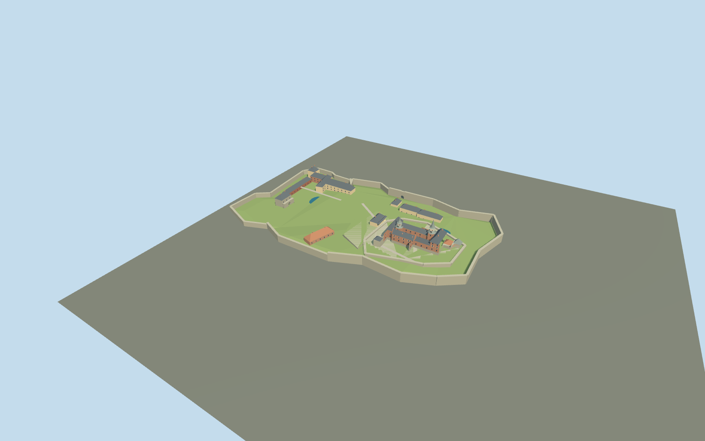

# Akershus Fortress

Akershus inner-fortress study:open mapped castle court,two faceted clock spires,stepped-gable wings,stone lower towers,terraced bastion silhouette and selected low museums,magazines and barracks. Wider site/elevations explicitly approximate.

## Evidence and reconstruction

Published dimensions and reconstructed details are separated in spec.json. Primary references:

- [Reference](https://www.forsvarsbygg.no/en/festningene/akershus-fortress)
- [Reference](https://www.forsvarshistoriskmuseum.no/akershus-slott/en)
- [Reference](https://www.forsvarshistoriskmuseum.no/historien-om-akershus-festning)
- [Reference](https://historiaviagenselivros.com/wp-content/uploads/2017/10/akershus-fortress-mapa.pdf)
- [Reference](https://www.openstreetmap.org/relation/13931023)

No third-party geometry, photograph or bitmap texture is embedded. Shared surface graphs come from the central library; vertex tints carry model colors. Glazing uses PBR materials; transparent surfaces are declared per model.

## Model and axes

3,883 triangles; 11,649 vertices; 8 material groups; 470,460 bytes. Native bounds: -92.700, 0.000, -304.695 to 133.649, 54.000, 99.627. Source hash: `sha256:2bf55c8d8b685797faa0746dcad681a58a4f83d85a9b1ac9dafcdcd562f81130`.

{"up":"+Y","longitudinal":"+Z south toward Munk Tower and Prince Carl bastion","lateral":"+X east toward Kongens gate","origin":"Cached castle-frame center,with unverified outer-site terrace datumY0;castle court attachmentY12m"}

Exact castle footprint/court only. Whole inner-fortress silhouette is approximate and excludes modern administrative parcels. Heading0,east/south nativeaxes;current terrain and absolute fit pending.

## Reproduce

Run `node packages/worldgen/scripts/generate-signature-towers.mjs --ids=N0282` (or add `--check`). The generator preserves manually edited masters by checking their baseline hashes. Import through the standard authored-model workflow with optimization disabled; then capture all QA cameras, including shared-surface views.

## Pending work

- Only the castle ring and courtyard are map-derived. Wider inner-fortress outline,bastions,building centers,pond shapes and depths are approximately interpreted from a primary isometric diagram with no scale. No current wider-site map retrieved;not a fully verified whole-fortress reconstruction.
- All elevations and tower widths,cap profiles,gable steps,window rhythm,gate clearances,terrace slopes and opening positions are estimates. Spire54m and castle court12m are provisional values relative to a made-up lower-groundY0,not actual elevations or tower height claims. Castle footprint has small simplifications around roofs and attachments.
- Two visually distinctive clock stair towers are rendered;their exact attachment positions and name-to-tower correspondence need a measured castle plan. Named northern/southern in controls to avoid false identification.
- Gate passages are open geometry. Main entrance position is interpreted;no interiors or claimed accessible/collision-certified route. Historical demolished Vågehals and removed outer defenses are not rebuilt.
- Modern southern/eastern Armed Forces offices and Armed Forces Museum complex,trees,artillery,memorial sculpture,interiors,harbor/quay and terrain outside the enclosure are excluded. Study covers the recognizable inner fortress,not every administrative parcel.
- Stepped terraced ground is sparse authoring geometry,not sampled real terrain;outer contours need corrected registration and terrain blending. Ponds are opaque study surfaces using shared blue color,not engine water simulation.
- Shared256² brick,granite,slate,ceramic-tile,copper and lime-plaster graphs;blue-grey glazing and terraced ground untextured. No research photos redistributed,no baked lighting/AO,no individual bricks or subpixel rails.
- Native+X east/+Z south,heading0. Signed orientation,vertical datum,whole-site fit,temporal state and footprint replacement require in-world review. Inactive draft,replaceFootprint=false. Synthetic review context is not the real Oslo shore.
- Physical laptop/phone timing and continuous-motion LOD shimmer remain unmeasured.

This bundle follows the medium-fi standard. Medium-fi appearance and geographic fit are reviewed separately. Hash-bound visual acceptance is recorded separately after capture inspection.

## Additional geographic data

© OpenStreetMap contributors;Forsvarsbygg/National Fortifications Heritage and Forsvarshistorisk museum.
